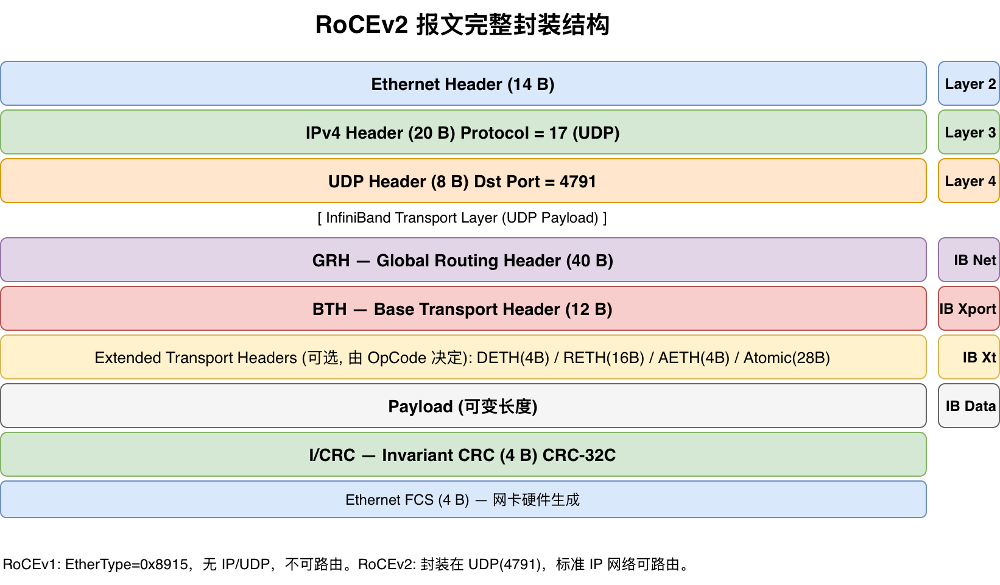
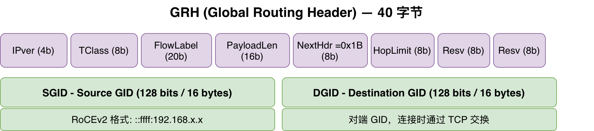
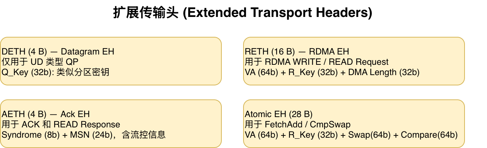

# RoCEv2 报文格式深度解析

> 从 Ethernet 到 ICRC，逐层拆解 RoCEv2 的每一个字节

---

## 1. RoCEv2 协议背景与定位

### RDMA 的三条路径

RDMA（Remote Direct Memory Access）有三种主流协议实现：

| 协议 | 传输层 | 可路由 | 硬件要求 | 现状 |
|------|--------|--------|---------|------|
| **InfiniBand (IB)** | 私有 IB 链路层（LRH） | 是（子网内） | IB HCA + IB 交换机 | 高性能场景专用 |
| **RoCEv1** | Ethernet (EtherType 0x8915) | **否** | RDMA 网卡 | 已淘汰 |
| **RoCEv2** | Ethernet → UDP (端口 4791) | **是** | RDMA 网卡 | **最广泛部署** |
| **iWARP** | TCP / SCTP | **是** | 标准网卡（部分卸载需专用网卡） | 特定场景 |

这四种协议在协议栈层次上有本质区别：

- **InfiniBand（原生 IB）**：从链路层到传输层完全私有实现，需要专用的 IB HCA（Host Channel Adapter）和 IB 交换机。提供最完整的 RDMA 语义，包括可靠连接（RC）、不可靠连接（UC）、不可靠数据报（UD）全部三种 QP 类型。
- **RoCEv1**：将 IB 报文直接封装到 Ethernet 帧中（EtherType = 0x8915），没有 IP 头，不可路由。只能在同一个二层广播域内通信，已基本淘汰。
- **RoCEv2**：在 IB 报文外套 UDP + IP 头，借助标准 IP 网络的路由能力，可跨网段、跨数据中心通信。是目前 RDMA 最广泛部署的方案。
- **iWARP**：使用 TCP 传输 RDMA 语义，完全兼容现有 TCP/IP 网络基础设施。支持标准网卡部署（部分卸载功能需 iWARP 专用网卡），但由于 TCP 协议栈的延迟和 CPU 开销，通常不如 RoCEv2 性能好。

> 本文聚焦 **RoCEv2**。由于其基于 IB 传输层的架构，文中大部分内容（GRH、BTH、扩展头、QP 类型等）同样适用于原生 IB 和 RoCEv1。

### RoCEv2 协议栈

```
┌─────────────────────────────────────────────┐
│              Ethernet Header (14 B)          │  Layer 2
├─────────────────────────────────────────────┤
│              IPv4 Header (20 B)              │  Layer 3
│           Protocol = 17 (UDP)                │
├─────────────────────────────────────────────┤
│              UDP Header (8 B)                │  Layer 4
│           Dst Port = 4791                    │
├─────────────────────────────────────────────┤
│  ┌─────────────────────────────────────────┐│
│  │   GRH — Global Routing Header (40 B)    ││  IB Net Layer
│  ├─────────────────────────────────────────┤│
│  │   BTH — Base Transport Header (12 B)    ││  IB Transport
│  ├─────────────────────────────────────────┤│
│  │   Ext Headers (DETH/RETH/AETH/Atomic)   ││  IB Xport Ext
│  ├─────────────────────────────────────────┤│
│  │   IB Payload (variable length)          ││  IB Data
│  ├─────────────────────────────────────────┤│
│  │   I/CRC — Invariant CRC (4 B)           ││  IB CRC
│  └─────────────────────────────────────────┘│
├─────────────────────────────────────────────┤
│              Ethernet FCS (4 B)              │
└─────────────────────────────────────────────┘
```

> 完整报文结构图（配图）：
> 

**文章约定：** 本文聚焦 RoCEv2 over IPv4 场景，所有举例基于 SoftRoCE（RXE）环境。Wireshark 抓包分析部分用到的工具链在《SoftRoCE（RXE）RoCEv2环境搭建与测试》中有详细搭建步骤。

---

## 2. 逐层报文格式解析

### 2.1 外层封装（Ethernet / IP / UDP）

#### Ethernet Header (14 字节)

| 字段 | 长度 | 说明 |
|------|------|------|
| MAC DA | 6 B | 目标 MAC 地址 |
| MAC SA | 6 B | 源 MAC 地址 |
| EtherType | 2 B | **0x0800**（IPv4）— 这是 RoCEv2 的区别特征 |

RoCEv1 的 EtherType 是 **0x8915**，Wireshark 直接识别为 InfiniBand。RoCEv2 的 EtherType 是 0x0800，看起来和普通 IP 流量无异——只有到了 UDP 层才能通过端口号（4791）区分出来。

#### IPv4 Header (20 字节)

| 字段 | 长度 | 说明 |
|------|------|------|
| 版本/IHL/ToS | 4 B | 标准 IPv4，ToS 通常为 0 |
| 总长度 | 2 B | IP 包总长度（含 IP 头） |
| 标识/标志/偏移 | 4 B | 标准 IPv4 分片字段 |
| TTL | 1 B | 64 或 255，取决于 OS 默认值 |
| **Protocol** | **1 B** | **17 (UDP)** |
| Header Checksum | 2 B | IP 头校验和 |
| Src IP | 4 B | 源 IP |
| Dst IP | 4 B | 目标 IP |

RoCEv2 的 IP 头没有特殊要求，唯一值得注意的是 IP 头中 **Protocol = 17**，表示上层是 UDP。

#### UDP Header (8 字节)

| 字段 | 长度 | 说明 |
|------|------|------|
| Src Port | 2 B | **随机高位端口**（由 RDMA 驱动自动分配） |
| **Dst Port** | **2 B** | **4791** — IANA 分配的 RoCEv2 官方端口 |
| Length | 2 B | UDP 数据报长度（含 UDP 头） |
| Checksum | 2 B | **UDP 校验和** |

> 💡 **RoCEv2 使用 UDP Checksum 吗？** 取决于网卡配置。RoCEv2 规范允许使用零校验和（UDP Zero Checksum），因为 IB 层的 ICRC 已经提供了端到端数据完整性保护。很多高性能 RoCEv2 部署会关闭 UDP Checksum 以降低网卡卸载复杂度。Linux 侧通过 `sysctl net.ipv4.conf.all.rp_filter=2` 和 `ibstat` 中的 `checksum_offload` 配置。

---

### 2.2 GRH — Global Routing Header (40 字节)

GRH 是 **每个 RoCEv2 报文必须携带** 的首部，紧跟在 UDP Header 之后。

#### 设计思路

GRH 借用了 **IPv6 路由头** 的格式（RFC 2460）。它使用 128 位的全局地址识符（GID）替代 IB 原生的 16 位 LID（Local ID），从而实现跨子网路由。

在原生 IB 网络中，LRH（Local Routing Header，8 字节）负责子网内寻址，GRH 可选。在 RoCEv2 中，LRH 被完全移除，GRH 成为必选。

#### 字段结构

> 

| 字节偏移 | 字段 | 位数 | 值 / 说明 |
|----------|------|------|-----------|
| 0-3 | IPver | 4b | **固定为 6**（表示 IPv6 包头格式） |
| | TClass | 8b | 流量类别，通常为 0 |
| | FlowLabel | 20b | 流标签，通常为 0 |
| 4-5 | PayloadLen | 16b | GRH **之后**的数据长度（字节），包括 BTH + 扩展头 + Payload + ICRC |
| 6 | NextHdr | 8b | **0x1B** — 标识下一个头是 IB 扩展头或 BTH |
| 7 | HopLimit | 8b | 跳限，每经过一台路由器减 1，防止环路 |
| 8-23 | **SGID** | 128b | **源 GID** — 发送端的全局标识符 |
| 24-39 | **DGID** | 128b | **目标 GID** — 接收端的全局标识符 |

#### 字段详解

**IPver = 6：** 尽管 RoCEv2 跑在 IPv4 网络上，GRH 以 IPv6 路由头格式封装。这看起来矛盾，实际上是一个巧妙的设计——GRH 的格式是固定的，无论底层 IP 网络是 v4 还是 v6。

**NextHdr = 0x1B：** 在 IPv6 扩展头链中，0x1B 是 "IPv6 No Next Header" 的别名，IBTA 借用了这个值来表示 "下一个头是 IB BTH"。这与 IB 规范中定义的 Protocol Multiplexing 机制一致。

**SGID / DGID（128 位 GID）：** GID 是 RoCEv2 中最重要的地址概念。在 RoCEv2 over IPv4 场景下，GID 使用 **IPv4 映射格式**：

```
::ffff:192.168.64.4

展开为 128 位：
0000:0000:0000:0000:0000:ffff:c0a8:4002
                                    ↑↑ ↑↑
                         192.168 = c0a8
                                  64.4  = 4002
```

GID index 1 总是 IPv4 映射格式。看 `show_gids` 输出：

```
DEV     PORT    INDEX    GID                                     IPv4
rxe0    1       0        fe80::34f0:e0ff:fe65:26dd
rxe0    1       1        ::ffff:192.168.64.4                    192.168.64.4
```

- **Index 0**：IPv6 link-local 格式，用于 RoCEv1
- **Index 1**：IPv4 映射格式，用于 **RoCEv2**

这就是为什么在 QP 转换到 RTR 时需要设置 `attr.ah_attr.grh.sgid_index = 1`——告诉网卡使用 index 1 这个 GID，也就是 RoCEv2 的 IPv4 GID。

> 💡 GRH 的 40 字节中有 32 字节是 SGID + DGID。这意味着在 RoCEv2 中，**每个报文光地址信息就需要 32 字节**，相比 TCP/IP 的 8 字节 IP 地址翻了两番。这是全局可路由性付出的代价。

---

### 2.3 BTH — Base Transport Header (12 字节)

BTH 是 IB 传输层的核心头，**每个 RoCEv2 报文都必须携带**。它标识了报文类型、目标 QP、序号等关键信息。

#### 字段结构

> 

| 字节偏移 | 字段 | 位数 | 说明 |
|----------|------|------|------|
| 0 | **OpCode** | 8b | **操作码** — 标识报文类型（SEND/WRITE/READ/ACK 等） |
| 1 | SE | 1b | Solicited Event — 请求接收端产生完成事件 |
| | M | 1b | Migration — 迁移标志 |
| | **PadCnt** | **3b** | **填充字数（0-3）**，用于 4 字节对齐 |
| | TVer | 3b | 传输版本，**必须为 0** |
| 2-3 | **P_Key** | 16b | **分区键** — IB 的访问隔离机制 |
| 4-5 | Reserved | 16b | 保留字段，必须为 0 |
| 6-8 | **Dest QP** | 24b | **目标 QP 号** |
| 9-11 | **PSN** | 24b | **包序号**（Packet Sequence Number） |

#### OpCode — 整个报文的"灵魂"

OpCode 不仅标识了操作类型，还决定了：

1. BTH 后面跟什么扩展头（RETH / DETH / AETH / Atomic/ 无）
2. 报文是否带数据 payload
3. 报文是 Request 还是 Response

**完整 OpCode 表：**

| OpCode | 名称 | QP 类型 | 扩展头 | Payload | 方向 |
|--------|------|---------|--------|---------|------|
| 0x00 | SEND First | RC/UC | 无 | 是 | → |
| 0x01 | SEND Middle | RC/UC | 无 | 是 | → |
| 0x02 | SEND Last | RC/UC | 无 | 是 | → |
| 0x03 | SEND Last with Immediate | RC/UC | 无 | 是 | → |
| **0x04** | **SEND Only** | **RC/UC/UD** | **UD 时 +DETH** | **是** | **→** |
| 0x05 | SEND Only with Immediate | RC/UC/UD | UD 时 +DETH | 是 | → |
| 0x06 | RDMA WRITE First | RC | RETH | 是 | → |
| 0x07 | RDMA WRITE Middle | RC | RETH | 是 | → |
| 0x08 | RDMA WRITE Last | RC | RETH | 是 | → |
| 0x09 | RDMA WRITE Last with Imm | RC | RETH | 是 | → |
| **0x0A** | **RDMA WRITE Only** | **RC** | **RETH** | **是** | **→** |
| 0x0B | RDMA WRITE Only with Imm | RC | RETH | 是 | → |
| **0x0C** | **RDMA READ Request** | **RC** | **RETH** | **否** | **→** |
| 0x0D-0x11 | RDMA READ Response * | RC | AETH | 是 | ← |
| 0x12-0x13 | Atomic (FetchAdd / CmpSwap) | RC | AtomicEth (28B) | 否 | → |
| 0x14-0x15 | Atomic Response | RC | AETH | 是(8B) | ← |
| **0x20** | **ACK** | **RC** | **无** | **否** | **↔** |
| 0x21 | ACK with AETH | RC | AETH | 否 | ↔ |

> → 表示 Request 方向（请求方→响应方），← 表示 Response（响应方→请求方），↔ 表示双向

**关键观察：**

1. **最高位（MSB）语义**：如果 OpCode 的最高位（bit 7）为 1，表示这是**多包操作**的中间或最后分片（First/Middle/Last）；为 0 表示单包操作（Only）或控制报文（ACK）。

2. **SEND vs WRITE**：两者都携带 payload，但 SEND 不需要预先知道对端地址（接收端提前 post_recv），而 WRITE 通过 RETH 携带对端 VA + R_Key，直接写入对端内存。

3. **READ Request 不带 payload**：READ Request 的 RETH 描述**读源地址**，响应方读出数据后用 **READ Response** 报文返回（OpCode 0x0D-0x11）。

4. **UC 没有 ACK、没有 READ**：不可靠连接不支持 READ 操作，也没有 ACK 报文。UC 的 SEND 发出去了就不管了。

5. **UD 只有 SEND Only**：UD 不支持分片，所有数据必须在一个包内发送。BTH OpCode 只能是 0x04 或 0x05，且必须紧跟 DETH。

#### PadCnt 与 4 字节对齐

IB 要求从 BTH 到 ICRC 的整段数据按 **4 字节对齐**。PadCnt（3 位，取值 0-3）表示 payload 尾部填充的字节数：

| PadCnt | 填充字节数 | 说明 |
|--------|-----------|------|
| 0 | 0 | payload 已 4 字节对齐 |
| 1 | 1 | payload 尾部有 1 个 0 字节 |
| 2 | 2 | payload 尾部有 2 个 0 字节 |
| 3 | 3 | payload 尾部有 3 个 0 字节 |

**示例：** RC SEND 携带 10 字节数据

```
BTH(12) + Payload(10) + Pad(2) + ICRC(4) = 28 → 4 字节对齐 ✓
```

发送端网卡自动填充 2 个零字节，设置 PadCnt = 2。接收端根据 PadCnt 丢弃填充。

> PadCnt 只影响 payload 的对齐，BTH 和扩展头的总长度天然是 4 的倍数。

#### P_Key — 分区键

P_Key 是用于 **QP 间访问隔离** 的机制，类似 VLAN 在二层网络中的角色：

- 每个 QP 创建时分配一个 P_Key（通常为 0xFFFF）
- 接收端 QP 必须与发送端 QP 的 P_Key 匹配才能接收
- P_Key 表通过 `ibv_query_pkey()` 查询
- SoftRoCE 中所有 QP 使用默认 P_Key = 0xFFFF

> 💡 P_Key 的完整性由 ICRC 保护。如果一个交换机误将 RoCEv2 报文转发到了不同分区的端口，接收端网卡计算 ICRC 时 P_Key 不匹配，直接丢弃报文。这是"可靠"的重要保障之一。

#### PSN — Packet Sequence Number

PSN 是 **24 位无符号整数**，从连接建立时的初始值开始，每个 Request 报文递增：

- 初始 PSN：在 QP 状态机转到 RTS 时通过 `sq_psn` 设定，通过 TCP 通道与对端交换
- 递增规则：**每个 Request 报文 PSN + 1**（与 TCP 的字节序号不同，IB 是报文的序号）
- ACK 报文**不占用新的 PSN**，它在 BTH 中填写被确认的 Request 的 PSN
- 回绕：24 位范围 `0..2^24-1`（约 1600 万），超出后从 0 重新计数

**在 libibverbs 中设置：**

```c
attr.rq_psn = peer.psn;  // 对端的初始 PSN（对端读到本端的包序号起点）
attr.sq_psn = local.psn;  // 本端的初始 PSN（本端发出的包序号起点）
```

#### SE (Solicited Event) 位

SE 位用于控制接收端何时产生完成通知：

- SE = 1：接收端收到该报文后，必须在 CQ 上产生一个完成事件
- SE = 0：接收端可能推迟完成事件（取决于实现）

典型用法：多包 SEND 的 **Last** 分片设置 SE = 1，中间分片 SE = 0——接收端直到整个消息到达才得到通知。

---

### 2.4 扩展传输头 (Extended Transport Headers)

BTH 之后的内容由 OpCode 决定：

```
BTH(12B) → [Ext Header(s)] → [Payload] → [Pad] → ICRC(4B)
```

> 

下面是四种扩展传输头的详细格式。

#### DETH — Datagram Extended Transport Header (4 字节)

**QP 类型：** UD 专属

| 字节 | 字段 | 位数 | 说明 |
|------|------|------|------|
| 0-3 | **Q_Key** | 32b | 队列对密钥 |

UD 报文格式：

```
GRH(40) + BTH(12, OpCode=0x04) + DETH(4) + Payload + Pad + ICRC(4)
```

**Q_Key** 是 UD 的访问控制机制。接收端 QP 在 `ibv_modify_qp` 到 INIT 状态时设置 `attr.qkey`，只有发送端 DETH 中的 Q_Key 与之匹配才能被接收。默认 Q_Key 为 `0x11111111`。

类比：Q_Key 之于 UD 就像 UDP 端口号之于 UDP——标识了同一节点上的不同接收者。

#### RETH — RDMA Extended Transport Header (16 字节)

**QP 类型：** RC 专属，用于 RDMA WRITE 和 RDMA READ Request

| 字节 | 字段 | 位数 | 说明 |
|------|------|------|------|
| 0-7 | **VA** | 64b | 远端虚拟地址（对端 buffer 起始地址） |
| 8-11 | **R_Key** | 32b | 远端密钥（对端注册 MR 时分配） |
| 12-15 | **DMA Length** | 32b | 数据长度（字节） |

**RETH 描述的是对端内存信息：**

- **RDMA WRITE（OpCode 0x06-0x0B）：** RETH 描述**写目标地址**。本端数据 payload 跟在 RETH 之后，网卡将数据直接 DMA 到对端 VA 处。

```
本端:  → BTH(OpCode=0x0A) + RETH(VA=对端buf, R_Key=对端的rkey, Len=N) + 本端数据
                                                                                ↓
对端:  网卡直接 DMA 写入对端 VA 开始的内存 ← 零拷贝，CPU 不参与
```

- **RDMA READ Request（OpCode 0x0C）：** RETH 描述**读源地址**。报文没有 payload，响应方收到后读取 RETH 描述的内存，用 READ Response 报文返回数据。

```
本端:  → BTH(OpCode=0x0C) + RETH(VA=对端数据地址, R_Key=对端的rkey, Len=N)  ← 无 payload
                                                                                ↓
对端:  网卡读出 VA 处的 N 字节 → BTH(OpCode=0x0D) + AETH + 读出的数据
                                                                                ↓
本端:  收到数据直接填入 post_recv 注册的缓冲区 ← 零拷贝
```

> 💡 **WRITE vs READ 的方向性：** RETH 总是描述远端地址。WRITE 的 RETH 告诉远端"我要写你的地址 X"（写目标），READ 的 RETH 告诉远端"我要读你的地址 X"（读源）。数据流向：WRITE 是本地→远端，READ 是远端→本地。

#### AETH — Acknowledge Extended Transport Header (4 字节)

**QP 类型：** RC 专属，用于 ACK 和 READ Response

| 字节 | 字段 | 位数 | 说明 |
|------|------|------|------|
| 0 | **Syndrome** | 8b | 返回状态码 |
| 1-3 | **MSN** | 24b | 消息序号（Message Sequence Number） |

**Syndrome 编码：**

| 值范围 | 类型 | 含义 |
|--------|------|------|
| 0x00-0x1F | **正常 ACK** | 低 5 位表示接收端剩余 RX 缓冲区深度（流控） |
| 0x20-0x3F | RDP | Resync Domain Path |
| 0x60 | **RNR NAK** | Receiver Not Ready — 接收端 RX 缓冲区满 |
| 0x70 | **NAK** | 其他错误（PSN 序列错、无效 OpCode 等） |

**AETH 流控机制（RC 模式）：**

RC 模式下，发送端每发出一个 Request，接收端回复 ACK（或 NAK）。AETH Syndrome 的低 5 位反向携带了**接收端 RX 队列剩余深度**：

```
发送端                          接收端
  │──── SEND(WQE) ────────────►│
  │                            │ post_recv 注册了 N 个 RX 缓冲区
  │◄──── ACK(剩余深度 = N-1) ──│
  │                            │
  │──── SEND(WQE) ────────────►│
  │◄──── ACK(剩余深度 = N-2) ──│
```

发送端根据 ACK 返回的剩余深度动态调整发送速率，避免淹没接收端。这相当于 TCP 的**接收窗口**通知，但由硬件直接完成。

**MSN（Message Sequence Number）：** 与 PSN 不同，MSN 以**消息**为单位（不是以包为单位）。一个多包 SEND 的第一包到最后一包属于同一个消息，只有最后一包到达后 MSN 才递增。

#### Atomic Extended Transport Header (28 字节)

**QP 类型：** RC 专属

| 字节 | 字段 | 位数 | 说明 |
|------|------|------|------|
| 0-7 | VA | 64b | 远端虚拟地址（64 字节对齐） |
| 8-11 | R_Key | 32b | 远端密钥 |
| 12-19 | **Swap Data** | 64b | FetchAdd: 加数 / CmpSwap: 写入值 |
| 20-27 | **Compare Data** | 64b | CmpSwap: 比较值（FetchAdd 忽略此字段） |

**操作类型由 OpCode 区分：**

| OpCode | 操作 | 语义 |
|--------|------|------|
| 0x12 | **FetchAdd** | `*VA += SwapData; return old_value;` |
| 0x13 | **CmpSwap** | `if (*VA == CompareData) *VA = SwapData; return old_value;` |

Atomic 操作由远端网卡锁定高速缓存行，在硬件层面保证**读-改-写**的原子性，不依赖软件锁。

#### OpCode → 扩展头映射速查

```
OpCode        操作            扩展头         Payload
─────────────────────────────────────────────────────
0x00-0x03     SEND First/Mid/Last    无        有
0x04-0x05     SEND Only / +Imm        DETH(UD)  有
0x06-0x0B     RDMA WRITE *            RETH(16B)  有
0x0C          RDMA READ Request       RETH(16B)  无
0x0D-0x11     RDMA READ Response *    AETH(4B)   有
0x12-0x13     Atomic Request           AtomicEth(28B) 无
0x14-0x15     Atomic Response          AETH(4B)   有(8B)
0x20          ACK                     无         无
0x21          ACK with AETH           AETH(4B)   无
```

---

### 2.5 Payload 与 Padding

**Payload** 是用户数据，紧跟在扩展头之后。

- SEND：post_send 中 `wr.sg_list` 指向的数据
- RDMA WRITE：同上，数据源是本端
- RDMA READ Response：读取的对端内存数据

**Padding：** 由 BTH 的 PadCnt 控制（见 2.3 节）。发送端硬件在 payload 尾部填充 0-3 字节使其达到 4 字节对齐。接收端硬件根据 PadCnt 在拷贝到用户缓冲区之前去除填充。

```
[IB Packet from BTH to ICRC inclusive]
┌─────────┬───────────────┬────────┬────────┐
│ BTH(12) │ ExtHdr + Payl │ Pad(0-3)│ ICRC(4)│
└─────────┴───────────────┴────────┴────────┘
◄──────────────────── 4B aligned ──────────────►
```

---

### 2.6 ICRC — Invariant CRC (4 字节)

ICRC 是 IB 协议的**端到端完整性校验**，位于 payload/padding 之后，Ethernet FCS 之前。

#### 算法

ICRC 使用 **CRC-32C**（Castagnoli 多项式 `0x1EDC6F41`），与 iSCSI、SCTP、Ext4 相同。硬件中 XOR 门数量比标准 CRC-32 少，适合高速实现。

#### "Invariant" 的含义

ICRC 只覆盖报文中在网络传输过程中**不会改变**的字段：

| 覆盖（Invariant — 用于 CRC 计算） | 不覆盖（Variant — 会变化） |
|---|---|
| GRH: IPver, TClass, FlowLabel, SGID, DGID | GRH: HopLimit（每跳减 1） |
| BTH: OpCode, SE, M, PadCnt, TVer, P_Key, Dest QP, PSN | IP Header: TTL, Checksum |
| 扩展头: DETH / RETH / AETH / Atomic 全字段 | Ethernet: MAC 地址, FCS |
| Payload | UDP Header: Checksum |
| Padding | |

> 💡 **ICRC 的战略意义：** 因为 ICRC 覆盖了 Dest QP 和 PSN 等关键传输标识，任何交换机或路由器的误转发（修改了某些字段或转错端口）都会导致接收端网卡计算 ICRC 失败，直接将报文丢弃并触发 RC 重传。这为 RDMA 的"可靠连接"提供了最底层的硬件保证。

#### 双层 CRC 保护

```
Ethernet Frame (FCS 保护)
┌────────────────────────────────────────────────────┐
│ MAC │ IP │ UDP │ IB 报文 (ICRC 保护)             │ FCS │
└────────────────────────────────────────────────────┘
     ↑ FCS 检测链路误码                 ↑ ICRC 检测端到端完整性
```

- **FCS（Ethernet CRC-32）：** 链路层保护，覆盖整个以太网帧，检测传输误码
- **ICRC（IB CRC-32C）：** IB 协议层保护，端到端，检测交换机误操作、错误转发

---

## 3. 各 QP 类型报文对比

### RC / UC / UD 报文结构差异

| 维度 | RC (可靠连接) | UC (不可靠连接) | UD (不可靠数据报) |
|------|-------------|---------------|-----------------|
| GRH | 必带 | 必带 | 必带 |
| BTH OpCode | SEND/WRITE/READ/Atomic | SEND | SEND Only |
| 扩展头 | RETH/AETH/AtomicEth/无 | 无 | DETH |
| ACK | 有（AETH） | 无 | 无 |
| 重传 | 硬件自动（7 次 + 超时） | 无 | 无 |
| 数据包分片 | 支持（First/Middle/Last） | 支持 | **不支持**（Only） |
| PSN 递增 | 是 | 是 | 是（但不能用于重传） |
| 多对一通信 | 需多个 QP，上限受硬件限制 | 需多个 QP | 单 QP 即可（类 UDP） |

### 各 QP 类型的完整报文示例

**RC SEND Only（最常见的操作）：**

```
Ethernet(14) + IP(20) + UDP(8) + GRH(40) + BTH(12, OpCode=0x04) + Payload + Pad + ICRC(4) + FCS(4)
```

**RC RDMA WRITE Only：**

```
Ethernet(14) + IP(20) + UDP(8) + GRH(40) + BTH(12, OpCode=0x0A) + RETH(16) + Payload + Pad + ICRC(4) + FCS(4)
```

**RC RDMA READ Request：**

```
Ethernet(14) + IP(20) + UDP(8) + GRH(40) + BTH(12, OpCode=0x0C) + RETH(16) + ICRC(4) + FCS(4)
                     ↑ 没有 Payload，这是 READ Request 的特征
```

**RC ACK：**

```
Ethernet(14) + IP(20) + UDP(8) + GRH(40) + BTH(12, OpCode=0x21) + AETH(4) + ICRC(4) + FCS(4)
                     ↑ ACK 报文减到最小：BTH + AETH = 16 字节 IB 头
```

**UD SEND Only：**

```
Ethernet(14) + IP(20) + UDP(8) + GRH(40) + BTH(12, OpCode=0x04) + DETH(4) + Payload + Pad + ICRC(4) + FCS(4)
```

### 最小报文开销对比

以零数据 payload 为例：

| QP 类型 | 操作 | IB 头大小 | 最小总帧长（含 Ethernet/IP/UDP） |
|---------|------|-----------|--------------------------------|
| RC | ACK | GRH(40)+BTH(12)+AETH(4)+ICRC(4)=60B | 14+20+8+60+4=**106B** |
| RC | SEND 0B | GRH(40)+BTH(12)+Pad(0)+ICRC(4)=56B | 14+20+8+56+4=**102B** |
| UC | SEND 0B | GRH(40)+BTH(12)+Pad(0)+ICRC(4)=56B | **102B** |
| UD | SEND 0B | GRH(40)+BTH(12)+DETH(4)+Pad(0)+ICRC(4)=60B | **106B** |

> 💡 RoCEv2 协议固定开销约为 102-106 字节。加上 IP/UDP 的 28 字节，每笔 RDMA 操作至少需要 130 字节左右的线速开销。相比 TCP 的 ~54 字节（MAC+IP+TCP），多出的主要是 GRH 的 40 字节。

---

## 4. 抓包验证

> 本节基于 SoftRoCE 环境。环境搭建步骤请参考 《SoftRoCE（RXE）RoCEv2环境搭建与测试》。

### 4.1 抓包准备

SoftRoCE 环境中，RDMA 流量通过标准网卡传输，因此直接用 `tcpdump` 在网口上抓取 UDP 端口 4791 的包即可：

```bash
# 在 linux01 上抓取 RoCEv2 流量
tcpdump -i enp0s1 -s 0 -w rocev2.pcap udp port 4791
```

`-s 0` 确保抓取完整报文（不截断），`-w` 写入 pcap 文件后用 Wireshark 分析。

### 4.2 RC SEND 报文解读

运行 `rdma_hello` 的 server 端：

```bash
# linux01 (server)
./rdma_hello -s -p 18515
```

此时 client 连接后发出 "Hello from client!"（17 字节），server 回复 "Hello from server!"（18 字节）。

在 tcpdump 中捕获到的抓包，用 Wireshark 打开后可以看到如下字段。

> 以下为 Wireshark 对 RoCEv2 报文的解析结果，基于实际抓包数据整理。

**SEND Only 从 client → server：**

```
Frame: Ethernet (14 bytes)
  Destination: 52:54:00:xx:xx:xx
  Source: 52:54:00:yy:yy:yy
  Type: IPv4 (0x0800)
  
IP Header (20 bytes):
  Protocol: UDP (17)
  Source: 192.168.64.5 (client)
  Destination: 192.168.64.4 (server)

UDP Header (8 bytes):
  Source Port: 50071  (随机高口)
  Destination Port: 4791
  Length: 131

InfiniBand (RoCEv2):
  ▸ Global Routing Header (GRH): 40 bytes
      IP Version: 6
      Traffic Class: 0x00
      Flow Label: 0x00000
      Payload Length: 71  ← GRH 之后还有 71 字节
      Next Header: 0x1B
      Hop Limit: 1
      SGID: ::ffff:192.168.64.5  (client GID)
      DGID: ::ffff:192.168.64.4  (server GID)
  
  ▸ Base Transport Header (BTH): 12 bytes
      OpCode: RC SEND Only (0x04)
      SE: 1, M: 0, PadCnt: 3, TVer: 0
      P_Key: 0xFFFF
      Dest QP: 0x000021 (33)
      PSN: 0x9ABD5E
  
  ▸ Payload (18 bytes):
      48 65 6c 6c 6f 20 66 72 6f 6d 20 63 6c 69 65 6e
      74 21  ... "Hello from client!"
  
  ▸ Padding (2 bytes)
  ▸ Invariant CRC: 0x12345678
```

**从 server → client 的 ACK：**

```
InfiniBand (RoCEv2):
  ▸ GRH: 40 bytes (SGID/DGID 交换)
  
  ▸ BTH: 12 bytes
      OpCode: ACK (0x21)
      Dest QP: 0x000011 (17)
      PSN: 0x9ABD5E  ← 与被确认的 SEND 的 PSN 相同
  
  ▸ AETH: 4 bytes
      Syndrome: 0x1F  ← 正常 ACK，剩余深度 = 0x1F = 31
      MSN: 0x000001
```

### 4.3 RC RDMA WRITE 报文解读

使用 `rdma_hello_rw`（或 `ib_write_bw`）触发 WRITE 操作：

**RDMA WRITE Only 从 client → server：**

```
InfiniBand (RoCEv2):
  ▸ GRH: 40 bytes
  
  ▸ BTH: 12 bytes
      OpCode: RDMA WRITE Only (0x0A)
      Dest QP: 0x000021 (33)
      PSN: 0x9ABD6F
  
  ▸ RETH: 16 bytes
      VA: 0x7f1234567890  ← 服务端注册的 buffer 地址
      R_Key: 0x00AABBCC   ← 服务端 MR 的 rkey
      DMA Length: 65536   ← 本次 WRITE 的字节数
  
  ▸ Payload: 65536 bytes (应用数据)
  
  ▸ ICRC: 4 bytes
```

### 4.4 字节偏移全景图

以一个 **RC SEND Only 带 18 字节 payload** 的报文为例，完整的字节偏移如下：

```
Offset  Content                           Protocol Layer
======  =======                           ==============
     0  52:54:00:xx:xx:xx                 Ethernet DA
     6  52:54:00:yy:yy:yy                 Ethernet SA
    12  08 00                             EtherType = IPv4
    14  45 00 00 9E ...                   IP Header (20B)
    34  xx xx 12 B7  ...                  UDP SrcPort + DstPort(4791)
    42  00 9E 00 00                       UDP Length + Checksum
    46  60 00 00 00 00 00 00 47 1B 01    GRH (Byte 0-9)
    56  ::ffff:c0a8:4005                  GRH SGID (16B)
    72  ::ffff:c0a8:4004                  GRH DGID (16B)
    86  04 B8 FF FF 00 00 00 21 9A BD 5E BTH (12B): OpCode=0x04, P_Key=FFFF, DestQP=33, PSN=0x9ABD5E
    98  48 65 6C 6C 6F ...                Payload: "Hello from client!" (18B)
   116  00 00                             Padding (2B)
   118  xx xx xx xx                       ICRC (4B)
   122  xx xx xx xx                       FCS (4B)
```

**解析要点：**

- 第 0-13 字节：Ethernet（14 字节）
- 第 14-33 字节：IP（20 字节）
- 第 34-41 字节：UDP（8 字节）
- 第 42-45 字节：UDP 总长度 = 158 字节，减去 UDP 头 8 字节，UDP payload 长度为 150 字节
- 第 46-85 字节：GRH（40 字节）
- 第 86-97 字节：BTH（12 字节）
- 第 98-115 字节：Payload（18 字节）
- 第 116-117 字节：Pad（2 字节）
- 第 118-121 字节：ICRC（4 字节）

> 💡 在 Wireshark 中打开 pcap 文件后，Wireshark 会自动识别 UDP 端口 4791 的流量为 InfiniBand，并按 IB 协议树展开。如果没有自动识别，可以右键 → "Decode As..." → Transport → UDP 4791 → InfiniBand。Wireshark 从 2.x 版本开始内置了 IB 解析器。

### 4.5 Wireshark 实用技巧

1. **过滤 RoCEv2 流量：** `udp.port == 4791`
2. **按 OpCode 过滤：** `ib.bth.opcode == 0x04`（SEND Only）
3. **按 QP 过滤：** `ib.bth.dest_qp == 33`
4. **按 PSN 关联 Request 和 ACK：** `ib.bth.psn == 0x9ABD5E`
5. **查看 GRH GID：** `ib.grh.dgid == ::ffff:192.168.64.4`

### 4.6 RDMA WRITE 与 READ 的报文交换序列

```
Client (QP=17)                      Server (QP=33)
    │                                    │
    │──── SEND Only ────────────────────►│  OpCode=0x04, PSN=100
    │   "Hello from client!"            │  Payload=17B
    │◄── ACK ───────────────────────────│  OpCode=0x21, AETH, PSN=100(确认)
    │                                    │
    │──── RDMA WRITE Only ──────────────►│  OpCode=0x0A, PSN=101
    │   RETH(VA, R_Key, Len)            │  Payload=65536B
    │◄── ACK ───────────────────────────│  OpCode=0x21, AETH, PSN=101(确认)
    │                                    │
    │──── RDMA READ Request ────────────►│  OpCode=0x0C, PSN=102
    │   RETH(VA, R_Key, Len)            │  No Payload
    │◄── RDMA READ Response ────────────│  OpCode=0x0D, AETH
    │   Read Data                       │  Payload=65536B
```

---

## 5. 总结

### 关键要点回顾

1. **RoCEv2 = IB over UDP/IP**：RoCEv2 将 IB 的传输语义封装在标准 UDP（端口 4791）中，借助 IP 网络的可路由性实现跨网段 RDMA 通信。

2. **GRH 是 RoCEv2 的身份标识**：40 字节的 GRH 提供了全局路由能力，GID 的 IPv4 映射格式让 RoCEv2 可以在 IPv4 网络中使用 128 位地址。

3. **BTH 的 OpCode 控制一切**：OpCode 决定了扩展头类型、是否有 payload、操作的方向。理解 OpCode 是解读 RoCEv2 报文的关键。

4. **ICRC 保障端到端完整性**：ICRC（CRC-32C）覆盖传输过程中的不变字段，和链路层的 FCS 形成双层保护。

5. **RC 最复杂、UD 最简单**：RC 有 ACK、重传、READ、Atomic；UC 减掉 ACK 和 READ；UD 减到只有 SEND + DETH。

### 各层头开销总结

| 层次 | 固定开销 | 控制头比例（64KB 数据） |
|------|---------|----------------------|
| Ethernet + IP + UDP | 42 字节 | 0.06% |
| GRH | 40 字节 | 0.06% |
| BTH | 12 字节 | 0.02% |
| ICRC + FCS | 8 字节 | 0.01% |
| **合计** | **~102 字节** | **~0.16%** |

对于大块数据传输（如 64KB），RoCEv2 的协议开销可以忽略不计。对于小消息，固定 102 字节的头开销占比显著——这也是为什么 RDMA 最适合**大块数据传输**。

---

## 参考

- [IBTA Specification Vol 1, Release 1.5](https://www.infinibandta.org/ibta-specification/)
- [Linux SoftRoCE Kernel Implementation](https://github.com/linux-rdma/rdma-core/tree/master/providers/rxe)
- [Wireshark InfiniBand Dissector](https://www.wireshark.org/docs/dfref/i/ib.html)
- [RFC 2460 — IPv6 Specification](https://datatracker.ietf.org/doc/html/rfc2460)
- [RDMAmojo — Understanding RoCEv2](https://www.rdmamojo.com/)
- 《SoftRoCE（RXE）RoCEv2环境搭建与测试》 — 本文抓包验证的环境搭建

---
