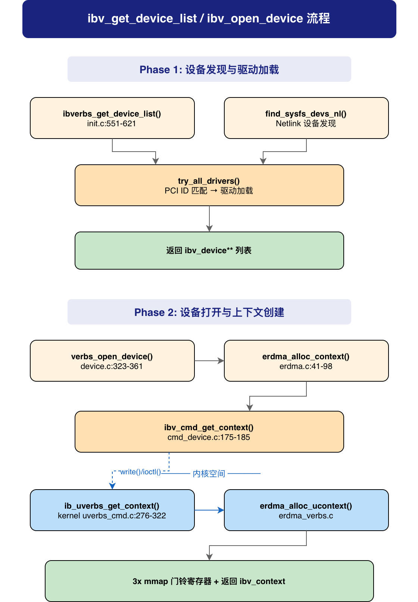

# ibv_get_device_list / ibv_open_device 调用流程分析（以 erdma 网卡为例）

> 分析范围：应用程序 → rdma-core libibverbs → erdma provider → 内核 uverbs 核心 → erdma 内核驱动
>
> 内核版本: linux-6.12.92 | rdma-core 对应内核头文件同步版本

---

## 1. 概述

`ibv_get_device_list` 和 `ibv_open_device` 是所有 RDMA 应用程序的**起点**：

- **`ibv_get_device_list()`** — 扫描系统中的 RDMA 设备，将每个设备匹配到对应的 userspace provider driver，返回 `ibv_device **` 列表
- **`ibv_open_device()`** — 打开一个设备的字符设备 `/dev/infiniband/uverbsX`，初始化 context（含 ops 表、cmd_fd、async_fd、Doorbell MMIO 映射），返回 `ibv_context *`

这两步完成后，应用程序才能调用 `ibv_alloc_pd()`、`ibv_reg_mr()`、`ibv_create_cq()`、`ibv_create_qp()` 等 verbs 操作。



---

## 2. 关键数据结构

### 2.1 用户态数据结构

**`struct ibv_device`** — 设备抽象 (`libibverbs/verbs.h`)

```c
struct ibv_device {
    struct ibv_device_ops  _ops;       // 设备操作 (查询等)
    enum ibv_node_type     node_type;  // 节点类型 (CA/SWITCH/RNIC)
    enum ibv_transport_type transport_type; // 传输类型 (IB/iWARP)
    char                   name[IBV_SYSFS_NAME_MAX];    // 设备名 (如 "erdma_0")
    char                   dev_name[IBV_SYSFS_NAME_MAX]; // sysfs 名 (如 "uverbs0")
    char                   dev_path[IBV_SYSFS_PATH_MAX]; // sysfs 路径
    char                   ibdev_path[IBV_SYSFS_PATH_MAX]; // ibdev sysfs 路径
};
```

**`struct verbs_device`** — libibverbs 内部设备包装 (`driver.h`)

```c
struct verbs_device {
    struct ibv_device               device;     // 嵌入通用 ibv_device
    struct list_head                entry;      // 设备链表节点
    atomic_int                      refcount;   // 引用计数
    const struct verbs_device_ops  *ops;        // provider 设备操作
    struct verbs_sysfs_dev         *sysfs;      // sysfs 设备信息
    uint64_t                        core_support; // 内核核心特性支持位图
};
```

**`struct ibv_context`** — 设备上下文 (`libibverbs/verbs.h`)

```c
struct ibv_context {
    struct ibv_device          *device;    // 所属设备
    struct ibv_context_ops      ops;       // 兼容性 ops (旧接口)
    int                         cmd_fd;    // /dev/infiniband/uverbsX fd
    int                         async_fd;  // 异步事件 fd
    int                         num_comp_vectors; // 完成向量数
    pthread_mutex_t             mutex;     // 保护共享资源的锁
    uint32_t                    abi_compat; // ABI 兼容性标志
};
```

**`struct verbs_context`** — 扩展上下文 (`driver.h`)

```c
struct verbs_context {
    struct ibv_context          context;  // 嵌入通用 ibv_context
    struct verbs_ex_private    *priv;     // 私有数据 (ops 表 + ioctl 位图)
    size_t                      sz;       // 结构体大小
    // 库级 ops (非 provider 提供):
    struct ibv_cq_ex *(*create_cq_ex)(...);
    int              (*query_port)(...);
    struct ibv_pd *  (*ibv_alloc_pd)(...);  // 旧入口兼容
    // ...
};
```

**`struct erdma_context`** — erdma 用户态上下文 (`providers/erdma/erdma.h:32`)

```c
struct erdma_context {
    struct verbs_context ibv_ctx;          // 嵌入 verbs_context
    uint32_t dev_id;                       // PCI device ID
    // QP 查询表 (QP ID → QP 指针快速查找)
    struct {
        struct erdma_qp **table;
        int refcnt;
    } qp_table[ERDMA_QP_TABLE_SIZE];
    pthread_mutex_t qp_table_mutex;
    // Doorbell MMIO 地址 (mmap 映射)
    uint8_t  sdb_type;
    uint32_t sdb_offset;
    void    *sdb;   // SQ Doorbell MMIO
    void    *rdb;   // RQ Doorbell MMIO
    void    *cdb;   // CQ Doorbell MMIO
    // Doorbell 记录管理
    uint32_t page_size;
    pthread_mutex_t dbrecord_pages_mutex;
    struct list_head dbrecord_pages_list;
};
```

### 2.2 数据结构关系

```
ibv_get_device_list 返回:      ibv_open_device 返回:
┌──────────────────────┐      ┌──────────────────────────┐
│ ibv_device **list    │      │ verbs_context            │
│   [0] → ibv_device   │ ──→  │   .context (ibv_context) │
│   [1] → ibv_device   │      │     .cmd_fd = uverbsX fd │
│   ...                │      │     .async_fd = event fd  │
│   [n] → NULL         │      │     .device → ibv_device  │
└──────────────────────┘      │   .priv->ops = provider   │
        ↑                     │   .priv->use_ioctl_write  │
  实际是 verbs_device         │   erdma_context 扩展:     │
  (内嵌 ibv_device)           │     .sdb / .rdb / .cdb    │
                               │     (mmap doorbells)     │
                               └──────────────────────────┘
```

### 2.3 内核态数据结构

**`struct ib_ucontext`** — 内核用户上下文

```c
struct ib_ucontext {
    struct ib_device          *device;  // 所属 RDMA 设备
    struct ib_uverbs_file     *ufile;   // 关联的 uverbs 文件
    struct xarray              mmap_xa; // mmap 条目管理 (用于 doorbell 映射)
    struct rdma_restrack_entry res;     // 资源跟踪
};
```

**`struct erdma_ucontext`** (内核) — erdma 内核上下文 (`hw/erdma/erdma_verbs.h:41`)

```c
struct erdma_ucontext {
    struct ib_ucontext ibucontext;          // 嵌入通用 ib_ucontext
    struct erdma_ext_db_info ext_db;        // 扩展 DB 信息
    u64 sdb, rdb, cdb;                      // Doorbell 总线地址
    struct rdma_user_mmap_entry *sq_db_mmap_entry;
    struct rdma_user_mmap_entry *rq_db_mmap_entry;
    struct rdma_user_mmap_entry *cq_db_mmap_entry;
    struct list_head dbrecords_page_list;   // Doorbell 记录页列表
    struct mutex dbrecords_page_mutex;
};
```

---

## 3. Phase 1: ibv_get_device_list — 设备发现

### Step 1: 应用程序调用

```c
struct ibv_device **dev_list;
int num_devices;

dev_list = ibv_get_device_list(&num_devices);
```

### Step 2: libibverbs 入口 — `ibv_get_device_list()`

**文件**: `rdma-core/libibverbs/device.c:54-96`

```c
LATEST_SYMVER_FUNC(ibv_get_device_list, 1_1, "IBVERBS_1.1",
                   struct ibv_device **, int *num)
{
    struct ibv_device **l = NULL;
    struct verbs_device *device;
    static bool initialized;
    int num_devices;
    int i = 0;

    if (num)
        *num = 0;

    pthread_mutex_lock(&dev_list_lock);

    // 首次调用时初始化
    if (!initialized) {
        if (ibverbs_init())   // ← 环境检查 + sysfs 路径
            goto out;
        initialized = true;
    }

    // 扫描系统设备
    num_devices = ibverbs_get_device_list(&device_list);
    if (num_devices < 0)
        goto out;

    // 分配返回值数组 (末尾 NULL 终止)
    l = calloc(num_devices + 1, sizeof(struct ibv_device *));
    if (!l)
        goto out;

    // 遍历 device_list 链表，增加引用计数
    list_for_each(&device_list, device, entry) {
        l[i] = &device->device;
        ibverbs_device_hold(l[i]);  // atomic_fetch_add(&refcount, 1)
        i++;
    }

    if (num)
        *num = num_devices;
out:
    pthread_mutex_unlock(&dev_list_lock);
    return l;
}
```

**关键点**：

- `dev_list_lock`：全局互斥锁，保护设备列表的并发访问
- `ibverbs_init()`：只在第一次调用时执行（一次初始化）
- 返回的数组以 NULL 结尾，类似 `argv` 风格
- 每个设备增加引用计数，后续 `ibv_free_device_list()` 释放

### Step 3: 一次初始化 — `ibverbs_init()`

**文件**: `rdma-core/libibverbs/init.c:666-685`

```c
int ibverbs_init(void)
{
    // 1. FORK_SAFE 环境变量检查
    if (check_env("RDMAV_FORK_SAFE") || check_env("IBV_FORK_SAFE"))
        if (ibv_fork_init())
            fprintf(stderr, PFX "Warning: fork()-safety ...\n");

    // 2. 允许 disassociate destroy 标志
    verbs_allow_disassociate_destroy = check_env("RDMAV_ALLOW_DISASSOC_DESTROY");

    // 3. 获取 sysfs 挂载路径 (/sys)
    if (!ibv_get_sysfs_path())
        return -errno;

    // 4. 检查 memlock 限制 (RLIMIT_MEMLOCK)
    check_memlock_limit();

    return 0;
}
```

### Step 4: 扫描设备 — `ibverbs_get_device_list()`

**文件**: `rdma-core/libibverbs/init.c:551-621`

```
ibverbs_get_device_list()
    ├── find_sysfs_devs_nl(&sysfs_list)  ← 优先 netlink (通过 rdma_nl)
    │   └── 失败则 fallback:
    │       find_sysfs_devs(&sysfs_list)  ← 遍历 /sys/class/infiniband_verbs/
    │
    ├── check_abi_version()  ← 读取 /sys/class/infiniband_verbs/abi_version
    │
    ├── 同步已有 device_list 和 sysfs_list (删除消失的设备)
    │
    ├── try_all_drivers(&sysfs_list, device_list, &num_devices)
    │   └── 第一轮: 用已加载的 driver 匹配
    │
    ├── load_drivers()  ← 动态加载 provider .so (如 libibverbs-erdma.so)
    │
    ├── try_all_drivers(&sysfs_list, device_list, &num_devices)
    │   └── 第二轮: 新加载的 driver 匹配
    │
    └── 处理未匹配的设备 (打印警告)
```

**关键点**：

- 优先使用 **netlink** 方式（`find_sysfs_devs_nl`），通过 `RDMA_NL_NLDEV` 从内核获取设备信息
- 若 netlink 不可用，回退到遍历 `/sys/class/infiniband_verbs/uverbs*` sysfs 目录
- `try_all_drivers()` 分两轮执行：第一轮用已加载的 driver，第二轮加载新的 provider `.so` 后再次尝试

### Step 5: 驱动匹配 — `try_driver()`

**文件**: `rdma-core/libibverbs/init.c:376-437`

```c
static struct verbs_device *try_driver(const struct verbs_device_ops *ops,
                                       struct verbs_sysfs_dev *sysfs_dev)
{
    // PCI ID 匹配
    if (!match_device(ops, sysfs_dev))
        return NULL;

    // 调用 provider 的 alloc_device (erdma: erdma_device_alloc)
    vdev = ops->alloc_device(sysfs_dev);

    // 填充 ibv_device 字段 (name, dev_path, transport_type 等)
    dev->transport_type = IBV_TRANSPORT_IWARP;  // erdma 是 iWARP
    strcpy(dev->dev_name, sysfs_dev->sysfs_name);  // "uverbs0"
    strcpy(dev->name, sysfs_dev->ibdev_name);       // "erdma_0"

    vdev->sysfs = sysfs_dev;  // 转移 sysfs 所有权
    return vdev;
}
```

erdma 的匹配表 (`providers/erdma/erdma.c:120-124`):

```c
static const struct verbs_match_ent match_table[] = {
    VERBS_DRIVER_ID(RDMA_DRIVER_ERDMA),          // 按 driver_id 匹配
    VERBS_PCI_MATCH(PCI_VENDOR_ID_ALIBABA, 0x107f, NULL),  // PCI VID:DID
    {},
};
```

**关键点**：

- `match_device()` 先按 `driver_id` 匹配（netlink 可提供），再按 PCI VID:DID 匹配
- 匹配成功后调用 `erdma_device_alloc()` 分配 `struct erdma_device`（仅 `calloc`，极轻量）

### Step 6: provider 设备分配 — `erdma_device_alloc()`

**文件**: `rdma-core/providers/erdma/erdma.c:100-110`

```c
static struct verbs_device *
erdma_device_alloc(struct verbs_sysfs_dev *sysfs_dev)
{
    struct erdma_device *dev;

    dev = calloc(1, sizeof(*dev));  // 仅分配内存
    if (!dev)
        return NULL;

    return &dev->ibv_dev;  // 返回内嵌的 verbs_device
}
```

**关键点**：

- erdma 的 `device_alloc` 非常轻量，仅仅 `calloc` 分配 `erdma_device` 结构
- `erdma_device` 只包含一个 `verbs_device ibv_dev`，没有私有数据
- 实际的重工作在 `open_device` 阶段的 `alloc_context` 中完成

---

## 4. Phase 2: ibv_open_device — 打开设备

### Step 7: 应用程序调用

```c
// 从设备列表中选择一个设备
struct ibv_context *ctx = ibv_open_device(dev_list[0]);
```

### Step 8: libibverbs 入口 — `ibv_open_device()`

**文件**: `rdma-core/libibverbs/device.c:363-368`

```c
LATEST_SYMVER_FUNC(ibv_open_device, 1_1, "IBVERBS_1.1",
                   struct ibv_context *,
                   struct ibv_device *device)
{
    return verbs_open_device(device, NULL);  // private_data = NULL
}
```

### Step 9: 核心打开逻辑 — `verbs_open_device()`

**文件**: `rdma-core/libibverbs/device.c:323-361`

```c
struct ibv_context *verbs_open_device(struct ibv_device *device, void *private_data)
{
    struct verbs_device *verbs_device = verbs_get_device(device);
    int cmd_fd = -1;
    struct verbs_context *context_ex;
    int ret;

    // 1. 打开字符设备 /dev/infiniband/uverbsX
    if (verbs_device->sysfs) {
        cmd_fd = open_cdev(verbs_device->sysfs->sysfs_name,
                           verbs_device->sysfs->sysfs_cdev);
        if (cmd_fd < 0)
            return NULL;
    }

    // 2. 调用 provider 的 alloc_context (→ erdma_alloc_context)
    //    cmd_fd 所有权随之转移
    context_ex = verbs_device->ops->alloc_context(device, cmd_fd, private_data);
    if (!context_ex)
        return NULL;

    // 3. 设置库级 ops (create_cq_ex, query_port 等)
    set_lib_ops(context_ex);

    // 4. 分配异步事件 fd
    if (verbs_device->sysfs) {
        if (context_ex->context.async_fd == -1) {
            ret = ibv_cmd_alloc_async_fd(&context_ex->context);
            if (ret) {
                ibv_close_device(&context_ex->context);
                return NULL;
            }
        }
    }

    return &context_ex->context;
}
```

**关键点**：

- `open_cdev()`：通过 sysfs 名称（如 `"uverbs0"`）找到设备号，调用 `open("/dev/infiniband/uverbs0", O_RDWR)`
- `alloc_context`：provider 的实现，分配 context + 初始化 ops 表 + mmap doorbells
- `set_lib_ops()`：设置库层回调（`create_cq_ex`、`query_port` 等），非 provider 实现
- `ibv_cmd_alloc_async_fd()`: 通过 `IB_USER_VERBS_CMD_GET_CONTEXT` 返回的 async_fd 创建设备 fd 对应的异步事件通道

### Step 10: erdma provider — `erdma_alloc_context()`

**文件**: `rdma-core/providers/erdma/erdma.c:41-98`

```c
static struct verbs_context *erdma_alloc_context(struct ibv_device *device,
                                                int cmd_fd, void *private_data)
{
    struct erdma_cmd_alloc_context_resp resp = {};
    struct ibv_get_context cmd = {};
    struct erdma_context *ctx;
    int i;

    // 1. 分配并初始化基础 context
    //    verbs_init_and_alloc_context → calloc + verbs_init_context
    //    verbs_init_context:
    //      - context->cmd_fd = cmd_fd
    //      - context->device = device
    //      - context_ex->priv = calloc(priv)
    //      - priv->driver_id = RDMA_DRIVER_ERDMA
    //      - verbs_set_ops(&verbs_dummy_ops)  ← 先设置哑 ops
    //      - priv->use_ioctl_write = has_ioctl_write(ctx)
    ctx = verbs_init_and_alloc_context(device, cmd_fd, ctx, ibv_ctx,
                                       RDMA_DRIVER_ERDMA);
    if (!ctx)
        return NULL;

    // 2. 初始化 QP 查询表
    pthread_mutex_init(&ctx->qp_table_mutex, NULL);
    for (i = 0; i < ERDMA_QP_TABLE_SIZE; ++i)
        ctx->qp_table[i].refcnt = 0;

    // 3. 通过 write/ioctl 发送 IB_USER_VERBS_CMD_GET_CONTEXT
    //    触发内核 ib_uverbs_get_context() → erdma_alloc_ucontext()
    if (ibv_cmd_get_context(&ctx->ibv_ctx, &cmd, sizeof(cmd),
                            &resp.ibv_resp, sizeof(resp)))
        goto err_out;

    // 4. 替换 ops 表为 erdma 的 ops
    verbs_set_ops(&ctx->ibv_ctx, &erdma_context_ops);

    // 5. 保存内核返回的信息
    ctx->dev_id = resp.dev_id;

    // 6. mmap 映射 Doorbell 寄存器到用户态
    //    SQ Doorbell
    ctx->sdb = mmap(NULL, ERDMA_PAGE_SIZE, PROT_WRITE, MAP_SHARED,
                    cmd_fd, resp.sdb);
    if (ctx->sdb == MAP_FAILED)
        goto err_out;

    //    RQ Doorbell
    ctx->rdb = mmap(NULL, ERDMA_PAGE_SIZE, PROT_WRITE, MAP_SHARED,
                    cmd_fd, resp.rdb);
    if (ctx->rdb == MAP_FAILED)
        goto err_rdb_map;

    //    CQ Doorbell
    ctx->cdb = mmap(NULL, ERDMA_PAGE_SIZE, PROT_WRITE, MAP_SHARED,
                    cmd_fd, resp.cdb);
    if (ctx->cdb == MAP_FAILED)
        goto err_cdb_map;

    // 7. 初始化 Doorbell 记录管理
    ctx->page_size = ERDMA_PAGE_SIZE;
    list_head_init(&ctx->dbrecord_pages_list);
    pthread_mutex_init(&ctx->dbrecord_pages_mutex, NULL);

    return &ctx->ibv_ctx;  // 返回 verbs_context 中的 ibv_context

    // 错误处理: munmap + verbs_uninit_context + free
}
```

**关键设计**：

- **两步 ops 初始化**：先用 `verbs_set_ops(&verbs_dummy_ops)` 占位，与内核通信后替换为 `erdma_context_ops`
- **`ibv_cmd_get_context()`**：发送 IB_USER_VERBS_CMD_GET_CONTEXT，内核返回 `num_comp_vectors` + Doorbell mmap 偏移等信息
- **三次 mmap**：分别映射 SQ Doorbell、RQ Doorbell、CQ Doorbell 的 MMIO 区域，用户态直接写 Doorbell 通知硬件
- **`has_ioctl_write()`**：探测设备是否支持 ioctl 路径（发送小请求，检查返回值）

### Step 11: 命令传输 — `ibv_cmd_get_context()`

**文件**: `rdma-core/libibverbs/cmd_device.c:175-185`

```c
int ibv_cmd_get_context(struct verbs_context *context_ex,
                        struct ibv_get_context *cmd, size_t cmd_size,
                        struct ib_uverbs_get_context_resp *resp,
                        size_t resp_size)
{
    DECLARE_CMD_BUFFER_COMPAT(cmdb, UVERBS_OBJECT_DEVICE,
                              UVERBS_METHOD_GET_CONTEXT, cmd, cmd_size,
                              resp, resp_size);

    return cmd_get_context(context_ex, cmdb);
}
```

最终通过 `write()` 或 `ioctl()` 发送 `IB_USER_VERBS_CMD_GET_CONTEXT` 命令给内核。

---

## 5. 内核侧处理

### Step 12: 内核入口 — `ib_uverbs_get_context()`

**文件**: `linux-6.12.92/drivers/infiniband/core/uverbs_cmd.c:276-322`

```c
static int ib_uverbs_get_context(struct uverbs_attr_bundle *attrs)
{
    struct ib_uverbs_get_context_resp resp;
    struct ib_uverbs_get_context cmd;
    struct ib_device *ib_dev;
    struct ib_uobject *uobj;
    int ret;

    // 1. 拷贝用户命令
    ret = uverbs_request(attrs, &cmd, sizeof(cmd));

    // 2. 分配 ucontext (通过 rdma_zalloc_drv_obj 分配 erdma_ucontext)
    ret = ib_alloc_ucontext(attrs);

    // 3. 分配异步事件 uobject
    uobj = uobj_alloc(UVERBS_OBJECT_ASYNC_EVENT, attrs, &ib_dev);

    // 4. 填写响应: 完成向量数 + async_fd 的 uobj->id
    resp = (struct ib_uverbs_get_context_resp){
        .num_comp_vectors = attrs->ufile->device->num_comp_vectors,
        .async_fd = uobj->id,
    };
    uverbs_response(attrs, &resp, sizeof(resp));

    // 5. 调用驱动层的 alloc_ucontext (→ erdma_alloc_ucontext)
    //    此时 ucontext 句柄已经返回用户态
    ret = ib_init_ucontext(attrs);
    // ...

    return 0;
}
```

**关键点**：

- **`ib_alloc_ucontext()`**：分配内核 `ib_ucontext`（`rdma_zalloc_drv_obj` → 对于 erdma 是 `sizeof(erdma_ucontext)`）
- **先响应后初始化**：先通过 `uverbs_response()` 将 `num_comp_vectors` 和 `async_fd` 返回用户态，再调用 `ib_init_ucontext()` 触发驱动层的 `alloc_ucontext`

### Step 13: erdma 内核驱动 — `erdma_alloc_ucontext()`

**文件**: `linux-6.12.92/drivers/infiniband/hw/erdma/erdma_verbs.c`

```c
int erdma_alloc_ucontext(struct ib_ucontext *ibctx, struct ib_udata *udata)
{
    struct erdma_ucontext *ctx = to_ectx(ibctx);
    struct erdma_dev *dev = to_edev(ibctx->device);
    struct erdma_uresp_alloc_ctx uresp = {};

    // 1. 限制最大 context 数
    if (atomic_inc_return(&dev->num_ctx) > ERDMA_MAX_CONTEXT)
        goto err_out;

    // 2. 分配 doorbell 资源 (MMIO 页)
    ret = alloc_db_resources(dev, ctx, ...);

    // 3. 为 SQ/RQ/CQ doorbell 创建 mmap 条目
    //    这些条目使得用户态可以通过 mmap(cmd_fd) 映射 doorbell
    ctx->sq_db_mmap_entry = erdma_user_mmap_entry_insert(
        ctx, (void *)ctx->sdb, PAGE_SIZE, ERDMA_MMAP_IO_NC, &uresp.sdb);
    ctx->rq_db_mmap_entry = erdma_user_mmap_entry_insert(
        ctx, (void *)ctx->rdb, PAGE_SIZE, ERDMA_MMAP_IO_NC, &uresp.rdb);
    ctx->cq_db_mmap_entry = erdma_user_mmap_entry_insert(
        ctx, (void *)ctx->cdb, PAGE_SIZE, ERDMA_MMAP_IO_NC, &uresp.cdb);

    // 4. 设置设备 ID (PCI device ID)
    uresp.dev_id = dev->pdev->device;

    // 5. 将结果写回用户态 (包含 doorbell mmap 偏移)
    ret = ib_copy_to_udata(udata, &uresp, sizeof(uresp));
    // ...
}
```

**关键点**：

- **`erdma_user_mmap_entry_insert()`**：创建 mmap 条目，用户态在 `erdma_alloc_context()` 中通过 `mmap(cmd_fd, resp.sdb)` 映射该条目到进程地址空间
- **`ERDMA_MMAP_IO_NC`**：标志 doorbell 是 IO 内存且不可缓存（`ioremap_wc` 等效）
- **`uresp.sdb/rdb/cdb`**：mmap 的偏移值（不是物理地址），用户态传入 `mmap` 的 offset 参数

---

## 6. 返回路径详解

### ibv_get_device_list 返回

```
③ ibverbs_get_device_list():
   try_drivers() → match PCI ID → erdma_device_alloc()
   ↓
② ibv_get_device_list():
   list_for_each → l[i] = &device->device  (加上 refcount)
   return l;  (NULL 结尾)
   ↓
① 用户代码:
   struct ibv_device **dev_list = ibv_get_device_list(&num);
```

### ibv_open_device 返回

```
⑦ erdma_alloc_context():
   ibv_cmd_get_context() → write/ioctl
   mmap → ctx->sdb/rdb/cdb  (doorbell MMIO)
   verbs_set_ops(erdma_context_ops)
   return &ctx->ibv_ctx
   ↓
⑥ verbs_open_device():
   set_lib_ops(context_ex)
   ibv_cmd_alloc_async_fd(context)  → async_fd
   return &context_ex->context
   ↓
⑤ 用户代码:
   struct ibv_context *ctx = ibv_open_device(dev);
   // ctx->cmd_fd  → /dev/infiniband/uverbs0
   // ctx->async_fd → 异步事件通道
   // ctx->ops      → erdma verbs 操作表
```

---

## 7. 总结

### erdma 设备发现与打开特点

1. **两阶段初始化**：`ibv_get_device_list` 只做轻量的设备发现和驱动匹配，实际资源分配在 `ibv_open_device` 中
2. **Provider 的极简设备分配**：`erdma_device_alloc()` 仅 `calloc`，无硬件交互
3. **重工作在 context 打开时完成**：`erdma_alloc_context()` 涉及 3 次 mmap（Doorbell）+ 内核通信 + ops 表设置
4. **Doorbell 直接映射**：SQ/RQ/CQ Doorbell 通过 `mmap` 直接映射到用户态，后续 post_send/post_recv 无需系统调用
5. **异步事件通道**：`async_fd` 用于接收内核异步事件（QP 错误、CQ 错误等）

### 完整调用链一览

| 步骤 | 文件/函数 | 核心动作 |
|------|-----------|----------|
| ① | 用户代码 | `ibv_get_device_list(&num)` |
| ② | `rdma-core/libibverbs/device.c:54` | `ibverbs_init()` + `ibverbs_get_device_list()` |
| ③ | `rdma-core/libibverbs/init.c:551` | `find_sysfs_devs_nl()` 扫描设备 |
| ④ | `rdma-core/libibverbs/init.c:376` | `try_driver()` → PCI ID 匹配 |
| ⑤ | `rdma-core/providers/erdma/erdma.c:100` | `erdma_device_alloc()` 分配设备 |
| ⑥ | 返回 | `ibv_device **` 列表 (NULL 结尾) |
| ⑦ | 用户代码 | `ibv_open_device(dev)` |
| ⑧ | `rdma-core/libibverbs/device.c:363` | `verbs_open_device(device, NULL)` |
| ⑨ | `rdma-core/libibverbs/device.c:335` | `open_cdev()` → `/dev/infiniband/uverbsX` |
| ⑩ | `rdma-core/providers/erdma/erdma.c:49` | `verbs_init_and_alloc_context()` |
| ⑪ | `rdma-core/providers/erdma/erdma.c:58` | `ibv_cmd_get_context()` → write/ioctl |
| ⑫ | `linux-6.12.92/drivers/infiniband/core/uverbs_cmd.c:276` | `ib_uverbs_get_context()` |
| ⑬ | `linux-6.12.92/drivers/infiniband/core/uverbs_cmd.c:288` | `ib_alloc_ucontext()` → `rdma_zalloc_drv_obj` |
| ⑭ | `linux-6.12.92/drivers/infiniband/hw/erdma/erdma_verbs.c` | `erdma_alloc_ucontext()` → alloc DB + mmap entries |
| ⑮ | `rdma-core/providers/erdma/erdma.c:68-79` | 3 次 `mmap` → ctx->sdb/rdb/cdb |
| ⑯ | `rdma-core/libibverbs/device.c:349` | `set_lib_ops()` + `ibv_cmd_alloc_async_fd()` |
| ⑰ | 返回 | `ibv_context *` (含 ops + cmd_fd + async_fd + doorbells) |

---

## 附录: 相关文件路径

| 组件 | 路径 |
|------|------|
| ibv_get_device_list 入口 | `rdma-core/libibverbs/device.c` |
| ibverbs_init + 设备扫描 | `rdma-core/libibverbs/init.c` |
| get_context 命令传输 | `rdma-core/libibverbs/cmd_device.c` |
| 字符设备打开 | `rdma-core/util/open_cdev.c` |
| ops 与 verbs_device 定义 | `rdma-core/libibverbs/driver.h` |
| 用户态 erdma 设备/上下文 | `rdma-core/providers/erdma/erdma.c` |
| 用户态 erdma context 结构 | `rdma-core/providers/erdma/erdma.h` |
| 内核 uverbs get_context | `linux-6.12.92/drivers/infiniband/core/uverbs_cmd.c` |
| 内核 ucontext 初始化 | `linux-6.12.92/drivers/infiniband/core/uverbs_cmd.c` |
| 内核 erdma alloc_ucontext | `linux-6.12.92/drivers/infiniband/hw/erdma/erdma_verbs.c` |
| 内核 erdma ucontext 结构 | `linux-6.12.92/drivers/infiniband/hw/erdma/erdma_verbs.h` |
