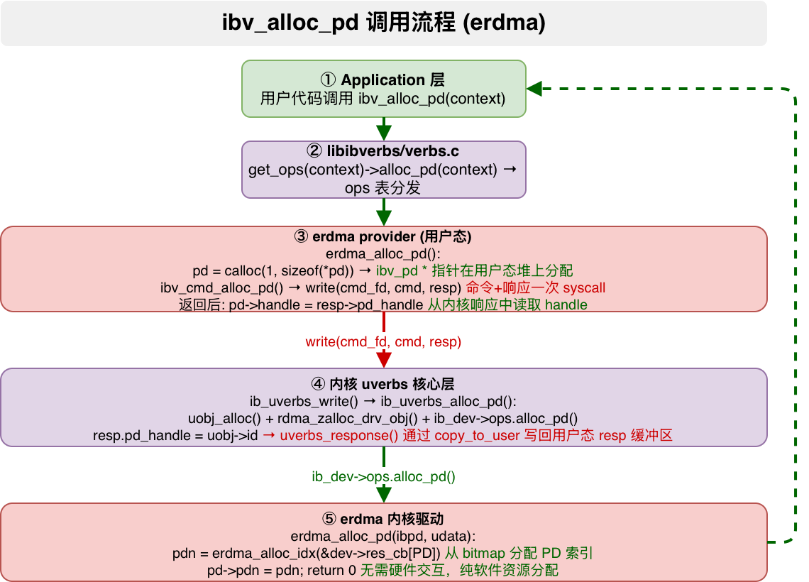

# ibv_alloc_pd 调用流程分析（以 erdma 网卡为例）

> 分析范围：应用程序 → rdma-core libibverbs → erdma provider → 内核 uverbs 核心 → erdma 内核驱动
>
> 内核版本: linux-6.12.92 | rdma-core 对应内核头文件同步版本

---

## 1. 概述

`ibv_alloc_pd` 用于分配一个 **Protection Domain（PD，保护域）**。PD 是 RDMA 中最重要的资源隔离单元，它关联了 MR（内存区域）、QP（队列对）、AH（地址句柄）等资源。同一个 PD 内的资源可以互相访问，不同 PD 之间隔离。



整个调用路径涉及 **5 层** 软件栈：

```
Application (用户程序)
    ↓
rdma-core libibverbs (verbs.c) — 通用 ops 分发
    ↓
rdma-core erdma provider (rdma-core/providers/erdma/) — 厂商实现
    ↓
write() 系统调用 (/dev/infiniband/uverbsX)
    ↓
内核 uverbs 核心层 (linux-6.12.92/drivers/infiniband/core/) — 命令分发 + 对象管理
    ↓
内核 erdma 驱动 (linux-6.12.92/drivers/infiniband/hw/erdma/) — 硬件资源分配
```

---

## 2. 关键数据结构

### 2.1 用户态数据结构

**`struct ibv_pd`** — 用户态 PD 表示 (`rdma-core/libibverbs/verbs.h:631`)

```c
struct ibv_pd {
    struct ibv_context     *context;  // 所属设备上下文
    uint32_t               handle;    // 内核返回的 PD 句柄 (uobj->id)
};
```

> 该结构极其简洁：只记录了所属 context 和内核分配的 handle。handle 用于后续所有需要 PD 的操作（如 reg_mr, create_qp）作为参数传递给内核。

### 2.2 内核态数据结构

**`struct ib_pd`** — 内核通用 PD 结构 (`linux-6.12.92/include/rdma/ib_verbs.h:1550`)

```c
struct ib_pd {
    u32                     local_dma_lkey;
    u32                     flags;
    struct ib_device       *device;       // 所属 RDMA 设备
    struct ib_uobject      *uobject;      // 关联的 uobject (用于用户态映射)
    atomic_t                usecnt;       // 引用计数 (跟踪所有关联资源)
    u32                     unsafe_global_rkey;
    struct ib_mr           *__internal_mr;
    struct rdma_restrack_entry res;        // 资源跟踪
};
```

**`struct erdma_pd`** — erdma 驱动私有 PD 结构 (`linux-6.12.92/drivers/infiniband/hw/erdma/erdma_verbs.h:59`)

```c
struct erdma_pd {
    struct ib_pd ibpd;   // 嵌入通用 ib_pd
    u32 pdn;             // erdma 硬件 PD 编号 (PD Index)
};
```

> erdma 的 PD 私有数据只有一个 `pdn`，它是从设备 bitmap 中分配的一个索引号。

**`struct erdma_resource_cb`** — erdma 资源分配管理器 (`linux-6.12.92/drivers/infiniband/hw/erdma/erdma.h:170`)

```c
struct erdma_resource_cb {
    unsigned long *bitmap;        // 资源分配位图
    spinlock_t     lock;          // 保护位图的自旋锁
    u32            next_alloc_idx; // 下一次分配起点 (用于 round-robin)
    u32            max_cap;       // 最大容量
};
```

**`struct erdma_dev`** — erdma 设备对象（部分成员）(`linux-6.12.92/drivers/infiniband/hw/erdma/erdma.h:183`)

```c
struct erdma_dev {
    struct ib_device ibdev;                        // 嵌入通用 ib_device
    // ...
    struct erdma_resource_cb res_cb[ERDMA_RES_CNT]; // 资源池: [PD, STAG_IDX]
    struct xarray qp_xa;                            // QP 分配表
    struct xarray cq_xa;                            // CQ 分配表
    // ...
};
```

其中资源类型枚举:
```c
enum {
    ERDMA_RES_TYPE_PD = 0,      // PD 资源
    ERDMA_RES_TYPE_STAG_IDX = 1, // STAG 索引资源
    ERDMA_RES_CNT = 2,
};
```

---

## 3. 完整调用流程

### Step 1: 应用程序调用

```c
// 用户代码
struct ibv_pd *pd = ibv_alloc_pd(context);
```

应用程序传入已打开的 `ibv_context`（通过 `ibv_open_device` 获取，代表 `/dev/infiniband/uverbsX` 的一个打开实例），调用 `ibv_alloc_pd`。

---

### Step 2: libibverbs 通用入口 — `ibv_alloc_pd()`

**文件**: `rdma-core/libibverbs/verbs.c:290-301`

```c
LATEST_SYMVER_FUNC(ibv_alloc_pd, 1_1, "IBVERBS_1.1",
                   struct ibv_pd *,
                   struct ibv_context *context)
{
    struct ibv_pd *pd;

    pd = get_ops(context)->alloc_pd(context);   // ← ops 表分发到 provider
    if (pd)
        pd->context = context;                   // 记录所属 context

    return pd;
}
```

**关键点**：

- `LATEST_SYMVER_FUNC` 是 ELF 符号版本控制宏，用于 ABI 兼容性
- `get_ops()` 从 `verbs_context` 中提取 ops 函数指针表
- 该函数不关心具体 provider，只做通用 ops 分发 + 设置 context

**`get_ops()` 实现** (`rdma-core/libibverbs/ibverbs.h:85`):

```c
static inline const struct verbs_context_ops *get_ops(struct ibv_context *ctx)
{
    return &get_priv(ctx)->ops;
}
```

---

### Step 3: ops 表注册 — `verbs_set_ops()`

**文件**: `rdma-core/providers/erdma/erdma.c:20-62`

在 `erdma_alloc_context()` 中，erdma provider 注册自己的 ops 表：

```c
static const struct verbs_context_ops erdma_context_ops = {
    .alloc_pd   = erdma_alloc_pd,       // PD 分配
    .dealloc_pd = erdma_free_pd,        // PD 释放
    .create_cq  = erdma_create_cq,      // CQ 创建
    .create_qp  = erdma_create_qp,      // QP 创建
    .reg_mr     = erdma_reg_mr,         // MR 注册
    .query_device_ex = erdma_query_device,
    .query_port     = erdma_query_port,
    .poll_cq        = erdma_poll_cq,
    .post_send      = erdma_post_send,
    .post_recv      = erdma_post_recv,
    // ...
};

// 在 erdma_alloc_context() 中调用:
verbs_set_ops(&ctx->ibv_ctx, &erdma_context_ops);
```

> `verbs_context_ops` 结构体 (`driver.h:311`) 定义了所有 verbs 操作的函数指针，每个 provider 需实现自己的一套。

---

### Step 4: erdma provider `erdma_alloc_pd()`

**文件**: `rdma-core/providers/erdma/erdma_verbs.c:68-84`

```c
struct ibv_pd *erdma_alloc_pd(struct ibv_context *ctx)
{
    struct ib_uverbs_alloc_pd_resp resp;
    struct ibv_alloc_pd cmd = {};
    struct ibv_pd *pd;

    // 1. 在用户态堆上分配 ibv_pd 结构
    pd = calloc(1, sizeof(*pd));
    if (!pd)
        return NULL;

    // 2. 调用通用命令传输函数，与内核通信
    if (ibv_cmd_alloc_pd(ctx, pd, &cmd, sizeof(cmd), &resp, sizeof(resp))) {
        free(pd);
        return NULL;
    }
    // ibv_cmd_alloc_pd 成功后:
    //   pd->handle  = resp.pd_handle;  (从内核响应中读取)
    //   pd->context = context;         (已设置)

    return pd;  // 返回 ibv_pd * 指针
}
```

**关键设计**：

- **`ibv_pd *` 指针完全在用户态堆上分配**（calloc），内核不感知用户态指针
- erdma 的 alloc_pd 实现非常简洁，不需要做任何特殊的 MMIO 映射或私有数据初始化
- 实际"分配"动作在内核侧完成，用户态通过 `ibv_cmd_alloc_pd()` 发送命令

---

### Step 5: 命令传输 — `ibv_cmd_alloc_pd()`

**文件**: `rdma-core/libibverbs/cmd.c:50-65`

```c
int ibv_cmd_alloc_pd(struct ibv_context *context, struct ibv_pd *pd,
                     struct ibv_alloc_pd *cmd, size_t cmd_size,
                     struct ib_uverbs_alloc_pd_resp *resp, size_t resp_size)
{
    int ret;

    // 通过 write() 系统调用发送命令给内核
    // cmd 中包含命令头 (IB_USER_VERBS_CMD_ALLOC_PD)
    // resp 缓冲区地址提前嵌入 cmd 中，内核直接写回数据
    ret = execute_cmd_write(context, IB_USER_VERBS_CMD_ALLOC_PD,
                            cmd, cmd_size, resp, resp_size);
    if (ret)
        return ret;

    // 从内核写回的 resp 中读取 pd_handle
    pd->handle  = resp->pd_handle;
    pd->context = context;

    return 0;
}
```

**关键点**：

- `execute_cmd_write` 是宏，展开后调用 `_execute_cmd_write()`
- 用户态将 **cmd 和 resp 缓冲区的地址** 都嵌入到命令中传给内核
- 内核处理完毕后，通过 `copy_to_user` 将响应数据（含 `pd_handle`）直接写入用户的 resp 缓冲区

---

### Step 6: write() 系统调用 — `_execute_cmd_write()`

**文件**: `rdma-core/libibverbs/cmd_fallback.c:233-257`

```c
int _execute_cmd_write(struct ibv_context *ctx, unsigned int write_method,
                       void *vreq, size_t core_req_size,
                       size_t req_size, void *resp, size_t core_resp_size,
                       size_t resp_size)
{
    struct ib_uverbs_cmd_hdr *req = vreq;

    // 尝试 ioctl 路径（如果设备支持）
    if (!VERBS_WRITE_ONLY && (VERBS_IOCTL_ONLY || priv->use_ioctl_write))
        return ioctl_write(...);

    // 填充命令头
    req->command    = write_method;          // IB_USER_VERBS_CMD_ALLOC_PD
    req->in_words   = __check_divide(req_size, 4);   // 输入长度(4字节为单位)
    req->out_words  = __check_divide(resp_size, 4);  // 输出长度(4字节为单位)

    // write() 系统调用 — 发送到 /dev/infiniband/uverbsX
    if (write(ctx->cmd_fd, vreq, req_size) != req_size)
        return errno;

    // write() 返回后，resp 缓冲区已被内核写入响应数据
    if (resp)
        VALGRIND_MAKE_MEM_DEFINED(resp, resp_size);
    return 0;
}
```

**关键点**：

- `ctx->cmd_fd` 是 `/dev/infiniband/uverbsX` 的设备文件描述符
- `in_words` / `out_words` 分别表示命令和响应的大小，内核据此拆分缓冲区
- 命令头中包含了响应缓冲区的用户态地址（`cmd->core_payload.response`），内核通过 `copy_to_user` 写回

---

### Step 7: 内核入口 — `ib_uverbs_write()`

**文件**: `linux-6.12.92/drivers/infiniband/core/uverbs_main.c:570-679`

```c
static ssize_t ib_uverbs_write(struct file *filp, const char __user *buf,
                               size_t count, loff_t *pos)
{
    struct ib_uverbs_file *file = filp->private_data;
    const struct uverbs_api_write_method *method_elm;
    struct ib_uverbs_cmd_hdr hdr;
    struct uverbs_attr_bundle bundle;
    // ...

    // 1. 从用户态拷贝命令头
    if (copy_from_user(&hdr, buf, sizeof(hdr)))
        return -EFAULT;

    // 2. 根据 command 号查找 handler
    //    IB_USER_VERBS_CMD_ALLOC_PD → ib_uverbs_alloc_pd
    method_elm = uapi_get_method(uapi, hdr.command);

    // 3. 根据 has_udata/has_resp 标志设置驱动数据缓冲区
    //    将用户态传入的 provider 数据和响应缓冲区映射到内核

    // 4. 调用 handler
    ret = method_elm->handler(&bundle);
    // ↑ 相当于调用 ib_uverbs_alloc_pd(&bundle)
    // ...
}
```

**关键点**：

- `method_elm->handler` 是一个函数指针，通过 `uapi_get_method` 从 command ID 查表定位
- `uverbs_attr_bundle` 是内核传递参数的载体，包含了从用户态拷贝的 cmd、驱动数据、响应缓冲区等信息
- handler 的注册在编译时通过 `UAPI_DEF_WRITE_UDATA_IO` 等宏完成

**handler 注册** (`uverbs_cmd.c:3890`):

```c
UAPI_DEF_WRITE_UDATA_IO(struct ib_uverbs_alloc_pd,
                         struct ib_uverbs_alloc_pd_resp),
```

---

### Step 8: 内核 uverbs 核心 — `ib_uverbs_alloc_pd()`

**文件**: `linux-6.12.92/drivers/infiniband/core/uverbs_cmd.c:419-466`

```c
static int ib_uverbs_alloc_pd(struct uverbs_attr_bundle *attrs)
{
    struct ib_uverbs_alloc_pd_resp resp = {};
    struct ib_uverbs_alloc_pd      cmd;
    struct ib_uobject             *uobj;
    struct ib_pd                  *pd;
    int                            ret;
    struct ib_device              *ib_dev;

    // 1. 从用户态拷贝命令数据
    ret = uverbs_request(attrs, &cmd, sizeof(cmd));
    if (ret)
        return ret;

    // 2. 分配 uobject (内核对象管理系统)
    //    uobj_alloc 会分配 struct ib_uobject，并分配一个 ID (idr 分配)
    //    这个 ID 就是后续返回给用户态的 pd_handle
    uobj = uobj_alloc(UVERBS_OBJECT_PD, attrs, &ib_dev);
    if (IS_ERR(uobj))
        return PTR_ERR(uobj);

    // 3. 分配 ib_pd (驱动通用结构)
    //    rdma_zalloc_drv_obj 会调用 ib_dev->ops.size_ib_pd 获取大小
    //    对于 erdma，它分配的是 sizeof(struct erdma_pd) 空间
    pd = rdma_zalloc_drv_obj(ib_dev, ib_pd);
    if (!pd) {
        ret = -ENOMEM;
        goto err;
    }

    pd->device  = ib_dev;       // 关联设备
    pd->uobject = uobj;         // 关联 uobject
    atomic_set(&pd->usecnt, 0); // 初始化引用计数

    // 4. 调用 RDMA 驱动层的 alloc_pd 回调
    ret = ib_dev->ops.alloc_pd(pd, &attrs->driver_udata);
    if (ret)
        goto err_alloc;

    // 5. uobject 关联到 pd，标记创建成功
    uobj->object = pd;
    uobj_finalize_uobj_create(uobj, attrs);

    // 6. 设置响应: pd_handle = uobj->id (即 idr 分配的 ID)
    resp.pd_handle = uobj->id;

    // 7. 通过 copy_to_user 将 resp 写回用户态缓冲区
    return uverbs_response(attrs, &resp, sizeof(resp));

    // 错误处理路径...
err_alloc:
    rdma_restrack_put(&pd->res);
    kfree(pd);
err:
    uobj_alloc_abort(uobj, attrs);
    return ret;
}
```

**关键点**：

- **`uobj_alloc`**：分配内核对象 `ib_uobject`，通过 idr 分配一个唯一 ID。这个 ID 就是 `pd_handle`
- **`rdma_zalloc_drv_obj`**：根据驱动注册的 `size_ib_pd` 分配内存（对 erdma 是 `sizeof(erdma_pd)`），确保驱动私有数据有足够空间
- **`ib_dev->ops.alloc_pd()`**：调用具体驱动的 alloc_pd 回调
- **`uverbs_response()`**：内部通过 `copy_to_user` 将 `resp.pd_handle` 写回用户态

**`uverbs_response()` 实现** (`uverbs_cmd.c:58`):

```c
static int uverbs_response(struct uverbs_attr_bundle *attrs, const void *resp,
                           size_t resp_len)
{
    if (uverbs_attr_is_valid(attrs, UVERBS_ATTR_CORE_OUT))
        return uverbs_copy_to_struct_or_zero(
                attrs, UVERBS_ATTR_CORE_OUT, resp, resp_len);

    // 直接 copy_to_user 到用户态的响应缓冲区
    if (copy_to_user(attrs->ucore.outbuf, resp,
                     min(attrs->ucore.outlen, resp_len)))
        return -EFAULT;
    // ...
}
```

**`rdma_zalloc_drv_obj` 宏** (`linux-6.12.92/include/rdma/ib_verbs.h:2288`):

```c
#define rdma_zalloc_drv_obj_gfp(ib_dev, ib_type, gfp)                          \
    ((struct ib_type *)rdma_zalloc_obj(ib_dev, ib_dev->ops.size_##ib_type,      \
                                       gfp, false))

#define rdma_zalloc_drv_obj(ib_dev, ib_type)                                   \
    rdma_zalloc_drv_obj_gfp(ib_dev, ib_type, GFP_KERNEL)
```

> 驱动通过 `DECLARE_RDMA_OBJ_SIZE(ib_pd)` 声明 `size_ib_pd` 变量，并在初始化时赋值。erdma 驱动的赋值在 `erdma_main.c` 中：
> ```c
> static int erdma_ib_device_init(struct erdma_dev *dev)
> {
>     ibdev = &dev->ibdev;
>     ibdev->ops.size_ib_pd = sizeof(struct erdma_pd);
>     // ...
> }
> ```

---

### Step 9: erdma 内核驱动 — `erdma_alloc_pd()`

**文件**: `linux-6.12.92/drivers/infiniband/hw/erdma/erdma_verbs.c:404-417`

```c
int erdma_alloc_pd(struct ib_pd *ibpd, struct ib_udata *udata)
{
    struct erdma_pd *pd = to_epd(ibpd);          // container_of 获取 erdma 私有结构
    struct erdma_dev *dev = to_edev(ibpd->device); // 获取 erdma 设备对象
    int pdn;

    // 从 PD 资源位图中分配一个空闲索引
    pdn = erdma_alloc_idx(&dev->res_cb[ERDMA_RES_TYPE_PD]);
    if (pdn < 0)
        return pdn;

    pd->pdn = pdn;   // 保存分配到的 PD 编号

    return 0;        // 成功
}
```

**关键点**：

- **`to_epd()`**：`container_of(ibpd, struct erdma_pd, ibpd)` 从通用 `ib_pd` 获取 `erdma_pd`
- **`erdma_alloc_idx()`**：基于 bitmap 的轻量级资源分配器
- **`udata` 参数**：从用户态传递过来的额外数据，erdma 的 alloc_pd 不需要使用（mlx5 等复杂驱动可能需要）
- 整个分配**不需要与硬件交互**（没有 MMIO 读写、没有 DMA 描述符），纯软件资源管理

---

### Step 10: erdma 资源索引分配 — `erdma_alloc_idx()`

**文件**: `linux-6.12.92/drivers/infiniband/hw/erdma/erdma_verbs.c:246-268`

```c
static int erdma_alloc_idx(struct erdma_resource_cb *res_cb)
{
    int idx;
    unsigned long flags;

    spin_lock_irqsave(&res_cb->lock, flags);

    // 从 next_alloc_idx 开始查找第一个空闲位 (round-robin 优化)
    idx = find_next_zero_bit(res_cb->bitmap, res_cb->max_cap,
                             res_cb->next_alloc_idx);

    if (idx == res_cb->max_cap) {
        // 后半段没有空闲位，从头开始找
        idx = find_first_zero_bit(res_cb->bitmap, res_cb->max_cap);
        if (idx == res_cb->max_cap) {
            // bitmap 全满，资源耗尽
            spin_unlock_irqrestore(&res_cb->lock, flags);
            return -ENOSPC;
        }
    }

    // 标记该位已使用
    set_bit(idx, res_cb->bitmap);

    // 更新下一次分配起点 (避免每次都从头扫描)
    res_cb->next_alloc_idx = idx + 1;

    spin_unlock_irqrestore(&res_cb->lock, flags);

    return idx;
}
```

**关键点**：

- **`find_next_zero_bit` / `find_first_zero_bit`**：标准内核 bitmap API，O(n) 扫描
- **`next_alloc_idx`**：记录下一次分配起点的游标，避免每次都从位图头部开始扫描
- **`spin_lock_irqsave`**：使用自旋锁保护位图操作（可能被中断上下文调用？实际 erdma 的 alloc_pd 只会在进程上下文调用，但这里用了最保守的锁保护）
- **`ERDMA_MAX_PD = 128 * 1024`**：最多支持 128K 个 PD

---

## 4. 返回路径详解

### 返回数据流

```
⑤ erdma 内核驱动: return 0
    ↓
④ ib_uverbs_alloc_pd():
    resp.pd_handle = uobj->id;
    uverbs_response() → copy_to_user(用户态 resp 缓冲区)
    ↓
③ ibv_cmd_alloc_pd():
    pd->handle = resp->pd_handle;  (从内核写回的缓冲区读取)
    return 0;
    ↓
   erdma_alloc_pd():
    return pd;  (返回 calloc 分配的 ibv_pd * 指针)
    ↓
② ibv_alloc_pd():
    pd->context = context;
    return pd;
    ↓
① 用户代码拿到 ibv_pd * 指针
```

### 关键理解

| 概念 | 说明 |
|------|------|
| `ibv_pd *` **指针** | 纯用户态地址，在③中 `calloc` 分配，内核完全不知晓 |
| `pd->handle` | 内核返回的 uobject ID，后续所有需要 PD 的操作都通过这个 handle 标识 PD |
| **响应机制** | `write()` 系统调用一次完成"发送命令+接收响应"，内核通过 `copy_to_user` 写回 resp |

---

## 5. 总结

### erdma PD 分配特点

1. **用户态 provider 极简**：`calloc` 分配 + 调用通用 `ibv_cmd_alloc_pd()`，没有额外的 MMIO 映射或私有数据
2. **内核驱动实现极简**：纯 bitmap 索引分配，无需任何硬件交互
3. **PD 资源容量大**：支持最大 128K 个 PD

### 完整调用链一览

| 步骤 | 文件/函数 | 核心动作 |
|------|-----------|----------|
| ① | 用户代码 | `ibv_alloc_pd(context)` |
| ② | `rdma-core/libibverbs/verbs.c:290` | `get_ops()->alloc_pd()` ops 分发 |
| ③ | `rdma-core/providers/erdma/erdma_verbs.c:68` | `calloc(ibv_pd)` + `ibv_cmd_alloc_pd()` |
| ④ | `rdma-core/libibverbs/cmd.c:50` | `execute_cmd_write(IB_USER_VERBS_CMD_ALLOC_PD)` |
| ⑤ | `rdma-core/libibverbs/cmd_fallback.c:233` | `write(ctx->cmd_fd, ...)` 系统调用 |
| ⑥ | `uverbs_main.c:570` | `ib_uverbs_write()` 命令分发 |
| ⑦ | `uverbs_cmd.c:419` | `uobj_alloc()` + `rdma_zalloc_drv_obj()` |
| ⑧ | `uverbs_cmd.c:449` | `ib_dev->ops.alloc_pd(pd, udata)` 回调驱动 |
| ⑨ | `linux-6.12.92/drivers/infiniband/hw/erdma/erdma_verbs.c:404` | `erdma_alloc_idx()` bitmap 分配 PD 索引 |
| ⑩ | `uverbs_cmd.c:457` | `resp.pd_handle = uobj->id` → `copy_to_user` 回写 |

---

## 附录: 相关文件路径

| 组件 | 路径 |
|------|------|
| libibverbs 入口 | `rdma-core/libibverbs/verbs.c` |
| 命令传输 | `rdma-core/libibverbs/cmd.c` |
| write 封装 | `rdma-core/libibverbs/cmd_fallback.c` |
| ops 定义 | `rdma-core/libibverbs/driver.h` |
| get_ops 实现 | `rdma-core/libibverbs/ibverbs.h` |
| 用户态 erdma provider | `rdma-core/providers/erdma/erdma_verbs.c` |
| 用户态 erdma ops 注册 | `rdma-core/providers/erdma/erdma.c` |
| 内核 uverbs 入口 | `linux-6.12.92/drivers/infiniband/core/uverbs_main.c` |
| 内核 uverbs 命令处理 | `linux-6.12.92/drivers/infiniband/core/uverbs_cmd.c` |
| 内核通用数据结构 | `linux-6.12.92/include/rdma/ib_verbs.h` |
| 内核 erdma 驱动 | `linux-6.12.92/drivers/infiniband/hw/erdma/erdma_verbs.c` |
| 内核 erdma 头文件 | `linux-6.12.92/drivers/infiniband/hw/erdma/erdma_verbs.h` |
| 内核 erdma 设备结构 | `linux-6.12.92/drivers/infiniband/hw/erdma/erdma.h` |
