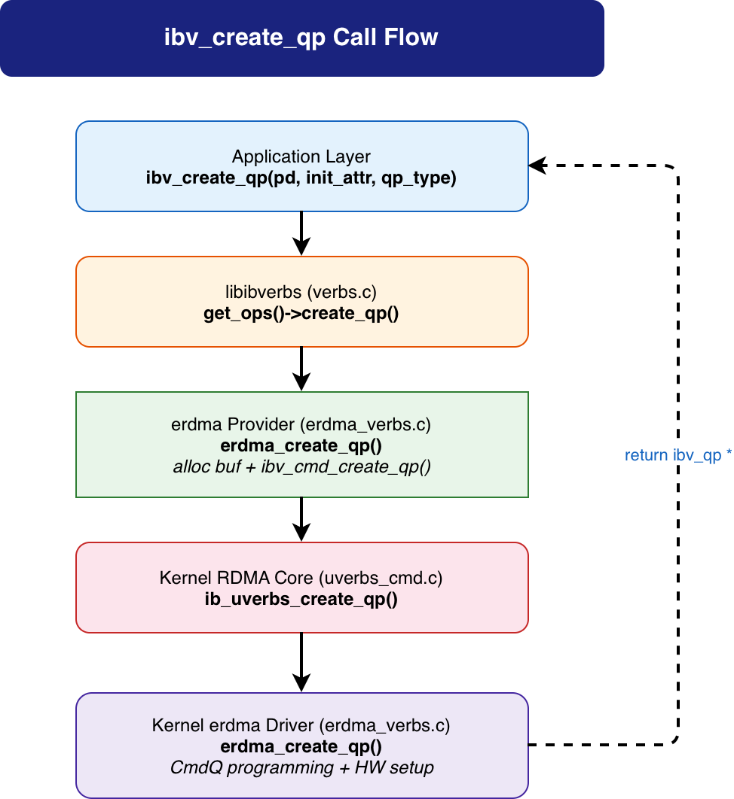

# ibv_create_qp 调用流程分析（以 erdma 网卡为例）

> 分析范围：应用程序 → rdma-core libibverbs → erdma provider → 内核 uverbs 核心 → erdma 内核驱动
>
> 内核版本: linux-6.12.92 | rdma-core 对应内核头文件同步版本

---

## 1. 概述

`ibv_create_qp` 用于创建 **队列对（Queue Pair, QP）**。QP 是 RDMA 通信的基本端点，包含 **SQ（发送队列）** 和 **RQ（接收队列）** 两个工作队列。用户态通过 `ibv_post_send` / `ibv_post_recv` 提交工作请求（WR），硬件异步执行并通过 CQ 返回完成事件。



整个调用路径涉及 **5 层** 软件栈：

```
Application (用户程序)
    ↓
rdma-core libibverbs (verbs.c) — 通用 ops 分发
    ↓
rdma-core erdma provider (rdma-core/providers/erdma/) — 厂商实现
    ↓
write() 系统调用 (/dev/infiniband/uverbsX)
    ↓
内核 uverbs 核心层 (linux-6.12.92/drivers/infiniband/core/) — 命令分发 + 对象管理
    ↓
内核 erdma 驱动 (linux-6.12.92/drivers/infiniband/hw/erdma/) — QP 资源分配 + 硬件配置
```

---

## 2. 关键数据结构

### 2.1 用户态数据结构

**`struct ibv_qp`** — 用户态 QP 表示 (`rdma-core/libibverbs/verbs.h:1282`)

```c
struct ibv_qp {
    struct ibv_context     *context;    // 所属设备上下文
    void                   *qp_context; // 用户注册的上下文指针
    struct ibv_pd          *pd;         // 所属保护域
    struct ibv_srq         *srq;        // 关联的 SRQ (若有)
    struct ibv_cq          *send_cq;    // SQ 关联的完成队列
    struct ibv_cq          *recv_cq;    // RQ 关联的完成队列
    uint32_t                handle;     // 内核返回的 QP 句柄 (uobj->id)
    uint32_t                qp_num;     // QP 编号 (硬件唯一标识)
    ibv_qp_state            state;      // QP 状态 (RESET/INIT/RTR/RTS/...)
    enum ibv_qp_type        qp_type;    // QP 类型 (RC/UC/UD/RAW 等)
    pthread_mutex_t         mutex;      // 状态保护锁
    struct ibv_qp_cap       cap;        // QP 能力 (SQ/RQ 深度、SGE 数等)
};
```

**`struct erdma_qp`** — erdma 用户态 QP (`rdma-core/providers/erdma/erdma_verbs.h:37`)

```c
struct erdma_qp {
    struct ibv_qp       base_qp;       // 嵌入通用 ibv_qp
    struct erdma_sq     sq;            // 发送队列 (SQ)
    struct erdma_rq     rq;            // 接收队列 (RQ)
    void               *qbuf;          // QP 队列缓冲 (SQ WQE + RQ RQE)
    size_t              qbuf_size;     // 队列缓冲大小
    uint64_t           *db_records;    // Doorbell 记录数组 [sq_db, rq_db]
    uint32_t            id;            // erdma QP 编号
    uint32_t            sq_sig_all;    // 所有 SQ WR 都生成完成事件
    // Doorbell 寄存器
    void               *sdb;           // SQ Doorbell MMIO 地址
    void               *rdb;           // RQ Doorbell MMIO 地址
    // ...
};
```

**内部 SQ/RQ 结构** (`rdma-core/providers/erdma/erdma_verbs.h`):

```c
struct erdma_sq {
    void       *qbuf;       // SQ WQE 队列缓冲 (在 qbuf 的前部分)
    uint32_t   *wr_tbl;     // WR 状态跟踪表
    int         depth;      // SQ 深度 (WQE 数)
    uint32_t    size;       // SQ 总大小 (字节)
    uint32_t    head;       // 生产者索引 (用户态写)
    uint32_t    tail;       // 消费者索引 (硬件更新)
    spinlock_t  lock;       // SQ 锁
};

struct erdma_rq {
    void       *qbuf;       // RQ RQE 队列缓冲 (在 qbuf 的后部分)
    uint32_t   *wr_tbl;     // WR 状态跟踪表
    int         depth;      // RQ 深度 (RQE 数)
    uint32_t    size;       // RQ 总大小 (字节)
    uint32_t    head;       // 生产者索引
    uint32_t    tail;       // 消费者索引
    spinlock_t  lock;       // RQ 锁
};
```

### 2.2 内核态数据结构

**`struct ib_qp`** — 内核通用 QP 结构 (`linux-6.12.92/include/rdma/ib_verbs.h:1781`)

```c
struct ib_qp {
    struct ib_device       *device;        // 所属 RDMA 设备
    struct ib_pd           *pd;            // 所属保护域
    struct ib_cq           *send_cq;       // SQ 完成队列
    struct ib_cq           *recv_cq;       // RQ 完成队列
    struct ib_srq          *srq;           // 关联 SRQ
    struct ib_qp_sec       *qp_sec;        // QP 安全上下文
    struct ib_uobject      *uobject;       // 关联的 uobject
    spinlock_t              mr_lock;
    struct list_head        rdma_mrs;      // 关联的 RDMA MR 列表
    u32                     qp_num;        // QP 编号
    enum ib_qp_type         qp_type;       // QP 类型
    enum ib_qp_state        state;         // QP 状态
    struct rdma_restrack_entry res;          // 资源跟踪
    // ...
};
```

**`struct erdma_qp`** (内核态) — erdma 内核 QP (`linux-6.12.92/drivers/infiniband/hw/erdma/erdma_verbs.h:220`)

```c
struct erdma_qp {
    struct ib_qp ibqp;           // 嵌入通用 ib_qp
    struct erdma_dev *dev;       // 所属设备
    struct erdma_cq *scq;        // 关联的 SQ 完成队列
    struct erdma_cq *rcq;        // 关联的 RQ 完成队列
    u32 qp_state;                // erdma QP 状态
    // 用户态 QP 相关
    struct erdma_user_qp_info user_qp;  // 用户队列缓冲信息
    struct erdma_qp_attrs attrs;        // QP 属性和硬件参数
    // ...
};
```

### 2.3 ABI 结构 (用户态↔内核通信)

**`struct erdma_ureq_create_qp`** — 创建 QP 的用户请求 (`rdma-core/kernel-headers/rdma/erdma-abi.h:25`)

```c
struct erdma_ureq_create_qp {
    __aligned_u64 db_record_va;    // Doorbell 记录的用户态虚拟地址
    __aligned_u64 qbuf_va;         // QP 队列缓冲的用户态虚拟地址
    __u32 qbuf_len;                // 队列缓冲总大小
    __u32 rsvd0;
};
```

**`struct erdma_uresp_create_qp`** — 创建 QP 的内核响应 (`rdma-core/kernel-headers/rdma/erdma-abi.h:32`)

```c
struct erdma_uresp_create_qp {
    __u32 qp_id;                   // erdma QP 编号
    __u32 num_sqe;                 // 实际 SQ 深度
    __u32 num_rqe;                 // 实际 RQ 深度
    __u32 rq_offset;               // RQ 在 qbuf 中的偏移量
};
```

---

## 3. 完整调用流程

### Step 1: 应用程序调用

```c
// 用户代码
struct ibv_qp_init_attr attr = {
    .send_cq    = cq,
    .recv_cq    = cq,
    .qp_type    = IBV_QPT_RC,     // 可靠连接 (RC)
    .cap = {
        .max_send_wr  = 128,
        .max_recv_wr  = 128,
        .max_send_sge = 1,
        .max_recv_sge = 1,
    },
};

struct ibv_qp *qp = ibv_create_qp(pd, &attr);
```

参数: `pd`(保护域)、`attr`(QP 属性包括 SQ/RQ 能力、CQ 关联、QP 类型等)。

---

### Step 2: libibverbs 通用入口 — `ibv_create_qp()`

**文件**: `rdma-core/libibverbs/verbs.c:658-666`

```c
LATEST_SYMVER_FUNC(ibv_create_qp, 1_1, "IBVERBS_1.1",
                   struct ibv_qp *,
                   struct ibv_pd *pd,
                   struct ibv_qp_init_attr *qp_init_attr)
{
    struct ibv_qp *qp = get_ops(pd->context)->create_qp(pd, qp_init_attr);

    return qp;
}
```

**关键点**：

- 与 `ibv_alloc_pd`、`ibv_create_cq` 类似，使用 `get_ops()` ops 表分发
- 该入口非常简洁，QP 创建的复杂逻辑在 provider 层和内核层
- `get_ops(pd->context)`：通过 PD 获取 context，再获取 ops 表

---

### Step 3: erdma provider — `erdma_create_qp()`

**文件**: `rdma-core/providers/erdma/erdma_verbs.c:429-488`

```c
struct ibv_qp *erdma_create_qp(struct ibv_pd *pd, struct ibv_qp_init_attr *attr)
{
    struct erdma_context *ctx = to_ectx(pd->context);
    struct erdma_cmd_create_qp_resp resp = {};
    struct erdma_cmd_create_qp cmd = {};
    struct erdma_qp *qp;
    int rv;

    // 1. 分配用户态 QP 结构
    qp = calloc(1, sizeof(*qp));
    if (!qp)
        return NULL;

    // 2. 分配 QP 队列缓冲 + Doorbell 记录
    //    (SQ WQE + RQ RQE + Doorbell 记录 合并分配)
    rv = erdma_alloc_qp_buf_and_db(ctx, qp, attr);
    if (rv)
        goto err;

    // 3. 填充驱动命令
    cmd.db_record_va = (uintptr_t)qp->db_records;
    cmd.qbuf_va      = (uintptr_t)qp->qbuf;
    cmd.qbuf_len     = (__u32)qp->qbuf_size;

    // 4. 调用通用命令传输 (包含 ibv_cmd_create_qp)
    rv = ibv_cmd_create_qp(pd, &qp->base_qp, attr,
                           &cmd.ibv_cmd, sizeof(cmd),
                           &resp.ibv_resp, sizeof(resp));
    if (rv)
        goto err_cmd;

    // 5. 保存内核返回的 QP 信息
    qp->id       = resp.qp_id;       // erdma QP 编号
    qp->sq.qbuf  = qp->qbuf;         // SQ 队列在 qbuf 起始
    qp->rq.qbuf  = qp->qbuf + resp.rq_offset;  // RQ 在偏移处
    qp->sq.depth = resp.num_sqe;     // SQ 实际深度
    qp->rq.depth = resp.num_rqe;     // RQ 实际深度
    qp->sq.size  = resp.num_sqe * SQEBB_SIZE;
    qp->rq.size  = resp.num_rqe * sizeof(struct erdma_rqe);

    // 6. 分配 Doorbell 寄存器地址 (MMIO 映射)
    __erdma_alloc_dbs(qp, ctx);

    // 7. 分配 WR 跟踪表
    rv = erdma_alloc_wrid_tbl(qp);
    if (rv)
        goto err_wrid_tbl;

    // 8. 在 context 中记录 QP (用于错误恢复等)
    rv = erdma_store_qp(ctx, qp);
    if (rv) {
        errno = -rv;
        goto err_store;
    }

    return &qp->base_qp;

    // 错误处理...
err_store:
    erdma_free_wrid_tbl(qp);
err_wrid_tbl:
    ibv_cmd_destroy_qp(&qp->base_qp);
err_cmd:
    erdma_free_qp_buf_and_db(ctx, qp);
err:
    free(qp);
    return NULL;
}
```

**关键设计**：

- **`erdma_alloc_qp_buf_and_db()`**：一次性分配 SQ WQE 队列、RQ RQE 队列、Doorbell 记录三块内存
  - SQ WQE 和 RQ RQE 在同一个 `qbuf` 中（SQ 在前，RQ 在后，由内核确定 RQ 偏移）
  - Doorbell 记录通过 `erdma_alloc_dbrecords()` 分配
- **QP 队列缓冲布局**：`[SQ WQE 区域 + RQ RQE 区域]`，`resp.rq_offset` 指定 RQ 起始位置
- **QP 创建后仍处于 RESET 状态**，需要 `ibv_modify_qp` → INIT → RTR → RTS 后才能通信

---

### Step 4: QP 队列缓冲分配 — `erdma_alloc_qp_buf_and_db()`

```c
static int erdma_alloc_qp_buf_and_db(struct erdma_context *ctx,
                                     struct erdma_qp *qp,
                                     struct ibv_qp_init_attr *attr)
{
    int sq_size, rq_size;

    // 计算 SQ/RQ 大小 (向上取整到页)
    qp->sq.depth = roundup_pow_of_two(attr->cap.max_send_wr);
    qp->rq.depth = roundup_pow_of_two(attr->cap.max_recv_wr);

    sq_size = align(qp->sq.depth * SQEBB_SIZE, ERDMA_PAGE_SIZE);
    rq_size = align(qp->rq.depth * sizeof(struct erdma_rqe), ERDMA_PAGE_SIZE);
    qp->qbuf_size = sq_size + rq_size;

    // 页对齐分配 QP 队列缓冲
    rv = posix_memalign((void **)&qp->qbuf, ERDMA_PAGE_SIZE, qp->qbuf_size);
    if (rv)
        return rv;

    // 锁定内存，防止 swap
    rv = ibv_dontfork_range(qp->qbuf, qp->qbuf_size);
    if (rv) {
        free(qp->qbuf);
        return rv;
    }
    memset(qp->qbuf, 0, qp->qbuf_size);

    // 分配 Doorbell 记录
    qp->db_records = erdma_alloc_dbrecords(ctx);
    if (!qp->db_records) {
        ibv_dofork_range(qp->qbuf, qp->qbuf_size);
        free(qp->qbuf);
        return -ENOMEM;
    }

    return 0;
}
```

> 关键：SQ WQE 和 RQ RQE 在连续的 `qbuf` 中布局，Doorbell 记录单独分配。所有缓冲页对齐并锁定。

---

### Step 5: 命令传输 — `ibv_cmd_create_qp()`

**文件**: `rdma-core/libibverbs/cmd_qp.c:373-399`

```c
int ibv_cmd_create_qp(struct ibv_pd *pd,
                      struct ibv_qp *qp, struct ibv_qp_init_attr *attr,
                      struct ibv_create_qp *cmd, size_t cmd_size,
                      struct ib_uverbs_create_qp_resp *resp, size_t resp_size)
{
    DECLARE_CMD_BUFFER_COMPAT(cmdb, UVERBS_OBJECT_QP,
                              UVERBS_METHOD_QP_CREATE, cmd, cmd_size, resp,
                              resp_size);

    struct ibv_qp_init_attr_ex attr_ex = {};
    int ret;

    // 填充扩展属性 (将旧接口转换为扩展接口)
    attr_ex.qp_context = attr->qp_context;
    attr_ex.send_cq    = attr->send_cq;
    attr_ex.recv_cq    = attr->recv_cq;
    attr_ex.srq        = attr->srq;
    attr_ex.cap        = attr->cap;
    attr_ex.qp_type    = attr->qp_type;
    attr_ex.sq_sig_all = attr->sq_sig_all;
    attr_ex.comp_mask  = IBV_QP_INIT_ATTR_PD;
    attr_ex.pd         = pd;

    ret = ibv_icmd_create_qp(pd->context, NULL, qp, &attr_ex, cmdb);
    if (!ret)
        memcpy(&attr->cap, &attr_ex.cap, sizeof(attr_ex.cap));

    return ret;
}
```

> 内部通过 `ibv_icmd_create_qp` 使用新式 ioctl 命令缓冲区完成通信，最终调用 `execute_cmd_write` 或 `execute_ioctl`。

---

### Step 6: write() 系统调用

```
cmd_fd → write() → /dev/infiniband/uverbsX → 内核 ib_uverbs_write()
```

`IB_USER_VERBS_CMD_CREATE_QP` 对应的 handler 为 `ib_uverbs_create_qp`。

---

### Step 7: 内核 uverbs 核心 — `ib_uverbs_create_qp()` → `create_qp()`

**文件**: `linux-6.12.92/drivers/infiniband/core/uverbs_cmd.c:1511-1537` / `uverbs_std_types_qp.c`

```c
static int ib_uverbs_create_qp(struct uverbs_attr_bundle *attrs)
{
    struct ib_uverbs_create_qp      cmd;
    struct ib_uverbs_ex_create_qp   cmd_ex;
    int ret;

    ret = uverbs_request(attrs, &cmd, sizeof(cmd));
    if (ret)
        return ret;

    // 转换为扩展命令
    cmd_ex.user_handle    = cmd.user_handle;
    cmd_ex.pd_handle      = cmd.pd_handle;
    cmd_ex.send_cq_handle = cmd.send_cq_handle;
    cmd_ex.recv_cq_handle = cmd.recv_cq_handle;
    cmd_ex.max_send_wr    = cmd.max_send_wr;
    cmd_ex.max_recv_wr    = cmd.max_recv_wr;
    cmd_ex.max_send_sge   = cmd.max_send_sge;
    cmd_ex.max_recv_sge   = cmd.max_recv_sge;
    cmd_ex.qp_type        = cmd.qp_type;
    cmd_ex.sq_sig_all     = cmd.sq_sig_all;

    return create_qp(attrs, &cmd_ex);
}
```

**内部 `create_qp()` 处理流程**:

```c
static int create_qp(struct uverbs_attr_bundle *attrs,
                     struct ib_uverbs_ex_create_qp *cmd)
{
    struct ib_uqp_object *obj;
    struct ib_qp *qp;
    struct ib_pd *pd;
    struct ib_cq *scq, *rcq;
    struct ib_device *device;

    // 1. 分配 uobject (QP 对象 + 多播列表 + 事件管理)
    obj = uobj_alloc(UVERBS_OBJECT_QP, attrs, &device);
    if (IS_ERR(obj))
        return PTR_ERR(obj);

    // 2. 查找关联资源: PD / Send CQ / Recv CQ / SRQ / XRCD
    pd  = uobj_get_obj_read(pd, UVERBS_OBJECT_PD, cmd->pd_handle, attrs);
    scq = uobj_get_obj_read(cq, UVERBS_OBJECT_CQ, cmd->send_cq_handle, attrs);
    rcq = uobj_get_obj_read(cq, UVERBS_OBJECT_CQ, cmd->recv_cq_handle, attrs);

    // 3. 初始化 QP 属性
    attr.qp_type       = cmd->qp_type;
    attr.send_cq       = scq;
    attr.recv_cq       = rcq;
    attr.cap.max_send_wr  = cmd->max_send_wr;
    attr.cap.max_recv_wr  = cmd->max_recv_wr;
    attr.cap.max_send_sge = cmd->max_send_sge;
    attr.cap.max_recv_sge = cmd->max_recv_sge;

    // 4. 创建 QP (调用 ib_create_qp_user → create_qp)
    qp = ib_create_qp_user(device, pd, &attr, &attrs->driver_udata, obj,
                           KBUILD_MODNAME);
    if (IS_ERR(qp))
        goto err_put;

    // 5. 增加所有关联资源的引用计数
    ib_qp_usecnt_inc(qp);

    // 6. 设置响应
    uobj->object = qp;
    resp.base.qpn             = qp->qp_num;
    resp.base.qp_handle       = obj->uevent.uobject.id;
    resp.base.max_send_wr     = attr.cap.max_send_wr;
    resp.base.max_recv_wr     = attr.cap.max_recv_wr;
    return uverbs_response(attrs, &resp, sizeof(resp));
    // ...
}
```

---

### Step 8: 内核 QP 创建 — `ib_create_qp_user()` → `create_qp()`

**文件**: `linux-6.12.92/drivers/infiniband/core/verbs.c:1289-1311` / `1210-1275`

```c
struct ib_qp *ib_create_qp_user(struct ib_device *dev, struct ib_pd *pd,
                                struct ib_qp_init_attr *attr,
                                struct ib_udata *udata,
                                struct ib_uqp_object *uobj, const char *caller)
{
    struct ib_qp *qp;

    if (attr->qp_type == IB_QPT_XRC_TGT)
        qp = create_qp(dev, pd, attr, NULL, NULL, caller);
    else
        qp = create_qp(dev, pd, attr, udata, uobj, NULL);  // 用户态路径

    return qp;
}
```

**内部 `create_qp()`**:

```c
static struct ib_qp *create_qp(struct ib_device *dev, struct ib_pd *pd,
                               struct ib_qp_init_attr *attr,
                               struct ib_udata *udata,
                               struct ib_uqp_object *uobj, const char *caller)
{
    struct ib_qp *qp;
    int ret;

    if (!dev->ops.create_qp)
        return ERR_PTR(-EOPNOTSUPP);

    // 分配内核 ib_qp (rdma_zalloc_drv_obj → sizeof(erdma_qp))
    qp = rdma_zalloc_drv_obj_numa(dev, ib_qp);
    if (!qp)
        return ERR_PTR(-ENOMEM);

    // 初始化通用字段
    qp->device    = dev;
    qp->pd        = pd;
    qp->uobject   = uobj;
    qp->qp_type   = attr->qp_type;
    qp->send_cq   = attr->send_cq;
    qp->recv_cq   = attr->recv_cq;
    qp->event_handler = attr->event_handler;

    // 调用驱动层 create_qp 回调 (→ erdma_create_qp)
    ret = dev->ops.create_qp(qp, attr, udata);
    if (ret)
        goto err_create;

    // 设置安全上下文
    ret = ib_create_qp_security(qp, dev);
    if (ret)
        goto err_security;

    rdma_restrack_add(&qp->res);
    return qp;
    // ...
}
```

---

### Step 9: erdma 内核驱动 — `erdma_create_qp()`

**文件**: `linux-6.12.92/drivers/infiniband/hw/erdma/erdma_verbs.c:932-1021`

```c
int erdma_create_qp(struct ib_qp *ibqp, struct ib_qp_init_attr *attrs,
                    struct ib_udata *udata)
{
    struct erdma_qp *qp = to_eqp(ibqp);
    struct erdma_dev *dev = to_edev(ibqp->device);
    struct erdma_ucontext *uctx = rdma_udata_to_drv_context(
            udata, struct erdma_ucontext, ibucontext);
    struct erdma_ureq_create_qp ureq;
    struct erdma_uresp_create_qp uresp;
    int ret;

    // 1. 验证 QP 能力 (SQ/RQ 深度、SGE 数等)
    ret = erdma_qp_validate_cap(dev, attrs);
    if (ret)
        goto err_out;
    ret = erdma_qp_validate_attr(dev, attrs);
    if (ret)
        goto err_out;

    // 2. 关联 CQ
    qp->scq = to_ecq(attrs->send_cq);
    qp->rcq = to_ecq(attrs->recv_cq);
    qp->dev = dev;

    // 3. xarray 分配 QP 编号 (全局唯一)
    ret = xa_alloc_cyclic(&dev->qp_xa, &qp->ibqp.qp_num, qp,
                          XA_LIMIT(1, dev->attrs.max_qp - 1),
                          &dev->next_alloc_qpn, GFP_KERNEL);
    if (ret < 0) {
        ret = -ENOMEM;
        goto err_out;
    }

    // 4. 确定 SQ/RQ 硬件大小
    qp->attrs.sq_size = roundup_pow_of_two(attrs->cap.max_send_wr *
                                           ERDMA_MAX_WQEBB_PER_SQE);
    qp->attrs.rq_size = roundup_pow_of_two(attrs->cap.max_recv_wr);

    // 5. 初始化用户态 QP (映射用户队列缓冲和 Doorbell 记录)
    if (uctx) {
        ret = ib_copy_from_udata(&ureq, udata,
                                 min(sizeof(ureq), udata->inlen));
        if (ret)
            goto err_out_xa;

        // 映射用户态队列缓冲 (get_user_pages)
        ret = init_user_qp(qp, uctx, ureq.qbuf_va, ureq.qbuf_len,
                           ureq.db_record_va);
        if (ret)
            goto err_out_xa;

        // 填充响应: QP ID + SQ/RQ 深度 + RQ 偏移
        memset(&uresp, 0, sizeof(uresp));
        uresp.num_sqe   = qp->attrs.sq_size;
        uresp.num_rqe   = qp->attrs.rq_size;
        uresp.qp_id     = QP_ID(qp);
        uresp.rq_offset = qp->user_qp.rq_offset;

        ret = ib_copy_to_udata(udata, &uresp, sizeof(uresp));
        if (ret)
            goto err_out_cmd;
    } else {
        ret = init_kernel_qp(dev, qp, attrs);
        if (ret)
            goto err_out_xa;
    }

    // 6. 初始化 QP 状态
    qp->attrs.state = ERDMA_QP_STATE_IDLE;

    // 7. 通过 CmdQ 通知硬件创建 QP
    ret = create_qp_cmd(uctx, qp);
    if (ret)
        goto err_out_cmd;

    spin_lock_init(&qp->lock);

    return 0;
    // 错误处理...
}
```

**关键点**：

- **`xa_alloc_cyclic()`**：xarray 分配 QP 编号，同时作为 `ibqp.qp_num`
- **`init_user_qp()`**：通过 `get_user_pages_fast` 锁定用户态的 QP 队列缓冲和 Doorbell 记录页，映射到 DMA 地址
- **`create_qp_cmd()`**：通过 CmdQ 向硬件下发 `CMDQ_OPCODE_CREATE_QP` 命令，硬件初始化 QP 调度器
- **`uresp.rq_offset`**：返回 RQ 在 qbuf 中的偏移量，用户态据此定位 RQ 起始位置

---

### Step 10: 用户 QP 初始化 — `init_user_qp()`

```c
static int init_user_qp(struct erdma_qp *qp, struct erdma_ucontext *uctx,
                        u64 qbuf_va, u32 qbuf_len, u64 db_record_va)
{
    struct erdma_dev *dev = qp->dev;

    // 1. 映射用户态 QP 队列缓冲 (SQ + RQ)
    //    get_user_pages 固定用户页，获取物理 DMA 地址
    ret = rdma_user_mmap_entry_insert_range(
            &dev->ibdev, &qp->user_qp.sq_mem, ...);

    // 2. 映射 Doorbell 记录页
    ret = erdma_map_user_dbrecords(uctx, &qp->user_qp.user_dbr_page,
                                   db_record_va);

    // 3. 确定 RQ 偏移 (SQ 之后的位置)
    qp->user_qp.rq_offset = align(qp->attrs.sq_size * SQEBB_SIZE,
                                   ERDMA_PAGE_SIZE);

    // 4. 设置 Doorbell 寄存器地址 (MMIO)
    qp->user_qp.sq_db = dev->func_bar + ERDMA_BAR_SQDB_SPACE_OFFSET;
    qp->user_qp.rq_db = dev->func_bar + ERDMA_BAR_RQDB_SPACE_OFFSET;

    return 0;
}
```

---

### Step 11: 硬件命令下发 — `create_qp_cmd()`

通过 erdma CmdQ 向硬件发送 `CMDQ_OPCODE_CREATE_QP` 命令，包含：
- QP ID (xa_alloc 分配的 qp_num)
- SQ/RQ 队列的 DMA 地址
- Doorbell 记录 DMA 地址
- SQ/RQ 深度
- CQ 关联
- 关联的 PD

硬件在内部 QP 调度表中创建条目，使能后续的 `ibv_modify_qp` → RTR/RTS 状态转换。

---

## 4. 返回路径详解

### 返回数据流

```
⑪ erdma 内核驱动: return 0  (QP ID/SQ深度/RQ深度/RQ偏移设置到 uresp)
    ↓
⑩ create_qp():
    resp.base.qpn        = qp->qp_num;
    resp.base.qp_handle  = uobj->id;
    resp.base.max_send_wr = attr.cap.max_send_wr;
    uverbs_response() → copy_to_user(用户态 resp 缓冲区)
    ↓
⑨ ibv_cmd_create_qp():
    base_qp->handle = resp->qp_handle;
    base_qp->qp_num = resp->qpn;
    memcpy(&attr->cap, ...);     // 更新实际能力
    return 0;
    ↓
   erdma_create_qp():
    qp->id       = resp.qp_id;     // erdma QP 编号
    qp->sq.qbuf  = qp->qbuf;       // SQ 队列起始
    qp->rq.qbuf  = qp->qbuf + resp.rq_offset;  // RQ 队列起始
    qp->sq.depth = resp.num_sqe;
    qp->rq.depth = resp.num_rqe;
    __erdma_alloc_dbs(qp, ctx);    // Doorbell MMIO 映射
    return &qp->base_qp;
    ↓
⑧ ibv_create_qp():
    return qp;
    ↓
⑦ 用户代码拿到 ibv_qp * 指针，包含 qp_num + SQ/RQ 队列
```

### 关键理解

| 概念 | 说明 |
|------|------|
| **QP 队列缓冲** | 用户态分配的 `[SQ WQE + RQ RQE]` 连续空间，硬件 DMA 直接读写 |
| **Doorbell 记录** | 用户态分配，硬件 DMA 读取 SQ/RQ 的生产者索引 |
| **Doorbell 寄存器** | MMIO 映射到用户态，写 SQ DB 触发硬件发送，写 RQ DB 触发硬件接收 |
| **qp_num** | 全局唯一的 QP 编号，通信对端通过该编号定位 QP（RC/UC 连接） |
| **RQ 偏移** | 内核确定 RQ 在 qbuf 中的起始位置，与 SQ 在同一 DMA 区域内 |

---

## 5. 总结

### erdma QP 创建特点

1. **四段式分配**：用户态 `calloc(erdma_qp)` + 内核 `rdma_zalloc_drv_obj(erdma_qp)` + xarray QP 编号 + CmdQ 硬件配置
2. **合并队列缓冲**：SQ WQE 和 RQ RQE 在同一个 `qbuf` 中连续布局，通过 `rq_offset` 分隔
3. **双 Doorbell 机制**：SQ 和 RQ 有独立的 Doorbell 寄存器和 Doorbell 记录
4. **零拷贝通信路径**：用户态直接操作 WQE/RQE 队列，硬件 DMA 直接读写，无需系统调用介入数据路径
5. **创建后处于 RESET 状态**：需要额外的 `ibv_modify_qp` 状态转换（RESET → INIT → RTR → RTS）后才能通信

### 完整调用链一览

| 步骤 | 文件/函数 | 核心动作 |
|------|-----------|----------|
| ① | 用户代码 | `ibv_create_qp(pd, &attr)` |
| ② | `rdma-core/libibverbs/verbs.c:658` | `get_ops(pd->context)->create_qp()` ops 分发 |
| ③ | `rdma-core/providers/erdma/erdma_verbs.c:429` | `calloc(erdma_qp)` + 分配队列缓冲 + `ibv_cmd_create_qp()` |
| ④ | `rdma-core/providers/erdma/erdma_verbs.c:441` | `erdma_alloc_qp_buf_and_db()` 分配 SQ/RQ 缓冲 + DB 记录 |
| ⑤ | `rdma-core/libibverbs/cmd_qp.c:373` | `ibv_icmd_create_qp()` → write() 系统调用 |
| ⑥ | `linux-6.12.92/drivers/infiniband/core/uverbs_cmd.c:1511` | `ib_uverbs_create_qp()` → `create_qp()` |
| ⑦ | `linux-6.12.92/drivers/infiniband/core/verbs.c:1289` | `ib_create_qp_user()` → `create_qp()` → `ops.create_qp()` |
| ⑧ | `linux-6.12.92/drivers/infiniband/hw/erdma/erdma_verbs.c:932` | `xa_alloc_cyclic()` 分配 QP 编号 |
| ⑨ | `linux-6.12.92/drivers/infiniband/hw/erdma/erdma_verbs.c:978` | `init_user_qp()` 映射用户队列缓冲 |
| ⑩ | `linux-6.12.92/drivers/infiniband/hw/erdma/erdma_verbs.c:1004` | `create_qp_cmd()` → CmdQ 通知硬件 |
| ⑪ | 返回路径 | `copy_to_user` → 用户态解析 resp → 设置 SQ/RQ/Doorbell |

---

## 附录: 相关文件路径

| 组件 | 路径 |
|------|------|
| libibverbs 入口 | `rdma-core/libibverbs/verbs.c` |
| QP 命令传输 | `rdma-core/libibverbs/cmd_qp.c` |
| write 封装 | `rdma-core/libibverbs/cmd_fallback.c` |
| ops 定义 | `rdma-core/libibverbs/driver.h` |
| get_ops 实现 | `rdma-core/libibverbs/ibverbs.h` |
| 用户态 erdma provider | `rdma-core/providers/erdma/erdma_verbs.c` |
| erdma ABI 定义 | `rdma-core/kernel-headers/rdma/erdma-abi.h` |
| 内核 uverbs 入口 | `linux-6.12.92/drivers/infiniband/core/uverbs_main.c` |
| 内核 uverbs 命令处理 | `linux-6.12.92/drivers/infiniband/core/uverbs_cmd.c` |
| 内核 QP 创建辅助 | `linux-6.12.92/drivers/infiniband/core/verbs.c` |
| 内核通用数据结构 | `linux-6.12.92/include/rdma/ib_verbs.h` |
| 内核 erdma QP 创建 | `linux-6.12.92/drivers/infiniband/hw/erdma/erdma_verbs.c` |
| 内核 erdma 头文件 | `linux-6.12.92/drivers/infiniband/hw/erdma/erdma_verbs.h` |
