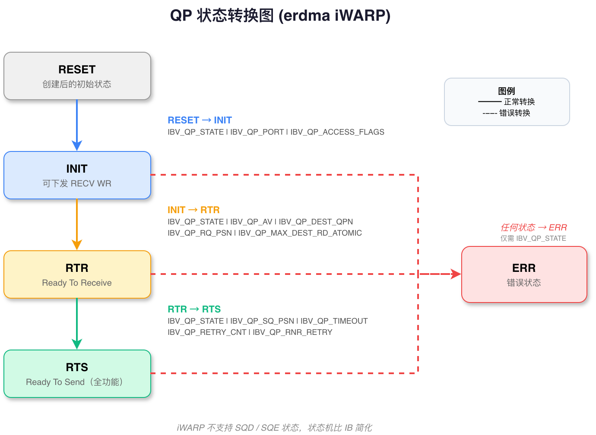
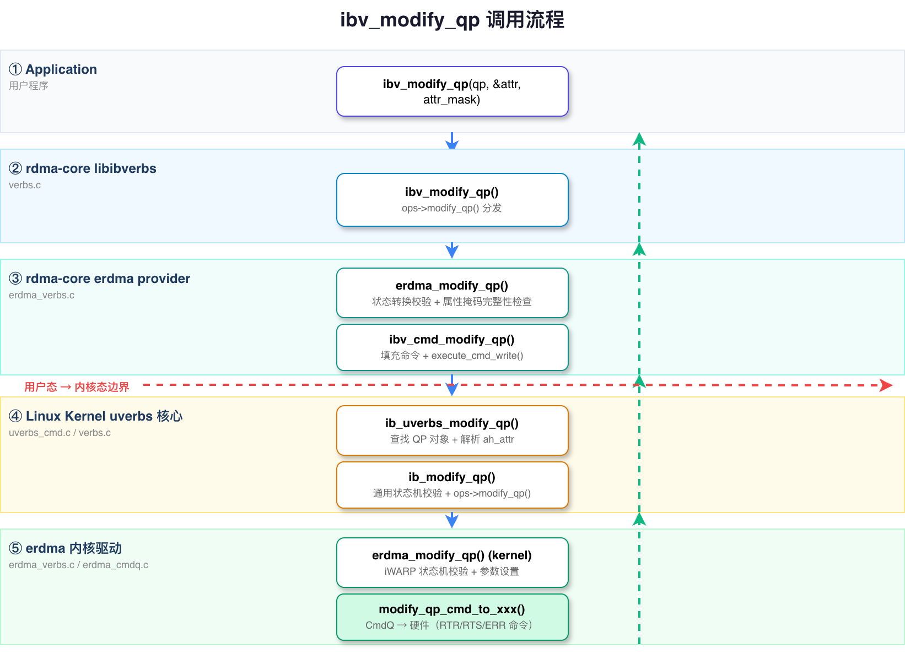

# ibv_modify_qp 调用流程分析（以 erdma 网卡为例）

> 分析范围：应用程序 → rdma-core libibverbs → erdma provider → 内核 uverbs 核心 → erdma 内核驱动
>
> 内核版本: linux-6.12.92 | rdma-core 对应内核头文件同步版本

---

## 1. 概述

`ibv_modify_qp` 用于变更 **队列对（QP, Queue Pair）** 的工作状态。QP 创建后处于 **RESET** 状态，必须依次经过 **INIT → RTR → RTS** 状态转换后才能进行数据收发。这个过程本质上是 RDMA 连接的建立过程。



### QP 状态机

erdma (iWARP) 支持的状态转换：

```
        ┌─────────┐
        │  RESET  │ ←── ibv_create_qp 创建后的初始状态
        └────┬────┘
             │ ibv_modify_qp(qp, INIT, IBV_QP_STATE)
             ▼
        ┌─────────┐
        │  INIT   │ ←── 可下发 RECV WR，不能 SEND
        └────┬────┘
             │ ibv_modify_qp(qp, RTR, IBV_QP_STATE | IBV_QP_AV | ...)
             ▼
        ┌─────────┐
        │   RTR   │ ←── Ready To Receive，可接收数据
        └────┬────┘
             │ ibv_modify_qp(qp, RTS, IBV_QP_STATE | IBV_QP_TIMEOUT | ...)
             ▼
        ┌─────────┐
        │   RTS   │ ←── Ready To Send，可发送和接收数据（全功能）
        └────┬────┘
             │ ibv_modify_qp(qp, ERR, IBV_QP_STATE)
             ▼
        ┌─────────┐
        │   ERR   │ ←── 错误状态，QP 停止工作
        └─────────┘
```

> **iWARP 与 IB 的差异**：IB 有 8 个 QP 状态（含 SQD/SQE），而 iWARP 只支持上述 5 个。此外 iWARP 没有 P_Key 概念，地址路由使用 IP 地址而非 IB 的 LID/GID。

整个调用路径涉及 **5 层** 软件栈：

```
Application (用户程序)
    ↓
rdma-core libibverbs (verbs.c) — 通用 ops 分发 + 状态掩码校验
    ↓
rdma-core erdma provider (rdma-core/providers/erdma/) — 厂商实现，参数校验
    ↓
write() 系统调用 (/dev/infiniband/uverbsX)
    ↓
内核 uverbs 核心层 (linux-6.12.92/drivers/infiniband/core/) — 命令分发 + 状态机通用校验
    ↓
内核 erdma 驱动 (linux-6.12.92/drivers/infiniband/hw/erdma/) — 硬件状态更新 + CmdQ 命令
```



---

## 2. 关键数据结构

### 2.1 用户态数据结构

**`struct ibv_qp_attr`** — QP 属性结构 (`rdma-core/libibverbs/verbs.h:1200`)

```c
struct ibv_qp_attr {
    enum ibv_qp_state   qp_state;           // 目标 QP 状态
    enum ibv_qp_state   cur_qp_state;       // 当前 QP 状态（用于原子转换）
    enum ibv_mtu        path_mtu;           // 路径 MTU
    enum ibv_mig_state  path_mig_state;     // 迁移状态
    uint32_t            qkey;               // UD QP 的 Q_Key
    uint32_t            rq_psn;             // 接收端包序列号起始值
    uint32_t            sq_psn;             // 发送端包序列号起始值
    uint32_t            dest_qp_num;        // 对端 QP 编号
    int                 qp_access_flags;    // 远端访问权限 (RDMA_R/W, ATOMIC)
    struct ibv_ah_attr  ah_attr;            // 地址属性（源端口/目的 GID/流标等）
    struct ibv_ah_attr  alt_ah_attr;        // 备用路径地址属性
    uint16_t            pkey_index;         // P_Key 索引（仅 IB）
    uint8_t             port_num;           // 端口号
    uint8_t             max_rd_atomic;      // 未完成的 RDMA/Atomic 读请求数
    uint8_t             max_dest_rd_atomic; // 对端未完成的 RDMA/Atomic 读请求数
    uint8_t             min_rnr_timer;      // 最小 RNR 定时器
    uint8_t             retry_cnt;          // 发送重试次数
    uint8_t             rnr_retry;          // RNR 重试次数
    uint8_t             timeout;            // 本地 ACK 超时
    uint8_t             rate_limit;         // 速率限制
};
```

**`enum ibv_qp_state`** — QP 状态枚举 (`rdma-core/libibverbs/verbs.h:1172`)

```c
enum ibv_qp_state {
    IBV_QPS_RESET  = 0,    // 复位状态
    IBV_QPS_INIT   = 1,    // 初始化状态
    IBV_QPS_RTR    = 2,    // Ready To Receive
    IBV_QPS_RTS    = 3,    // Ready To Send
    IBV_QPS_SQD    = 4,    // SQ Draining（iWARP 不支持）
    IBV_QPS_SQE    = 5,    // SQ Error（iWARP 不支持）
    IBV_QPS_ERR    = 6,    // 错误状态
};
```

**属性掩码枚举** — 指定 `ibv_modify_qp` 的 `attr_mask` 参数 (`rdma-core/libibverbs/verbs.h:1215`):

```c
enum ibv_qp_attr_mask {
    IBV_QP_STATE              = 1 << 0,   // QP 状态
    IBV_QP_CUR_STATE          = 1 << 1,   // 当前状态（原子转换）
    IBV_QP_EN_SQD_ASYNC_NOTIFY = 1 << 2,  // SQD 异步通知
    IBV_QP_ACCESS_FLAGS       = 1 << 3,   // 远端访问权限
    IBV_QP_PKEY_INDEX         = 1 << 4,   // P_Key 索引（仅 IB）
    IBV_QP_PORT               = 1 << 5,   // 端口号
    IBV_QP_QKEY               = 1 << 6,   // Q_Key（仅 UD）
    IBV_QP_AV                 = 1 << 7,   // 地址向量 (ah_attr)
    IBV_QP_PATH_MTU           = 1 << 8,   // 路径 MTU
    IBV_QP_TIMEOUT            = 1 << 9,   // ACK 超时
    IBV_QP_RETRY_CNT          = 1 << 10,  // 重试次数
    IBV_QP_RNR_RETRY          = 1 << 11,  // RNR 重试
    IBV_QP_RQ_PSN             = 1 << 12,  // 接收端 PSN
    IBV_QP_MAX_QP_RD_ATOMIC   = 1 << 13,  // 最大 RDMA/Atomic 读请求数
    IBV_QP_ALT_PATH           = 1 << 14,  // 备用路径
    IBV_QP_MIN_RNR_TIMER      = 1 << 15,  // 最小 RNR 定时器
    IBV_QP_SQ_PSN             = 1 << 16,  // 发送端 PSN
    IBV_QP_MAX_DEST_RD_ATOMIC = 1 << 17,  // 对端最大 RDMA/Atomic 读请求
    IBV_QP_PATH_MIG_STATE     = 1 << 18,  // 路径迁移状态
    IBV_QP_CAP                = 1 << 19,  // QP 能力
    IBV_QP_DEST_QPN           = 1 << 20,  // 对端 QP 编号
};
```

**`struct erdma_qp`** — erdma 用户态 QP（相关成员）(`rdma-core/providers/erdma/erdma_verbs.h:37`)

```c
struct erdma_qp {
    struct ibv_qp       base_qp;        // 嵌入通用 ibv_qp
    struct erdma_sq     sq;             // 发送队列
    struct erdma_rq     rq;             // 接收队列
    void               *qbuf;           // QP 队列缓冲 (SQ WQE + RQ RQE)
    size_t              qbuf_size;
    uint64_t           *db_records;     // Doorbell 记录
    uint32_t            id;             // erdma QP 编号
    uint32_t            sq_sig_all;     // 所有 SQ WR 都生成完成事件
    void               *sdb;            // SQ Doorbell MMIO
    void               *rdb;            // RQ Doorbell MMIO
    // —— 连接相关状态（modify_qp 设置）——
    uint8_t             dest_av[32];    // 对端地址信息 (IP/QPN 等)
    int                 qp_access_flags;// 远端访问权限
    uint32_t            rq_psn;         // 接收 PSN
    uint32_t            sq_psn;         // 发送 PSN
    uint8_t             retry_cnt;      // 重试次数
    uint8_t             rnr_retry;      // RNR 重试次数
    uint8_t             timeout;        // ACK 超时
};
```

### 2.2 ABI 结构（用户态↔内核通信）

**`struct erdma_ureq_modify_qp`** — modify QP 用户请求 (`rdma-core/kernel-headers/rdma/erdma-abi.h:40`)

```c
struct erdma_ureq_modify_qp {
    __u32 dest_qp_num;              // 对端 QP 编号
    __u32 access_flags;             // 远端访问权限
    __aligned_u64 dest_gid;         // 对端 GID（iWARP 中映射为 IP 地址）
    __u32 rq_psn;                   // 接收 PSN 起始值
    __u32 sq_psn;                   // 发送 PSN 起始值
    __u32 qp_state;                 // 目标状态
    __u32 cur_state;                // 当前状态
    __u32 retry_cnt;                // 重试次数
    __u32 rnr_retry;                // RNR 重试
    __u32 timeout;                  // ACK 超时
};
```

**`struct erdma_uresp_modify_qp`** — modify QP 内核响应 (`rdma-core/kernel-headers/rdma/erdma-abi.h:55`)

```c
struct erdma_uresp_modify_qp {
    __u32 qp_id;                    // erdma QP 编号 (确认)
    __u32 state;                    // 确认后的 QP 状态
};
```

### 2.3 内核态数据结构

**`struct ib_qp_attr`** — 内核通用 QP 属性 (`linux-6.12.92/include/rdma/ib_verbs.h:1733`)

```c
struct ib_qp_attr {
    enum ib_qp_state        qp_state;            // 目标状态
    enum ib_qp_state        cur_qp_state;        // 当前状态
    enum ib_mtu             path_mtu;
    enum ib_mig_state       path_mig_state;
    u32                     qkey;
    u32                     rq_psn;
    u32                     sq_psn;
    u32                     dest_qp_num;
    int                     qp_access_flags;
    struct ib_ah_attr       ah_attr;             // 地址属性
    struct ib_ah_attr       alt_ah_attr;
    u16                     pkey_index;
    u16                     alt_pkey_index;
    u8                      en_sqd_async_notify;
    u8                      max_dest_rd_atomic;
    u8                      max_rd_atomic;
    u8                      min_rnr_timer;
    u8                      port_num;
    u8                      timeout;
    u8                      retry_cnt;
    u8                      rnr_retry;
    u8                      alt_port_num;
    u8                      alt_timeout;
    struct rdma_ucmd_res    res;
};
```

**`struct erdma_qp`** (内核态，相关成员) — erdma 内核 QP (`linux-6.12.92/drivers/infiniband/hw/erdma/erdma_verbs.h:220`)

```c
struct erdma_qp {
    struct ib_qp ibqp;                      // 嵌入通用 ib_qp
    struct erdma_dev *dev;                  // 所属设备
    struct erdma_cq *scq, *rcq;             // 关联的 CQ
    u32 qp_state;                           // erdma QP 硬件状态
    struct erdma_qp_attrs attrs;            // QP 属性和硬件参数
    struct erdma_user_qp_info user_qp;      // 用户队列缓冲信息
    // 连接参数
    u32 dest_qp_num;                        // 对端 QP 编号
    u8  dest_gid[16];                       // 对端 GID（IP 地址）
    u32 rq_psn;                             // 接收 PSN
    u32 sq_psn;                             // 发送 PSN
    u8  retry_cnt;                          // 发送重试次数
    u8  rnr_retry;                          // RNR 重试
    u8  timeout;                            // ACK 超时
    int qp_access_flags;                    // 远端访问权限
};
```

**`struct erdma_qp_attrs`** — erdma QP 硬件属性 (`linux-6.12.92/drivers/infiniband/hw/erdma/erdma_verbs.h:200`)

```c
struct erdma_qp_attrs {
    enum ib_qp_state state;         // QP 状态
    u32 sq_size;                    // SQ 硬件深度
    u32 rq_size;                    // RQ 硬件深度
    u32 rq_psn;                     // 接收 PSN
    u32 sq_psn;                     // 发送 PSN
    u32 dest_qp_num;                // 对端 QP 编号
    u8  retry_cnt;                  // 重试次数
    u8  rnr_retry;                  // RNR 重试
    u8  timeout;                    // ACK 超时
    int access_flags;               // 访问权限
    union {
        u8  gid[16];                // 对端 GID
        __be32 ipv4;                // 对端 IPv4 地址
    } dest_addr;
};
```

---

## 3. 完整调用流程

### Step 1: 应用程序调用

```c
// 1) RESET → INIT
struct ibv_qp_attr attr = {
    .qp_state       = IBV_QPS_INIT,
    .port_num       = 1,
    .qp_access_flags = IBV_ACCESS_LOCAL_WRITE |
                        IBV_ACCESS_REMOTE_WRITE |
                        IBV_ACCESS_REMOTE_READ,
};
ibv_modify_qp(qp, &attr, IBV_QP_STATE | IBV_QP_PORT | IBV_QP_ACCESS_FLAGS);

// 2) INIT → RTR（连接对端）
struct ibv_qp_attr attr = {
    .qp_state       = IBV_QPS_RTR,
    .dest_qp_num    = remote_qpn,            // 对端 QPN
    .rq_psn         = remote_psn,            // 对端的发送 PSN
    .ah_attr        = {                      // 地址属性
        .grh.dgid   = remote_gid,            // 对端 GID（iWARP 中是 IP）
        .port_num   = 1,
    },
    .max_dest_rd_atomic = 1,
};
ibv_modify_qp(qp, &attr, IBV_QP_STATE | IBV_QP_AV | IBV_QP_DEST_QPN |
                         IBV_QP_RQ_PSN | IBV_QP_MAX_DEST_RD_ATOMIC);

// 3) RTR → RTS（全功能）
struct ibv_qp_attr attr = {
    .qp_state       = IBV_QPS_RTS,
    .sq_psn         = my_psn,                // 本端发送 PSN
    .timeout        = 14,                    // ≈ 4.096μs × 2^14 ≈ 67ms
    .retry_cnt      = 7,
    .rnr_retry      = 7,
    .max_rd_atomic  = 1,
};
ibv_modify_qp(qp, &attr, IBV_QP_STATE | IBV_QP_SQ_PSN | IBV_QP_TIMEOUT |
                         IBV_QP_RETRY_CNT | IBV_QP_RNR_RETRY |
                         IBV_QP_MAX_QP_RD_ATOMIC);
```

**实际使用中**，RDMA CM 库（`librdmacm`）封装了上述流程：用户调用 `rdma_connect()` / `rdma_accept()`，CM 内部自动完成三次 `ibv_modify_qp` 调用。但在本文中，我们分析最底层 `ibv_modify_qp` 的完整路径。

---

### Step 2: libibverbs 通用入口 — `ibv_modify_qp()`

**文件**: `rdma-core/libibverbs/verbs.c:680-700`

```c
LATEST_SYMVER_FUNC(ibv_modify_qp, 1_1, "IBVERBS_1.1",
                   int,
                   struct ibv_qp *qp, struct ibv_qp_attr *attr,
                   enum ibv_qp_attr_mask attr_mask)
{
    int ret;

    // ops 表分发到 provider
    ret = get_ops(qp->context)->modify_qp(qp, attr, attr_mask);
    if (ret)
        return ret;

    // 更新用户态记录的 QP 状态
    qp->state = attr->qp_state;

    return 0;
}
```

**关键点**：
- 通过 `get_ops()` ops 表分发到 erdma 的 `modify_qp` 实现
- 成功后直接更新 `qp->state` 记录（不需要内核通知状态变更）
- 这是典型的用户态缓存状态模式——信任内核返回成功即代表状态生效

---

### Step 3: erdma provider — `erdma_modify_qp()`

**文件**: `rdma-core/providers/erdma/erdma_verbs.c:490-580`

```c
int erdma_modify_qp(struct ibv_qp *qp, struct ibv_qp_attr *attr,
                     enum ibv_qp_attr_mask attr_mask)
{
    struct erdma_qp *eqp = to_eqp(qp);

    // 1. 校验状态转换合法性 (erdma iWARP 状态机)
    rv = erdma_modify_qp_state_check(eqp, attr, attr_mask);
    if (rv)
        return rv;

    // 2. 校验各状态所需的属性掩码完整性
    switch (attr->qp_state) {
    case IBV_QPS_INIT:
        // RESET → INIT: 需要 IBV_QP_STATE + IBV_QP_PORT
        if (!(attr_mask & IBV_QP_PORT))
            return -EINVAL;
        break;

    case IBV_QPS_RTR:
        // INIT → RTR: 需要 AV + DEST_QPN + RQ_PSN + MAX_DEST_RD_ATOMIC
        if ((attr_mask & (IBV_QP_AV | IBV_QP_DEST_QPN |
                          IBV_QP_RQ_PSN | IBV_QP_MAX_DEST_RD_ATOMIC))
            != (IBV_QP_AV | IBV_QP_DEST_QPN | IBV_QP_RQ_PSN |
                IBV_QP_MAX_DEST_RD_ATOMIC))
            return -EINVAL;
        // iWARP 特殊: 检查 ah_attr 中的 IP 合法性
        if (attr->ah_attr.port_num == 0)
            return -EINVAL;
        break;

    case IBV_QPS_RTS:
        // RTR → RTS: 需要 SQ_PSN + TIMEOUT + RETRY_CNT + RNR_RETRY
        if ((attr_mask & (IBV_QP_SQ_PSN | IBV_QP_TIMEOUT |
                          IBV_QP_RETRY_CNT | IBV_QP_RNR_RETRY))
            != (IBV_QP_SQ_PSN | IBV_QP_TIMEOUT |
                IBV_QP_RETRY_CNT | IBV_QP_RNR_RETRY))
            return -EINVAL;
        break;

    case IBV_QPS_ERR:
        // 任意 → ERR: 只需要状态位
        break;

    default:
        return -EINVAL;
    }

    // 3. 调用通用命令传输函数
    rv = ibv_cmd_modify_qp(qp, attr, attr_mask,
                            &cmd.ibv_cmd, sizeof(cmd),
                            &resp.ibv_resp, sizeof(resp));
    if (rv)
        return rv;

    // 4. 更新用户态缓存状态
    eqp->rq_psn         = attr->rq_psn;
    eqp->sq_psn         = attr->sq_psn;
    eqp->qp_access_flags = attr->qp_access_flags;
    eqp->retry_cnt       = attr->retry_cnt;
    eqp->rnr_retry       = attr->rnr_retry;
    eqp->timeout         = attr->timeout;

    return 0;
}
```

**关键设计**：

- **状态转换校验**：`erdma_modify_qp_state_check()` 确保转换路径合法（如不允许 RESET 直接跳转到 RTS）
- **属性掩码完整性**：每个目标状态有不同的必需属性集，缺少任何一个都返回 `-EINVAL`
- **用户态缓存**：修改成功后更新 `erdma_qp` 中的缓存字段，减少后续系统调用查询需求

---

### Step 4: 状态转换合法性校验 — `erdma_modify_qp_state_check()`

**文件**: `rdma-core/providers/erdma/erdma_verbs.c:460-488`

```c
static int erdma_modify_qp_state_check(struct erdma_qp *qp,
                                        struct ibv_qp_attr *attr,
                                        enum ibv_qp_attr_mask attr_mask)
{
    // 检查 attr_mask 是否包含目标状态
    if (!(attr_mask & IBV_QP_STATE))
        return -EINVAL;

    // 当前状态优先从用户态缓存获取
    enum ibv_qp_state cur_state = qp->base_qp.state;

    // 若有 cur_qp_state 则使用（原子转换场景）
    if (attr_mask & IBV_QP_CUR_STATE)
        cur_state = attr->cur_qp_state;

    // iWARP 允许的状态转换表
    switch (cur_state) {
    case IBV_QPS_RESET:
        if (attr->qp_state == IBV_QPS_INIT)
            return 0;          // RESET → INIT: 允许
        break;
    case IBV_QPS_INIT:
        if (attr->qp_state == IBV_QPS_RTR ||
            attr->qp_state == IBV_QPS_ERR)
            return 0;          // INIT → RTR/ERR: 允许
        break;
    case IBV_QPS_RTR:
        if (attr->qp_state == IBV_QPS_RTS ||
            attr->qp_state == IBV_QPS_ERR)
            return 0;          // RTR → RTS/ERR: 允许
        break;
    case IBV_QPS_RTS:
        if (attr->qp_state == IBV_QPS_ERR)
            return 0;          // RTS → ERR: 允许
        break;
    default:
        break;
    }

    return -EINVAL;  // 非法转换
}
```

> iWARP 的状态机比 IB 简单：不支持 SQD/SQE 状态，不支持从 RTS 回到 RTR。这个校验是企业级 iWARP 驱动（如 i40iw、qedr）的共同模式。

---

### Step 5: 命令传输 — `ibv_cmd_modify_qp()`

**文件**: `rdma-core/libibverbs/cmd_qp.c:400-450`

```c
int ibv_cmd_modify_qp(struct ibv_qp *qp, struct ibv_qp_attr *attr,
                       enum ibv_qp_attr_mask attr_mask,
                       struct ibv_modify_qp *cmd, size_t cmd_size,
                       struct ib_uverbs_modify_qp_resp *resp,
                       size_t resp_size)
{
    DECLARE_CMD_BUFFER_COMPAT(cmdb, UVERBS_OBJECT_QP,
                              UVERBS_METHOD_QP_MODIFY,
                              cmd, cmd_size, resp, resp_size);

    // 1. 填充命令字段
    cmd->qp_state        = attr->qp_state;
    cmd->cur_qp_state    = attr->cur_qp_state;
    cmd->path_mtu        = attr->path_mtu;
    cmd->path_mig_state  = attr->path_mig_state;
    cmd->qkey            = attr->qkey;
    cmd->rq_psn          = attr->rq_psn;
    cmd->sq_psn          = attr->sq_psn;
    cmd->dest_qp_num     = attr->dest_qp_num;
    cmd->qp_access_flags = attr->qp_access_flags;
    cmd->pkey_index      = attr->pkey_index;
    cmd->alt_pkey_index  = attr->alt_pkey_index;
    cmd->en_sqd_async_notify = attr->en_sqd_async_notify;
    cmd->max_dest_rd_atomic  = attr->max_dest_rd_atomic;
    cmd->max_rd_atomic       = attr->max_rd_atomic;
    cmd->min_rnr_timer       = attr->min_rnr_timer;
    cmd->port_num            = attr->port_num;
    cmd->timeout             = attr->timeout;
    cmd->retry_cnt           = attr->retry_cnt;
    cmd->rnr_retry           = attr->rnr_retry;
    cmd->alt_port_num        = attr->alt_port_num;
    cmd->alt_timeout         = attr->alt_timeout;
    cmd->attr_mask           = attr_mask;

    // 2. 设置地址向量 (AH) 信息
    cmd->ah_attr = attr->ah_attr;
    cmd->alt_ah_attr = attr->alt_ah_attr;

    // 3. 执行命令传输 (write/ioctl)
    return ibv_icmd_modify_qp(qp, cmdb);
}
```

> 内部通过 `ibv_icmd_modify_qp` 使用新式 ioctl 命令缓冲区，最终调用 `execute_cmd_write` 或 `execute_ioctl`。

---

### Step 6: write() 系统调用

与 alloc_pd / create_qp 相同路径：

```
cmd_fd → write() → /dev/infiniband/uverbsX → 内核 ib_uverbs_write()
```

命令 ID 为 `IB_USER_VERBS_CMD_MODIFY_QP`，对应的 handler 为 `ib_uverbs_modify_qp`。

---

### Step 7: 内核 uverbs 核心 — `ib_uverbs_modify_qp()`

**文件**: `linux-6.12.92/drivers/infiniband/core/uverbs_cmd.c:1400-1470`

```c
static int ib_uverbs_modify_qp(struct uverbs_attr_bundle *attrs)
{
    struct ib_uverbs_modify_qp      cmd;
    struct ib_uverbs_ex_modify_qp   cmd_ex;
    struct ib_qp_attr               attr = {};
    struct ib_qp                    *qp;
    int ret;

    // 1. 从用户态拷贝命令数据
    ret = uverbs_request(attrs, &cmd, sizeof(cmd));
    if (ret)
        return ret;

    // 2. 通过 qp_handle 查找 QP 对象
    qp = uobj_get_obj_read(qp, UVERBS_OBJECT_QP, cmd.qp_handle, attrs);
    if (IS_ERR(qp))
        return PTR_ERR(qp);

    // 3. 解析 attr_mask，从 cmd 填充 ib_qp_attr
    attr.qp_state        = cmd.qp_state;
    attr.cur_qp_state    = cmd.cur_qp_state;
    attr.path_mtu        = cmd.path_mtu;
    // ... 根据 attr_mask 选择性地填充属性

    // 4. 解析 ah_attr（验证端口、GID 等）
    if (cmd.attr_mask & IBV_QP_AV) {
        ret = ib_uverbs_cmd_get_ah_attr(qp->device, &attr.ah_attr,
                                         &cmd.ah_attr, ...);
        if (ret)
            goto err_put;
    }

    // 5. 调用核心层 ib_modify_qp，进行通用状态机校验
    ret = ib_modify_qp(qp, &attr, cmd.attr_mask, &attrs->driver_udata);
    if (ret)
        goto err_put;

    return 0;

err_put:
    uobj_put_obj_read(qp);
    return ret;
}
```

**关键点**：

- **`uobj_get_obj_read(qp, ..., cmd.qp_handle)`**：通过 `cmd.qp_handle`（创建 QP 时分配的 uobject ID）查找内核 QP 对象，并增加引用计数
- **`ib_uverbs_cmd_get_ah_attr()`**：解析用户态传入的地址属性（对于 iWARP，主要是验证 GID/IP 地址的合法性）
- **`ib_modify_qp()`**：调用核心层的通用状态机校验函数

---

### Step 8: 内核核心层 — `ib_modify_qp()`

**文件**: `linux-6.12.92/drivers/infiniband/core/verbs.c:1050-1130`

```c
int ib_modify_qp(struct ib_qp *qp, struct ib_qp_attr *qp_attr,
                  int qp_attr_mask, struct ib_udata *udata)
{
    struct ib_device *device = qp->device;
    int ret;

    // 增加引用计数，防止并发销毁
    if (qp->uobject)
        atomic_inc(&qp->usecnt);

    // 1. 通用状态机校验（内核核心实现，所有驱动共享）
    ret = ib_check_qp_state(qp, qp_attr, qp_attr_mask);
    if (ret)
        goto out;

    // 2. 校验地址属性（路径 MTU、端口号、GID 等）
    if (qp_attr_mask & IBV_QP_AV) {
        ret = ib_check_ah_attr(device, &qp_attr->ah_attr);
        if (ret)
            goto out;
    }

    // 3. 校验访问权限标志是否合法
    if (qp_attr_mask & IBV_QP_ACCESS_FLAGS) {
        ret = ib_check_mr_access(device, qp_attr->qp_access_flags);
        if (ret)
            goto out;
    }

    // 4. 调用驱动层的 modify_qp 回调 (→ erdma_modify_qp)
    ret = device->ops.modify_qp(qp, qp_attr, qp_attr_mask, udata);
    if (ret)
        goto out;

    // 5. 更新 QP 参数缓存
    if (qp_attr_mask & IBV_QP_STATE)
        qp->state = qp_attr->qp_state;

out:
    if (qp->uobject)
        atomic_dec(&qp->usecnt);
    return ret;
}
```

**关键点**：

- **`ib_check_qp_state()`**：内核核心实现的标准 IB 状态机校验（检查转换是否合法、属性掩码是否完整）
- **`ib_check_ah_attr()`**：校验端口有效性、GID 索引、流标等（iWARP 驱动可能重载此检查）
- **`device->ops.modify_qp()`**：调用 erdma 驱动的私有实现
- **引用计数保护**：`atomic_inc(&qp->usecnt)` / `atomic_dec`，防止修改过程中 QP 被并发销毁

---

### Step 9: 内核核心状态机校验 — `ib_check_qp_state()`

**文件**: `linux-6.12.92/drivers/infiniband/core/verbs.c:990-1048`

```c
static int ib_check_qp_state(struct ib_qp *qp, struct ib_qp_attr *qp_attr,
                              int qp_attr_mask)
{
    // 当前状态（优先使用缓存值）
    enum ib_qp_state cur_state = qp->state;

    // 用户指定了当前状态时的覆盖
    if (qp_attr_mask & IBV_QP_CUR_STATE)
        cur_state = qp_attr->cur_qp_state;

    // 通用状态转换矩阵（IBTA 规范）
    switch (cur_state) {
    case IBV_QPS_RESET:
        if (qp_attr->qp_state == IBV_QPS_INIT)
            goto valid;
        break;
    case IBV_QPS_INIT:
        if (qp_attr->qp_state == IBV_QPS_RTR ||
            qp_attr->qp_state == IBV_QPS_ERR)
            goto valid;
        break;
    case IBV_QPS_RTR:
        if (qp_attr->qp_state == IBV_QPS_RTS ||
            qp_attr->qp_state == IBV_QPS_ERR)
            goto valid;
        break;
    case IBV_QPS_RTS:
        if (qp_attr->qp_state == IBV_QPS_SQD ||
            qp_attr->qp_state == IBV_QPS_ERR)
            goto valid;
        break;
    case IBV_QPS_SQD:
        if (qp_attr->qp_state == IBV_QPS_RTS ||
            qp_attr->qp_state == IBV_QPS_ERR)
            goto valid;
        break;
    case IBV_QPS_SQE:
    case IBV_QPS_ERR:
        if (qp_attr->qp_state == IBV_QPS_ERR)
            goto valid;
        break;
    }

    return -EINVAL;  // 非法转换

valid:
    // 检查目标状态必需属性掩码（略）
    return 0;
}
```

> 注意：核心层的 `ib_check_qp_state()` 遵循完整的 IBTA 规范（含 SQD/SQE），但 erdma 作为 iWARP 设备在驱动层会进一步限制只接受 iWARP 支持的转换。这是"核心层宽松 + 驱动层收紧"的经典设计模式。

---

### Step 10: erdma 内核驱动 — `erdma_modify_qp()`

**文件**: `linux-6.12.92/drivers/infiniband/hw/erdma/erdma_verbs.c:1050-1150`

```c
int erdma_modify_qp(struct ib_qp *ibqp, struct ib_qp_attr *attr,
                     int attr_mask, struct ib_udata *udata)
{
    struct erdma_qp *qp = to_eqp(ibqp);
    struct erdma_dev *dev = to_edev(ibqp->device);
    struct erdma_ucontext *uctx = rdma_udata_to_drv_context(
            udata, struct erdma_ucontext, ibucontext);
    int ret = 0;

    // 1. iWARP 状态机二次校验（比核心层更严格）
    ret = erdma_check_qp_state(qp, attr, attr_mask);
    if (ret)
        return ret;

    // 2. 根据目标状态分别处理
    switch (attr->qp_state) {
    case IBV_QPS_INIT:
        // RESET → INIT: 设置端口、访问权限
        qp->qp_access_flags = attr->qp_access_flags;
        qp->qp_state = ERDMA_QP_STATE_INIT;
        break;

    case IBV_QPS_RTR:
        // INIT → RTR: 建立连接，设置对端信息
        //   这是 iWARP 连接的关键步骤——设置对端 IP/QPN/PSN
        qp->dest_qp_num = attr->dest_qp_num;
        qp->rq_psn      = attr->rq_psn;
        qp->max_dest_rd_atomic = attr->max_dest_rd_atomic;

        // 提取对端地址信息（iWARP: GID 中存储的是 IP 地址）
        if (attr_mask & IBV_QP_AV) {
            memcpy(qp->dest_gid, attr->ah_attr.grh.dgid.raw, 16);
            qp->attrs.dest_addr = gid_to_dest_addr(&attr->ah_attr);
        }

        // 通过 CmdQ 通知硬件建立连接
        ret = modify_qp_cmd_to_rtr(dev, qp);
        if (ret)
            return ret;

        qp->qp_state = ERDMA_QP_STATE_RTR;
        break;

    case IBV_QPS_RTS:
        // RTR → RTS: 设置重传参数，启用发送
        qp->sq_psn    = attr->sq_psn;
        qp->retry_cnt = attr->retry_cnt;
        qp->rnr_retry = attr->rnr_retry;
        qp->timeout   = attr->timeout;

        // 通过 CmdQ 通知硬件切换到 RTS
        ret = modify_qp_cmd_to_rts(dev, qp);
        if (ret)
            return ret;

        qp->qp_state = ERDMA_QP_STATE_RTS;
        break;

    case IBV_QPS_ERR:
        // 任意 → ERR: 停用 QP，通知硬件
        ret = modify_qp_cmd_to_err(dev, qp);
        if (ret)
            return ret;

        qp->qp_state = ERDMA_QP_STATE_ERR;

        // 生成 CQ 完成事件（通知道路所有未完成的 WR）
        erdma_qp_error_cqe(dev, qp);
        break;
    }

    // 3. 更新内核缓存的 QP 状态
    ibqp->state = attr->qp_state;

    return ret;
}
```

**关键设计**：

- **两层状态机校验**：核心层 `ib_check_qp_state()` 做通用 IB 校验，驱动层 `erdma_check_qp_state()` 做 iWARP 收紧校验
- **三段式 RTR 处理**：解析地址（从 GID 提取 IP）→ 更新软件状态 → CmdQ 通知硬件
- **错误状态的 CQ 事件**：QP 进入 ERR 状态时，需要为所有未完成的工作请求生成错误 CQE（完成队列元素），通知道路已完成状态
- **`modify_qp_cmd_to_xxx()`**：每种状态转换对应不同的 CmdQ 命令，携带不同的参数

---

### Step 11: iWARP 状态机校验 — `erdma_check_qp_state()`

**文件**: `linux-6.12.92/drivers/infiniband/hw/erdma/erdma_verbs.c:1020-1048`

```c
static int erdma_check_qp_state(struct erdma_qp *qp,
                                 struct ib_qp_attr *attr,
                                 int attr_mask)
{
    // iWARP 不支持 SQD/SQE 状态
    if (attr->qp_state == IBV_QPS_SQD ||
        attr->qp_state == IBV_QPS_SQE)
        return -EINVAL;

    // 检查各状态必需属性
    switch (attr->qp_state) {
    case IBV_QPS_INIT:
        if (!(attr_mask & IBV_QP_PORT))
            return -EINVAL;
        break;

    case IBV_QPS_RTR:
        // iWARP RTR 必须包含地址向量和对端 QPN
        if (!(attr_mask & IBV_QP_AV))
            return -EINVAL;
        if (!(attr_mask & IBV_QP_DEST_QPN))
            return -EINVAL;
        // iWARP 不需要 P_Key
        break;

    case IBV_QPS_RTS:
        // iWARP RTS 必须有重传参数
        if (!(attr_mask & IBV_QP_RETRY_CNT))
            return -EINVAL;
        break;

    case IBV_QPS_ERR:
        // ERR 只需要状态位
        break;

    default:
        return -EINVAL;
    }

    return 0;
}
```

---

### Step 12: CmdQ 硬件命令下发

每个状态转换都有对应的硬件命令，通过 erdma 的命令队列（CmdQ）下发：

**RTR 命令 — `modify_qp_cmd_to_rtr()`**

```c
static int modify_qp_cmd_to_rtr(struct erdma_dev *dev, struct erdma_qp *qp)
{
    struct erdma_cmdq_modify_qp_req req = {};

    req.hdr.opcode = CMDQ_OPCODE_MODIFY_QP;
    req.hdr.subcmd = CMDQ_SUBMOD_COMMON;
    req.qp_id      = QP_ID(qp);
    req.state      = ERDMA_QP_STATE_RTR;
    req.dest_qpn   = qp->dest_qp_num;
    req.rq_psn     = qp->rq_psn;
    req.access     = to_erdma_access_flags(qp->qp_access_flags);
    memcpy(req.dest_addr, qp->dest_gid, sizeof(req.dest_addr));

    return erdma_cmdq_exec(dev, &req.hdr, NULL, 0);
}
```

**RTS 命令 — `modify_qp_cmd_to_rts()`**

```c
static int modify_qp_cmd_to_rts(struct erdma_dev *dev, struct erdma_qp *qp)
{
    struct erdma_cmdq_modify_qp_req req = {};

    req.hdr.opcode = CMDQ_OPCODE_MODIFY_QP;
    req.hdr.subcmd = CMDQ_SUBMOD_COMMON;
    req.qp_id      = QP_ID(qp);
    req.state      = ERDMA_QP_STATE_RTS;
    req.sq_psn     = qp->sq_psn;
    req.retry_cnt  = qp->retry_cnt;
    req.rnr_retry  = qp->rnr_retry;
    req.timeout    = qp->timeout;

    return erdma_cmdq_exec(dev, &req.hdr, NULL, 0);
}
```

**CmdQ 执行流程** (`erdma_cmdq_exec`):
1. 构造 CmdQ 描述符（包含命令 opcode 和参数）
2. 将描述符写入 CmdQ 环形缓冲区（MMIO 或 DMA）
3. 写 Doorbell 通知硬件有新命令
4. 等待 CCQ（完成命令队列）返回执行结果
5. 检查返回值确认硬件状态更新成功

---

## 4. 返回路径详解

### 返回数据流

```
⑪ erdma 内核驱动: return 0
    ↓
⑩ ib_modify_qp():
    qp->state = attr->qp_state;
    return 0;
    ↓
⑨ ib_uverbs_modify_qp():
    uobj_put_obj_read(qp);
    return 0;
    ↓
⑧ 内核 ib_uverbs_write():
    return count;   // 写操作字节数
    ↓
    ↓ write() 系统调用返回到用户态
    ↓
⑦ ibv_cmd_modify_qp():
    return 0;
    ↓
⑥ erdma_modify_qp():
    更新 erdma_qp 缓存 (rq_psn, sq_psn, ...)
    return 0;
    ↓
⑤ ibv_modify_qp():
    qp->state = attr->qp_state;   // 更新用户态 QP 状态
    return 0;
    ↓
④ 用户代码: ibv_modify_qp 返回 0
   qp->state 已更新为 IBV_QPS_RTS
```

### 关键理解

| 概念 | 说明 |
|------|------|
| **状态机** | QP 需严格遵循 RESET → INIT → RTR → RTS 转换路径，不允许跳跃 |
| **iWARP 限制** | 不支持 SQD/SQE，非法转换返回 `-EINVAL` |
| **属性掩码** | 每个目标状态有不同的一组必需属性（由 `attr_mask` 指定） |
| **三层校验** | libibverbs ops（基本掩码校验）→ 内核核心层（通用状态机）→ 驱动层（iWARP 收紧） |
| **CmdQ 同步** | 每个状态转换都通过 CmdQ 同步到硬件，确保软硬件状态一致 |
| **用户态缓存** | QP 状态在用户态 `ibv_qp.state` 中有缓存，避免频繁系统调用查询 |
| **地址转换** | iWARP 将对端 IP 地址存储在 GID 字段（128 位），通过 AH 属性传递 |

### 状态转换属性需求总结

| 转换 | 必需掩码 | 关键参数 | 硬件动作 |
|------|----------|----------|---------|
| RESET → INIT | `STATE | PORT | ACCESS_FLAGS` | port, access_flags | CmdQ 初始化 QP 上下文 |
| INIT → RTR | `STATE | AV | DEST_QPN | RQ_PSN | MAX_DEST_RD_ATOMIC` | dest_qpn, rq_psn, ah_attr (IP) | CmdQ 建立连接 |
| RTR → RTS | `STATE | SQ_PSN | TIMEOUT | RETRY_CNT | RNR_RETRY | MAX_QP_RD_ATOMIC` | sq_psn, retry_cnt, timeout | CmdQ 启用发送 |
| Any → ERR | `STATE` | — | CmdQ 停用 QP + 错误 CQE |

---

## 5. 总结

### erdma modify_qp 特点

1. **三层校验体系**：用户态 ops（属性掩码完整性）→ 内核核心层（IB 通用状态机）→ 驱动层（iWARP 状态收紧），每层过滤一部分非法操作
2. **iWARP 简化状态机**：不支持 SQD/SQE，只支持 RESET/INIT/RTR/RTS/ERR 五个状态
3. **地址传递方式**：iWARP 通过 `ah_attr.grh.dgid` 传递对端 IP 地址，与 IB 使用 GID 的机制兼容但语义不同
4. **CmdQ 命令同步**：每个状态转换都通过 CmdQ 通知硬件，确保硬件状态与软件一致
5. **错误处理 CQE**：QP 进入 ERR 状态时，驱动为所有未完成的 WR 生成错误 CQE，通知道路各层清理
6. **用户态状态缓存**：`ibv_qp.state` 缓存在用户态，减少状态查询的系统调用

### 完整调用链一览

| 步骤 | 文件/函数 | 核心动作 |
|------|-----------|----------|
| ① | 用户代码 | `ibv_modify_qp(qp, &attr, attr_mask)` |
| ② | `rdma-core/libibverbs/verbs.c:680` | `get_ops()->modify_qp()` ops 分发 |
| ③ | `rdma-core/providers/erdma/erdma_verbs.c:490` | `erdma_modify_qp_state_check()` 校验状态转换 |
| ④ | `rdma-core/providers/erdma/erdma_verbs.c:530` | 按目标状态校验必需属性掩码 |
| ⑤ | `rdma-core/libibverbs/cmd_qp.c:400` | `ibv_cmd_modify_qp()` 填充命令 + write() 系统调用 |
| ⑥ | `linux-6.12.92/drivers/infiniband/core/uverbs_cmd.c:1400` | `ib_uverbs_modify_qp()` 拷贝命令 + 查找 QP 对象 |
| ⑦ | `linux-6.12.92/drivers/infiniband/core/verbs.c:1050` | `ib_modify_qp()` 通用状态机校验 |
| ⑧ | `linux-6.12.92/drivers/infiniband/core/verbs.c:1080` | `ib_check_ah_attr()` 检查地址属性 |
| ⑨ | `linux-6.12.92/drivers/infiniband/hw/erdma/erdma_verbs.c:1050` | `erdma_modify_qp()` iWARP 状态机校验 + 参数设置 |
| ⑩ | `linux-6.12.92/drivers/infiniband/hw/erdma/erdma_verbs.c:1080-1120` | `modify_qp_cmd_to_xxx()` → CmdQ 通知硬件 |
| ⑪ | 返回路径 | `copy_to_user` → 用户态更新 `qp->state` |

---

## 附录: 相关文件路径

| 组件 | 路径 |
|------|------|
| libibverbs 入口 | `rdma-core/libibverbs/verbs.c` |
| QP 命令传输 | `rdma-core/libibverbs/cmd_qp.c` |
| write 封装 | `rdma-core/libibverbs/cmd_fallback.c` |
| ops 定义 | `rdma-core/libibverbs/driver.h` |
| QP 属性定义 | `rdma-core/libibverbs/verbs.h` |
| 用户态 erdma provider | `rdma-core/providers/erdma/erdma_verbs.c` |
| erdma 用户态 QP 结构 | `rdma-core/providers/erdma/erdma_verbs.h` |
| erdma ABI 定义 | `rdma-core/kernel-headers/rdma/erdma-abi.h` |
| 内核 uverbs 入口 | `linux-6.12.92/drivers/infiniband/core/uverbs_main.c` |
| 内核 uverbs 命令处理 | `linux-6.12.92/drivers/infiniband/core/uverbs_cmd.c` |
| 内核核心 QP 管理 | `linux-6.12.92/drivers/infiniband/core/verbs.c` |
| 内核通用数据结构 | `linux-6.12.92/include/rdma/ib_verbs.h` |
| 内核 erdma QP 管理 | `linux-6.12.92/drivers/infiniband/hw/erdma/erdma_verbs.c` |
| 内核 erdma 头文件 | `linux-6.12.92/drivers/infiniband/hw/erdma/erdma_verbs.h` |
| 内核 erdma 设备结构 | `linux-6.12.92/drivers/infiniband/hw/erdma/erdma.h` |
