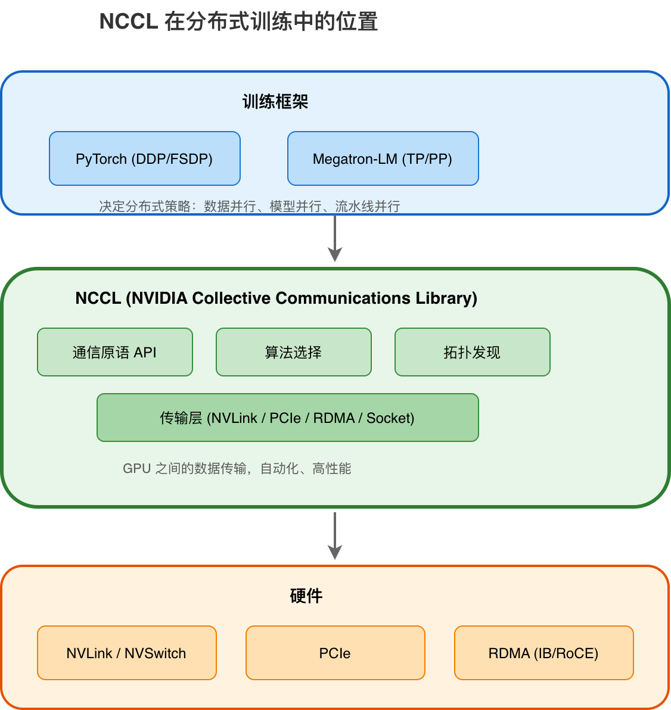
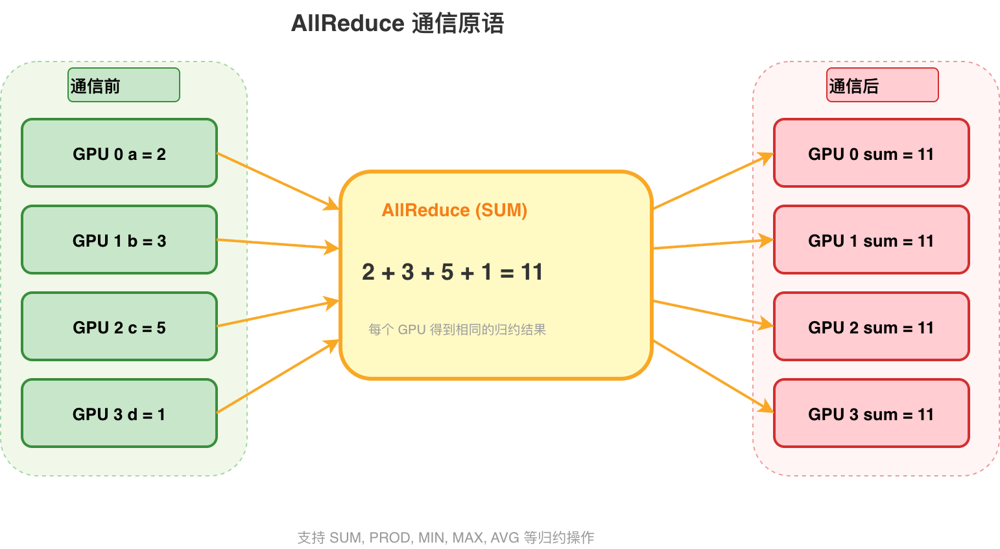
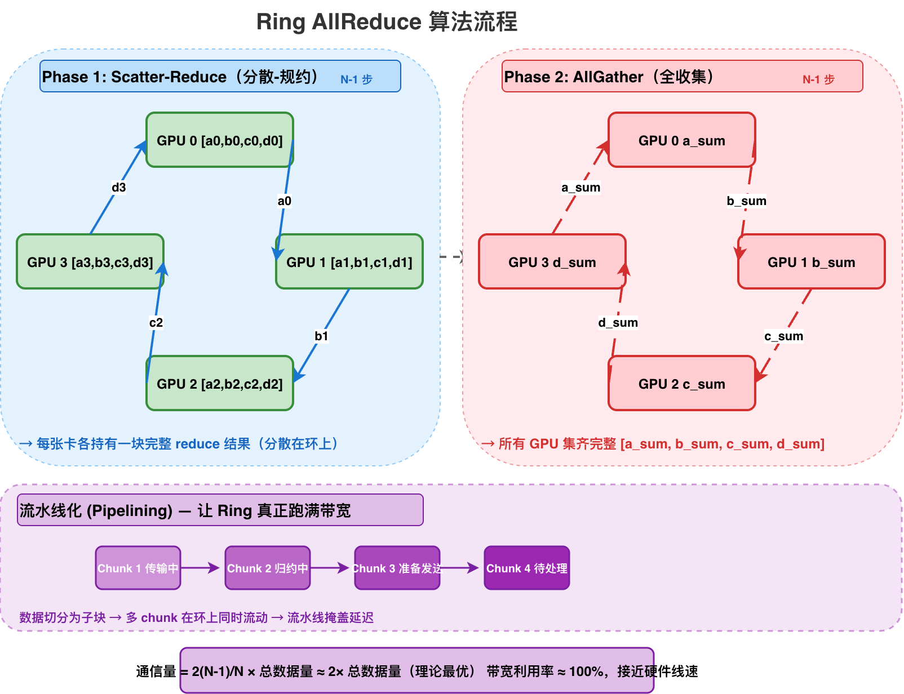
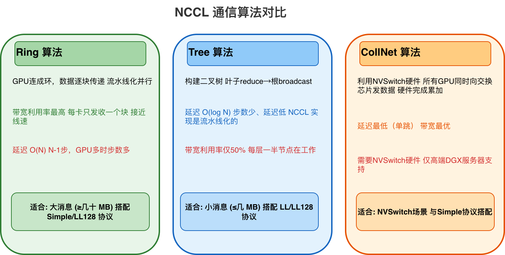
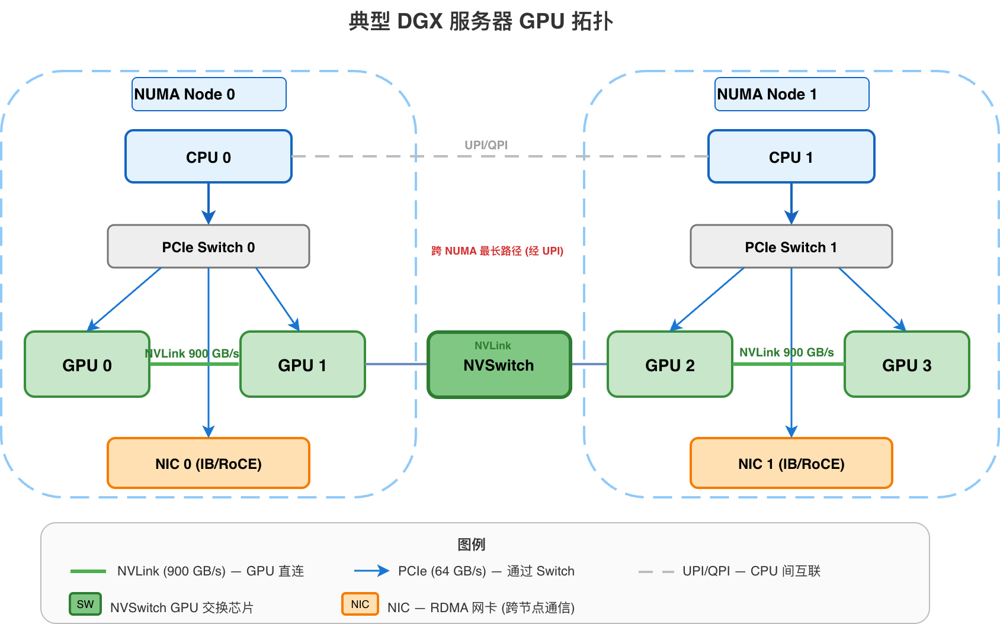
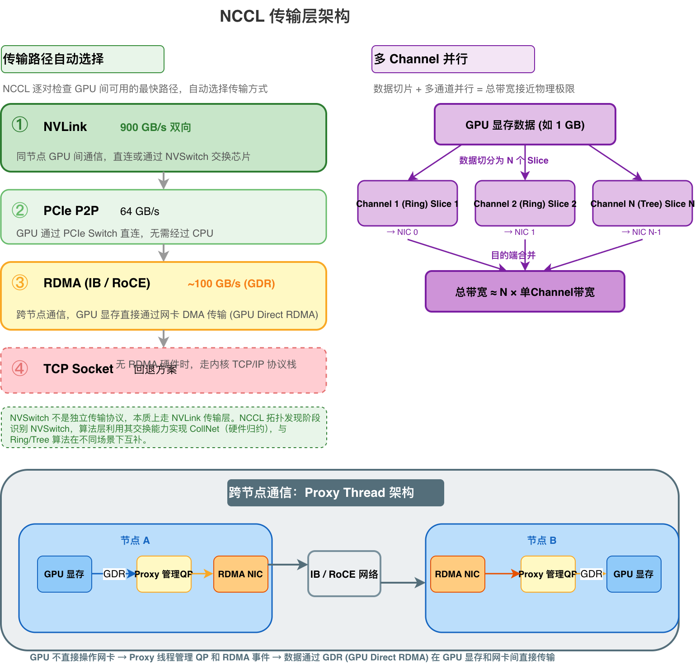
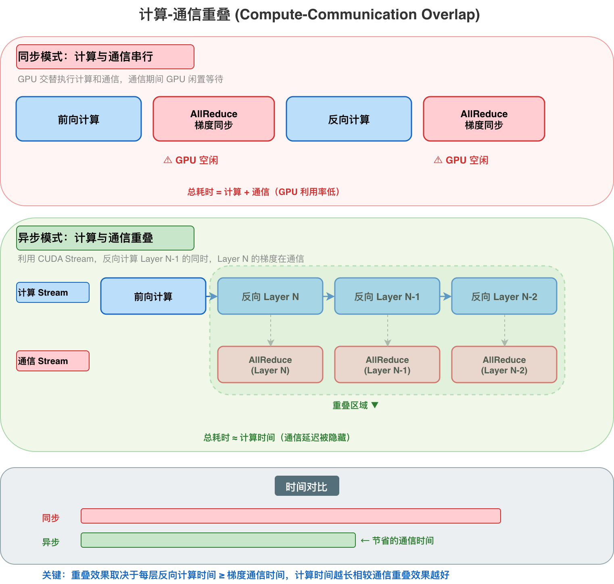

# NCCL 深度解析：一次 AllReduce 的旅程

## 写在前面

本文不会一次性讲完 NCCL 的所有内容。我们会从一个**最常用的操作——AllReduce** 入手，追踪它从 PyTorch 调用到底层硬件执行的完整旅程。在这个过程中，你会自然理解 NCCL 的核心：它的通信原语、算法、拓扑感知、传输层和异步执行。

如果你刚接触 NCCL——不必担心，本文会用类比来解释每个概念。如果你已有经验，算法细节和性能分析也不会少。

> **本系列上下文**：我之前写过 RDMA、RoCEv2、PFC/ECN 的文章。NCCL 同时覆盖**单机内 GPU 通信**（NVLink/NVSwitch/PCIe）和**跨机通信**（RDMA over IB/RoCE）。本文会讲清楚两者的边界和统一设计，但不会深挖 RDMA 细节。想了解 RDMA 的可以去看系列前文。

---

## 1. 引言：为什么需要 NCCL？

### 一个简单的问题

假设你想训练一个 GPT 模型。单张 GPU 的显存最多几十 GB，但一个大型模型的参数可能几百 GB 甚至上 TB。怎么办？

**答案**：把模型切到多张 GPU 上一起训练。

这就是**分布式训练**。但问题来了——每张 GPU 只负责模型的一部分，训练过程中它们需要互相交换数据（比如梯度），才能保持一致。

> **打个比方**
> 你和 3 个朋友分别算一道数学题的不同部分。算完后，你们需要把各自的结果汇总，每个人都拿到最终答案。这个"汇总"的过程，就是 NCCL 做的事。

### NCCL 是什么？

NCCL 的全称是 **NVIDIA Collective Communications Library**（NVIDIA 集体通信库）。它是 NVIDIA 专门为 GPU 设计的通信库，核心功能是让多张 GPU **高效地交换数据**——不管是同一台机器内的 GPU，还是跨机器的 GPU。

它的设计目标很明确：
- **统一**——同一套 API 覆盖单机（NVLink/NVSwitch）和跨机（RDMA）通信
- **快**——充分利用高速互联，把带宽压到极限
- **自动**——自动检测 GPU 拓扑，选择最优通信路径
- **简单**——给上层框架（PyTorch、Megatron 等）提供简洁的 API

### 为什么不直接用 MPI？

你可能听说过 MPI（Message Passing Interface），它也是做多机通信的。但 MPI 是为 CPU 集群设计的，未针对 GPU 的以下特性做优化：

- GPU 之间可能有 **NVLink**（900 GB/s），远超普通网络——MPI 理解不了这种"超级内部互联"
- GPU 可以通过 **GPU Direct RDMA** 直接读写网卡，不经过 CPU——MPI 的数据路径依赖 CPU 内存中转
- GPU 内存和 CPU 内存是分离的，**单机内和跨机的数据搬运路径截然不同**——但 NCCL 能用同一套接口统一处理

NCCL 就是专门为 GPU 的这些特性优化的。

### NCCL 在软件栈中的位置

下面这张图展示了 NCCL 在分布式训练中的位置：



从顶到底：
1. **训练框架**（PyTorch 等）决定"怎么做分布式的"（数据并行、模型并行等）
2. **NCCL** 负责"GPU 之间的数据传输"——同一套 API，自动适配单机和跨机
3. **硬件**提供实际的传输通道——单机走 NVLink/PCIe，跨机走 RDMA

### 本文主线

接下来的章节，我们会从一个 PyTorch 的 `all_reduce` 调用出发，像剥洋葱一样一层层看进去：

```text
框架调用 → 通信原语 → Ring 算法 → 
拓扑发现 → 传输层执行 → 异步完成
```

每章都会配合一张图，让你能"看见"数据是怎么流动的。

我们从第 2 章开始，先认识一下 NCCL 提供的几种"通信原语"。

---

## 2. 通信原语：NCCL 能做什么？

### 什么是"通信原语"？

在分布式训练中，GPU 之间需要一些固定的"交流模式"。比如"所有人都把自己的数据汇总后广播出去"，或者"一个人发数据给所有人"。这些标准化的交流模式就叫**通信原语**（Collective Communication Primitives）。

你可以把它们想象成**交通指令**——左转、右转、掉头。无论什么车、什么路，基本的指令就那几个。

NCCL 提供了 4 个最常用的原语。下面我们用 4 张 GPU 的例子来逐一说明。

### AllReduce（全规约）—— 最常用的一个

**作用**：每张 GPU 有自己的数据，通信后**所有 GPU 都得到相同的结果**。归约操作可以是求和（SUM）、求积（PROD）、取最小（MIN）、取最大（MAX）、取平均（AVG）等，最常用的是 SUM。

**场景**：梯度同步。训练中每张 GPU 算出梯度后，需要把所有人的梯度加起来，然后每张卡都用这个总和去更新模型。



图中：
- **左列**（绿色）：4 张 GPU 各有自己的数据
- **中间**：AllReduce 操作
- **右列**（红色）：所有 GPU 都得到了相同的"总和"

> **类比**：你和 3 个朋友各算了一笔账。AllReduce 就是你们各自报数，然后每个人都在纸上记下"总和"。

### Broadcast（广播）

**作用**：一张 GPU 把数据发给所有其他 GPU。

**场景**：参数初始化。一张卡加载好模型参数，然后广播给所有其他卡。

> **类比**：老师在黑板上写了一道题，全班同学都抄下来。

### AllGather（全收集）

**作用**：每张 GPU 把自己的数据给所有其他 GPU，通信后**每张卡都拥有全部卡的数据集合**。

**场景**：某些模型并行策略中需要收集各卡的输出做后续处理。

> **类比**：小组讨论，每个人说完自己的观点，最后所有人都听到了所有人的观点。

### ReduceScatter（规约+分发）

**作用**：先把每张 GPU 的数据切成 N 块，对每块分别做规约（如求和），规约后的各块结果分散存放在不同 GPU 上。**这正是 Ring AllReduce 前半段做的事**。

**场景**：Ring AllReduce 算法中会用到（下一章细讲）。

> **类比**：四个人各有一张答题卡，每张分成四部分。每人负责汇总所有答题卡上自己负责的那一部分（Scatter-Reduce），最终每人持有一部分的汇总结果。

### 小结

| 原语 | 一句话记忆 | 主要用途 |
|------|-----------|---------|
| AllReduce | 所有人有所有人的数据总和 | 梯度同步 |
| Broadcast | 一个人说，所有人听 | 参数广播 |
| AllGather | 每个人把自己的告诉所有人 | 输出收集 |
| ReduceScatter | 先汇总再分开 | Ring 算法中用 |

除了上述集体通信原语，NCCL 也提供了**点对点通信**（`ncclSend`/`ncclRecv`），用于两个 GPU 之间直接传输数据——在流水线并行（Pipeline Parallelism）等场景中会用到。不过本文聚焦于集体通信，点对点操作不再展开。

有了这些原语的基础，下一章我们进入最核心的部分——**Ring AllReduce**，看看 NCCL 到底是怎么高效实现 AllReduce 的。

---

## 3. Ring AllReduce：NCCL 的核心算法

### 3.1 如果"朴素"地做 AllReduce

我们刚刚学了 AllReduce 是"所有人汇总数据，所有人都拿到结果"。那最简单的方式怎么做？

> 每张卡把自己的数据发给一个中心节点，中心节点累加完后把结果广播给所有人。

这种做法叫 **中心化（Centralized）Reduce**。问题是：当 GPU 很多时，中心节点的带宽就成了瓶颈——N 张卡，中心节点需要收 N 份数据、发 N 份数据。

**N 越大，瓶颈越严重。**

### 3.2 Ring 的思路：拒绝中心化

Ring AllReduce 换了一个思路：

> **不设中心节点，所有 GPU 围成一个环，每张卡只和前后邻居通信。**

这个算法的精妙之处在于：**通信量和 GPU 数量无关**。加再多 GPU，每张卡也只发和收同样的数据量。

它是怎么做到的？分两步走。

### 3.3 Phase 1: Scatter-Reduce（分散-规约）

**Step 0：数据分片**
- 每张卡把自己的数据切 N 块（N = GPU 数量）
- 以 4 张 GPU 为例：GPU0 有 [a₀, b₀, c₀, d₀]，GPU1 有 [a₁, b₁, c₁, d₁]，GPU2 有 [a₂, b₂, c₂, d₂]，GPU3 有 [a₃, b₃, c₃, d₃]

**核心思想：chunk 在环上旋转**

每个 GPU 同时充当"发送者"和"接收者"。在每一步中：
- 你把**上一步收到的 chunk**（第一次则是你自己的某个 chunk）发给下一个邻居
- 同时从上一个邻居收到一个新的 chunk，把它**累加到自己的对应数据上**

chunk 每走一步就在一个 GPU 上留下一次"加法记录"，走完 N-1 步后，该 chunk 就携带了所有 GPU 中对应位置的数据——成为一个完整的 reduce 结果。

下面追踪 N=4、Ring 方向为 GPU0→GPU1→GPU2→GPU3→GPU0 的完整过程：

**Step 1：启动旋转**

| 发送者 → 接收者 | 发送的内容 | 接收者累加后 |
|---|---|---|
| GPU0 → GPU1 | a₀ | GPU1 持有 **a₀+a₁** |
| GPU1 → GPU2 | b₁ | GPU2 持有 **b₁+b₂** |
| GPU2 → GPU3 | c₂ | GPU3 持有 **c₂+c₃** |
| GPU3 → GPU0 | d₃ | GPU0 持有 **d₃+d₀** |

**Step 2：chunk 继续前进**

每个 GPU 把刚才收到的 chunk 转发给下一个邻居：

| 发送者 → 接收者 | 发送的内容 | 接收者累加后 |
|---|---|---|
| GPU0 → GPU1 | d₀₊₃ | GPU1 持有 **d₀+d₁+d₃** |
| GPU1 → GPU2 | a₀₊₁ | GPU2 持有 **a₀+a₁+a₂** |
| GPU2 → GPU3 | b₁₊₂ | GPU3 持有 **b₁+b₂+b₃** |
| GPU3 → GPU0 | c₂₊₃ | GPU0 持有 **c₀+c₂+c₃** |

**Step 3：chunk 走完最后一程**

| 发送者 → 接收者 | 发送的内容 | 接收者累加后 |
|---|---|---|
| GPU0 → GPU1 | c₀₊₂₊₃ | GPU1 持有 **c₀+c₁+c₂+c₃ = c_sum** |
| GPU1 → GPU2 | d₀₊₁₊₃ | GPU2 持有 **d₀+d₁+d₂+d₃ = d_sum** |
| GPU2 → GPU3 | a₀₊₁₊₂ | GPU3 持有 **a₀+a₁+a₂+a₃ = a_sum** |
| GPU3 → GPU0 | b₁₊₂₊₃ | GPU0 持有 **b₀+b₁+b₂+b₃ = b_sum** |

**3 步（N-1）后，每张卡各持有一块完整 reduce 结果，分散在整个环上。**

注意：具体哪块结果落在哪个 GPU 取决于 Ring 的排列方式。关键不是"谁拿哪块"，而是**每张卡恰好持有一块完整结果，为 Phase 2 的 AllGather 做好了准备**。

### 3.4 Phase 2: AllGather（全收集）

现在每张卡各有一块完整结果，但各自只持有一部分。需要把这些块分发给所有人。

**做法**：把 result 块继续绕环传，每传一轮每卡多得到一块。

- GPU0 把 b_sum 传给 GPU1 → GPU1 有了 b_sum
- GPU1 把 c_sum 传给 GPU2 → GPU2 有了 c_sum
- GPU2 把 d_sum 传给 GPU3 → GPU3 有了 d_sum
- GPU3 把 a_sum 传给 GPU0 → GPU0 有了 a_sum
- 如此继续，每传一轮各卡多收集一块...

**又是 3 步后，所有 4 张卡都集齐了 [a_sum, b_sum, c_sum, d_sum]。**

**N 张卡需要 N-1 步完成这个阶段。**

### 3.5 整体流程



### 3.6 为什么快？带宽分析

关键结论：

- **朴素中心化**：中心节点需要收 N 份 + 发 N 份数据。GPU 越多，每张卡分摊到的带宽越小。
- **Ring 算法**：每张卡始终只发 1 块、收 1 块数据。这个"1 块"是总数据量的 1/N。

总通信量 = **2(N-1)/N × 总数据量**

当 N 很大时，约等于 2× 总数据量——而这是理论上 AllReduce 能做到的最优值！

**也就是说：用 Ring 算法，1000 张卡的效率和 4 张卡一样高。**（不考虑网络延迟的话。）

### 3.7 流水线化：让 Ring 真正跑满带宽

上面的描述中，每一步都是"整块数据发完再做下一步"，听起来 N-1 步的延迟会很高。但 NCCL 的实际实现是**流水线化（Pipelining）**的：

> 数据被切成更小的**子块（chunks）**，GPU 发完第一个子块后不等它传完整圈，立刻开始发第二个子块。

举个例子：假设每张卡的数据被切成 4 个 chunk。在 Scatter-Reduce 阶段：
- GPU0 发 chunk1 给 GPU1，**同时**准备 chunk2
- GPU1 收到 chunk1 后加到自己数据上，立刻转发给 GPU2，**同时接收** GPU0 发来的 chunk2
- 多个 chunk 同时在环上流动，像流水线一样

这样就实现了**计算（reduce）和传输的并行**：当某个 chunk 在环上传输时，GPU 正在处理下一个 chunk。最终的效果是：尽管单个 chunk 走完整圈需要 N-1 步，但**每个 GPU 每个时刻都在发送和接收数据**，带宽利用率接近 100%。

这也是为什么 NCCL 需要多种协议（LL/LL128/Simple）——小消息用 LL 是因为 chunk 太小，流水线的启动延迟占比大；大消息用 Simple 是因为 chunk 足够大，流水线完全可以掩盖传输延迟。

### 3.8 这也是 NCCL 的核心贡献

Ring AllReduce 算法并不是 NVIDIA 发明的（学术界早就有了），但 NCCL 的贡献在于：
1. 在 GPU 上高效实现了这个算法
2. 结合拓扑感知选择了最优的 Ring 排列
3. 针对不同消息大小做了精细的工程优化

下一章我们会看到，Ring 并不是唯一的算法——NCCL 还有其他选择，适应不同场景。

---

## 4. 通信算法对比：什么时候用哪个？

Ring 算法很优雅，但它不是万能的。NCCL 还支持其他算法，针对不同场景有各自的优势。

### 4.1 三种算法一览



**Ring 算法**
- **工作机制**：GPU 连成环，数据逐块传递
- **优点**：带宽利用率最高，每卡只发收一个块，接近线速
- **缺点**：延迟随 GPU 数量线性增长（N-1 轮），小消息时步数开销显著
- **适合**：大数据量的 AllReduce（几十 MB 以上），带宽是关键瓶颈

**Tree 算法**
- **工作机制**：构建一棵二叉树，叶子向上传递数据（reduce），根再向下广播（broadcast）；NCCL 的实现是流水线化的，Reduce 和 Broadcast 阶段可以重叠
- **优点**：延迟只和树高度有关 O(log N)，步数少、延迟低
- **缺点**：带宽利用率只有一半（每一层只有一半节点在工作）
- **适合**：小数据量的 AllReduce（几 MB 以下），延迟是关键瓶颈

**CollNet**
- **工作机制**：利用 NVSwitch 硬件，所有 GPU 同时向交换芯片发数据，硬件完成累加
- **优点**：延迟最低（单跳即可），带宽最优
- **缺点**：需要 NVSwitch 硬件，只在高端 DGX 服务器上有
- **适合**：有大块 NVSwitch 的场景

### 4.2 NCCL 怎么选？

NCCL 内部会根据**消息大小**自动选择算法：

- **小消息**（几 KB ~ 几 MB）→ **Tree**，延迟主导，步数少是关键
- **大消息**（几十 MB ~ GB）→ **Ring**，带宽主导，利用率是关键
- 也可以手动指定：`NCCL_ALGO=Ring` 或 `NCCL_ALGO=Tree`

> **补充说明**：NCCL 同时支持三种协议（LL / LL128 / Simple），算法和协议是搭配使用的。小消息通常搭配 `Tree + LL`（极低延迟），中消息搭配 `Tree + LL128`（低延迟 + 较好带宽），大消息搭配 `Ring + Simple`（接近线速带宽）。NCCL 在初始化时会根据消息大小和硬件能力自动选择最优组合。

### 4.3 实际场景

| 场景 | 消息大小 | NCCL 会选择 |
|------|---------|------------|
| 小 batch 训练 | ~KB | Tree |
| BERT 梯度同步 | ~几 MB | Tree + LL128 |
| GPT 梯度同步 | ~几十 MB | Ring + LL128 |
| 大模型参数广播 | 百 MB+ | Ring + Simple / CollNet |

现在我们知道 NCCL 用什么算法传输了，但还有一个关键问题：**数据具体走哪条物理路径？** 同一台机器内的 GPU 之间可能用 NVLink、PCIe，不同机器之间走 RDMA。NCCL 怎么知道该走哪条路？这就是下一章——拓扑发现——要讲的内容。

---

## 5. 拓扑发现：NCCL 怎么"认识" GPU 的布局？

### 5.1 为什么拓扑这么重要？

来看几个数字：

| 传输方式 | 带宽 | 类比 |
|---------|------|------|
| NVLink (H100) | ~900 GB/s（双向） | 高铁 |
| PCIe 5.0 x16 | ~64 GB/s | 国道 |
| RDMA (NDR IB 4x) | ~100 GB/s | 省道 |

差了一个数量级。如果 NCCL 让应该走 NVLink 的数据走了 PCIe，性能就会暴跌。

所以 NCCL 做的第一件事就是：**搞清楚每张 GPU 在物理上是怎么连接的。**

### 5.2 服务器内部长什么样？



这是一个典型 DGX 服务器的简化拓扑。关键观察：

- **GPU 0 和 GPU 1**：同属 NUMA Node 0，挂在 PCIe Switch 0 下，可通过 NVLink 直连，也可以走 PCIe
- **GPU 2 和 GPU 3**：同属 NUMA Node 1，挂在 PCIe Switch 1 下
- **GPU 1 和 GPU 2**：跨 NUMA，通过 NVSwitch 互联，延迟比 PCIe 更低
- **GPU 0 和 GPU 2/3**：跨 NUMA + 跨 PCIe Switch，需经过 UPI，路径最长

NCCL 启动时通过读取 PCIe 的拓扑信息（就像看一张"地图"），精确知道每一对 GPU 之间有几条路径可选、每条路径的速度是多少。

### 5.3 拓扑发现过程

当 NCCL 初始化时（调用 `ncclCommInitAll`），它做了这几件事：

1. **枚举所有 PCIe 设备** - 通过读取 `/sys/devices` 和 NVML API 获取所有 GPU 和 NIC 的 PCIe 拓扑信息
2. **构建拓扑树** - 解析设备之间的层级关系（哪个 GPU 在哪个 PCIe Switch 下，NUMA 归属等）
3. **为每对 GPU 打分** - 计算 GPU-A → GPU-B 的最短/最快路径，给一个"距离分"
4. **构建最优 Ring/Tree** - 根据得分，把"近"的 GPU 排在通信组的前面位置

> **打个比方**：NCCL 就像一个刚搬进新小区的快递调度员——先拿出地图看看每栋楼的位置，然后规划最短的派送路线。

### 5.4 通信组（Communicator）

通信组是一组**参与同一次集体通信的 GPU**。NCCL 创建的每个通信组都有：

- 一个**拓扑排序的 GPU 列表**（最"近"的 GPU 排在一起）
- 针对这个列表构建的**最优 Ring/Tree 结构**
- 一组**传输通道**（每对 GPU 之间用最快的连接方式）

### 5.5 怎么查看拓扑信息？

设置环境变量 `NCCL_DEBUG=INFO`，NCCL 启动时会打印完整的拓扑发现日志：

```bash
NCCL INFO: Topology detection started
NCCL INFO: GPU 0: NVLink connected to GPU 2
NCCL INFO: GPU 0: NVLink connected to GPU 3
NCCL INFO: GPU 0: PCIe bus 0:...
NCCL INFO: nvsPair[0]  GPU0<->GPU2: NVLink1, rate 900
NCCL INFO: nvsPair[1]  GPU0<->GPU1: PIX, rate 64
```

看懂这些日志，对于排查 NCCL 性能问题非常有帮助。

### 5.6 连接如何建立？（Bootstrap）

拓扑发现之后，NCCL 还需要在 GPU 之间**建立连接**才能通信。这个过程叫 **Bootstrap**：

1. **生成 UniqueId**：rank 0 调用 `ncclGetUniqueId()` 生成一个唯一标识符，通过外部机制（如 MPI、环境变量、共享文件等）传递给所有其他 rank
2. **创建 Communicator**：所有 rank 调用 `ncclCommInitRank()`，传入 UniqueId 和自己的 rank 号
3. **建立点对点连接**：每对 GPU 之间根据拓扑信息建立传输通道（NVLink / RDMA / Socket），交换内存地址和端口信息
4. **分配通信缓冲区**：为每个 Channel 分配 GPU 显存缓冲区，用于数据收发

这个过程通常在 `torch.distributed.init_process_group()` 调用中自动完成，工程师不需要手动处理。但理解 Bootstrap 有助于排查初始化阶段的 hang 和超时问题。

---

现在 NCCL 知道了"拓扑结构"，也完成了连接建立。下一步就是**真正传输数据了**——不同的物理链路有不同的传输协议，NCCL 怎么统一管理它们？下一章讲传输层。

---

## 6. 传输层：数据真正走的"路"

### 6.1 统一接口，多种实现

NCCL 设计了一个**统一的传输接口**，底层可以切换不同的实现。一个 AllReduce 调用走完算法层后，传输层会根据拓扑信息自动选择最快的传输方式。



### 6.2 NVLink 传输（最快，双向 900 GB/s）

当两个 GPU 之间有 NVLink 连接时（同一台机器内），NCCL 会优先使用 NVLink。

NVLink 是 NVIDIA 的专属高速互联技术。H100 GPU 上的 NVLink 4.0 提供约 **450 GB/s 单向、900 GB/s 双向**带宽——比 PCIe 5.0 快了 **14 倍**。

NCCL 通过 CUDA 的 P2P（Peer-to-Peer）API 直接读写对方 GPU 的显存，不需要经过 CPU 或系统内存。这是效率最高的路径。

> **类比**：NVLink 就像两栋紧挨着的楼之间的封闭天桥——近、快、不用出大门。

### 6.3 PCIe P2P 传输（64 GB/s）

如果 GPU 之间没有 NVLink（比如不同代的 GPU，或者通过 PCIe Switch 连接），NCCL 退而求其次，使用 **PCIe P2P**。

同样通过 CUDA 的 P2P 机制，在 PCIe 总线上直接传输数据。带宽约 **64 GB/s**（PCIe 5.0 x16）。

> **类比**：PCIe 就像两栋楼之间的地面道路——也能到，但比天桥慢不少。

### 6.4 RDMA 传输（跨节点，~100 GB/s）

当 GPU 在不同的机器上时，数据必须通过网络传输。这时 NCCL 使用 **RDMA**（Remote Direct Memory Access）。

关键特性：**GPU Direct RDMA（GDR）**。数据可以直接从 GPU 显存 → 网卡 → 网络 → 另一台机器的网卡 → 另一块 GPU 显存，全程**不经过 CPU 和系统内存**。

这意味着：
- **延迟低**——少了 CPU 的中转
- **带宽高**——不占用 CPU 内存带宽
- **CPU 负载低**——CPU 只需发起操作，不参与数据搬运

> **类比**：RDMA 就像两个城市之间的直飞航班。GDR 就是"机场直达你家门口"——不需要先坐大巴去机场（CPU 中转）。

**IB 设备与 Multi-Rail**：在多网卡场景下，NCCL 会检测所有可用的 RDMA 设备。如果两台机器之间有多个 IB 网卡联通，NCCL 会利用多条路径（**multi-rail**）同时传输数据——这需要配合多 Channel 使用（见 6.7 节）。

**Proxy Thread**：对于跨机 RDMA 通信，NCCL 会为每个 GPU 启动一个 CPU 端的 **proxy 线程**。该线程负责：
- 监听 GPU 发起的 RDMA 请求
- 管理 RDMA 连接的建立和队列对（QP）
- 处理网络事件（完成通知、错误处理）

GPU 不直接操作网卡，而是通过 proxy 线程间接完成网络 I/O。这也是为什么大规模训练时 CPU 核心数要足够——每个 GPU 通常需要一个专用的 proxy 线程。

### 6.5 Socket 回退

如果以上都不支持（比如虚拟化环境、没有 RDMA 网卡），NCCL 最后会退回到传统的 **TCP/IP Socket** 通信。速度最慢，但兼容性最好。

### 6.6 自动选择策略

NCCL 的选择逻辑是这样的：

1. 检查两个 GPU 是否有 NVLink → 是则用 NVLink
2. 检查两个 GPU 是否支持 PCIe P2P → 是则用 PCIe
3. 检查是否有 RDMA 网卡且配置 → 是则用 RDMA
4. 否则用 Socket

这个选择是**自动的**，用户不需要干预。但如果想知道 NCCL 用了什么传输，可以看 `NCCL_DEBUG=INFO` 的输出。

### 6.7 不止一条路：多 Channel 并行

前面讲的传输选择都是"两个 GPU 之间怎么传"。但 NCCL 做 AllReduce 时，不是只在一条 Ring 上传输——它会**建多条并行的 Ring（或 Tree）**，每条叫一个 **Channel**。

核心思想很简单：

> 假设 GPU 0 和 GPU 1 之间有 NVLink 连接。一条 Ring 用不满 NVLink 的带宽怎么办？那就建两条 Ring，数据各切一半，两条 Ring 同时传。

具体来说：
- NCCL 将通信数据**分片（stripe）**到多个 Channel 上
- 每个 Channel 独立运行自己的 Ring/Tree 算法
- 所有 Channel **并行执行**，叠加后的总带宽接近所有可用链路的带宽之和

**为什么需要多个 Channel？**
- **负载均衡**：单条 Ring 可能只用到部分链路，多 Channel 能利用更多并行路径
- **多 NIC 场景**：有两张 IB 网卡时，NCCL 会建至少 2 个 Channel，每个 Channel 绑定一张网卡
- **NVSwitch 拓扑**：多 Channel 能更好地利用 NVSwitch 的 all-to-all 带宽

Channel 数量可以通过环境变量控制（`NCCL_MIN_NRINGS`、`NCCL_MAX_NRINGS`），NCCL 默认会根据拓扑自动选取最优值。

---

至此，算法和传输路径都已清楚。但还有最后一个重要问题：**通信的时候 GPU 在干吗？** 是停下来等通信完成，还是继续做计算？下一章讲多流与异步执行。

---

## 7. 多流与异步执行：让通信不再"阻塞"

### 7.1 问题：GPU 在等通信，浪费了算力

先看一个简单的训练场景：

```
前向计算 → AllReduce → 反向计算 → AllReduce → 下一层...
```

在同步模式下，AllReduce 期间 GPU 闲置——等待数据传输完成。对于很多模型来说，AllReduce 可能占总时间的 30% 以上，意味着 GPU 有将近三分之一的时间在**等待通信**。



### 7.2 解决方案：双 Stream 并行

NCCL 利用了 CUDA 的 **Stream** 机制。Stream 可以理解为 GPU 上的"流水线"——不同的 Stream 可以同时执行不同的任务。

NCCL 的做法是：

1. **计算 Stream**：跑前向/反向计算
2. **通信 Stream**：跑 AllReduce 等通信操作

两个 Stream 可以**同时运行**。当通信 Stream 在执行 AllReduce 时，计算 Stream 可以继续算下一层。

### 7.3 计算通信重叠（Overlap）

这是 NCCL 最重要的性能优化之一。

PyTorch DDP 在反向传播时的做法是：
- 反向传播从最后一层向前计算梯度
- 每算完一层的梯度，立刻将该层梯度入队到通信 Stream 做 AllReduce
- **与此同时**，计算 Stream 继续向前算前一层的梯度

> **类比**：你在做饭（计算），同时让洗碗机洗着碗（通信）。你在备下一道菜的时候，上一道菜的碗已经洗好了。

理论上，如果每层梯度的 AllReduce 时间比该层之上的计算时间短，通信开销可以被**完全隐藏**——训练时间 ≈ 纯计算时间。

但要注意，重叠效果取决于**每层计算时间和通信时间的比例**。对于计算量较小的层（如浅层网络、小 batch），AllReduce 可能比计算还快结束不了，此时通信无法被完全隐藏。这也是为什么大模型分布式训练中，通信拓扑优化至关重要。

### 7.4 NCCL Kernel 融合

NCCL 还有一个优化：**Kernel 融合**。

每个通信操作都需要启动 CUDA kernel（这是一个有一定开销的操作）。如果频繁做小通信，启动开销占比会很大。

NCCL 会把多个小块合并成一个大块，用一个 kernel 完成多块传输，大大减少启动次数。

### 7.5 异步带来的复杂度

异步虽然高效，但带来了一些复杂度：

- **内存管理**：通信 Stream 在后台读数据时，不能让计算 Stream 把数据覆盖了
- **同步点**：PyTorch 需要在 AllReduce 完成的地方插入同步（比如 `torch.cuda.synchronize()`）
- **组操作**：NCCL 提供了 `ncclGroupStart()` / `ncclGroupEnd()` 来批量启动多个通信操作

实际上，这些细节已由 PyTorch 等上层框架封装，用户通常无需关心。

---

异步执行是 NCCL 的"最后一层"。现在我们已经完整追踪了一次 AllReduce 从框架调用到硬件执行的旅程。下一章总结。

---

## 8. 总结：一次 AllReduce 的完整旅程

### 8.1 旅程回顾

让我们回顾一下，当你调用 `torch.distributed.all_reduce()` 时，背后发生了什么：

```text
你写的 PyTorch 代码
        ↓
Layer 1: 通信原语 — NCCL 决定用 AllReduce
        ↓
Layer 2: 算法选择 — 根据消息大小选 Ring/Tree/CollNet
        ↓
Layer 3: 拓扑发现 — 查找 GPU 之间的最优物理路径
        ↓
Layer 4: Bootstrap — 建立连接，形成 Communicator
        ↓
Layer 5: 传输层 — 自动选最快的传输方式 (NVLink > PCIe > RDMA > Socket)
        ↓
Layer 6: 多 Channel — 数据分片，多条 Ring/Tree 并行传输
        ↓
Layer 7: 异步执行 — 通信在后台运行，GPU 继续算
        ↓
        完成！所有 GPU 的梯度同步完毕
```

### 8.2 NCCL 的设计哲学

回顾全文，NCCL 的设计可以总结为三条原则：

1. **自动发现**——NCCL 启动时会扫描硬件拓扑，不需要用户配置
2. **自动选择**——根据消息大小选最优算法，根据拓扑选最优路径
3. **隐藏复杂性**——上层的 PyTorch 调用就是一个 API，内部的算法、拓扑、传输全部自动完成

### 8.3 常用调优环境变量

如果你要调试或优化 NCCL 性能，这几个环境变量最常用：

| 变量 | 作用 | 建议 |
|------|------|------|
| `NCCL_DEBUG=INFO` | 打印详细日志，查看拓扑和传输选择 | 排查问题时打开 |
| `NCCL_ALGO=Ring` | 强制使用 Ring 算法 | 大消息场景 |
| `NCCL_ALGO=Tree` | 强制使用 Tree 算法 | 小消息场景 |
| `NCCL_PROTO=Simple` | 使用简单协议 | 默认，通常最优 |
| `NCCL_MIN_NRINGS` | 设置 Ring 数量 | 多网卡时调大 |
| `NCCL_NTHREADS` | 设置线程数 | 默认 256，一般不需改 |
| `NCCL_P2P_LEVEL` | 控制 P2P 传输级别 | NVLink 不可用时调试 |

### 8.4 与系列前文的联系

读到这里，你可能已经发现了 NCCL 与本系列前文的联系：

- **RDMA / RoCEv2**：NCCL 跨机器通信时，底层通过 RDMA 传输。你之前学的 IB Verbs、RoCEv2 包格式，正是 NCCL 跨机通信的基础
- **PFC / ECN / DCQCN**：在大规模 RDMA 网络中，拥塞控制直接影响 NCCL 的 AllReduce 性能。这也是为什么 Nvidia 的 DGX 服务器内部用 NVLink（不受网络拥塞影响），外部用 RDMA 时需要精心设计网络拓扑

### 8.5 进一步学习

- [NCCL 官方文档](https://docs.nvidia.com/deeplearning/nccl/) — 最权威的参考资料
- [NCCL GitHub 源码](https://github.com/NVIDIA/nccl) — 可以看 `src/` 下的算法实现
- [NCCL Tests](https://github.com/NVIDIA/nccl-tests) — 官方性能测试工具，运行 `nccl-tests` 即可看到实际带宽

---

*本文是 RDMA 技术文章系列的一部分。下一篇计划写 NCCL 在大规模集群中的实践——比如 1000 卡训练时，网络拓扑怎么设计、NCCL 参数怎么调优。如有想了解的话题，欢迎反馈。*
