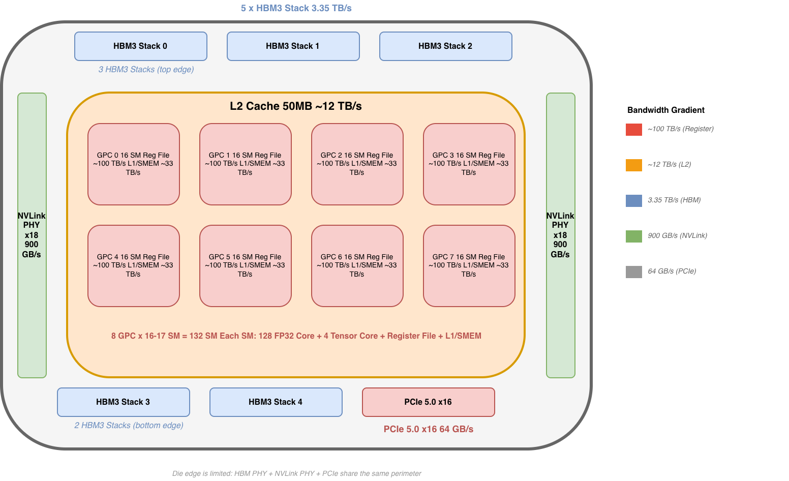
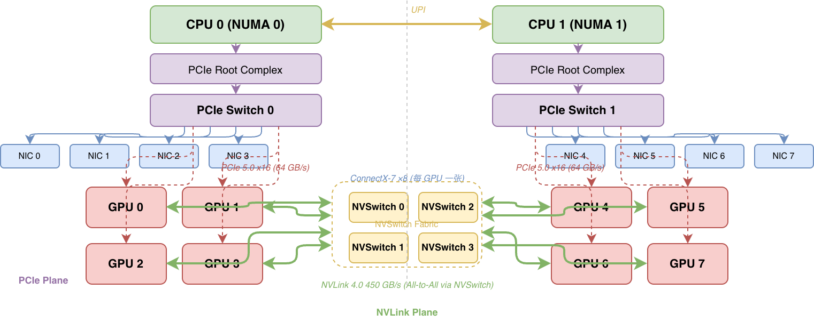

# GPU 互联深度解析：NVLink、NVSwitch、PCIe 与 CUDA

## 1. 问题：算力在涨，互联在拖后腿

先看一组数字：

- NVIDIA H100 FP16 Tensor Core 算力：~2000 TFLOPS
- HBM3 显存带宽：3.35 TB/s
- PCIe 5.0 x16 带宽：64 GB/s

**算力与 PCIe 带宽的比值约为 30000:1。** GPU 一秒钟能算 2000 万亿次，但要把算完的数据送出去，PCIe 这条管子只有 64 GB/s。就算走 NVLink 4.0（900 GB/s 双向），跨 GPU 访问仍然比本地 HBM 慢将近 4 倍。

这不是理论推演。在 GPT-3 级别的分布式训练中，梯度同步（AllReduce）占用总训练时间的 20-40%，这个比例随着 GPU 数量增加而上升。用 Amdahl's Law 简单推导：如果通信占 30%，即使计算部分无限加速，整体最多加速 3.3 倍。

PCIe 带宽的演进速度也追不上算力：

| PCIe 代际 | 单 lane 带宽 | x16 带宽 | 代表年份 |
|-----------|-------------|---------|---------|
| Gen3 | 8 GT/s | 16 GB/s | 2010 |
| Gen4 | 16 GT/s | 32 GB/s | 2017 |
| Gen5 | 32 GT/s | 64 GB/s | 2019 |
| Gen6 | 64 GT/s | 128 GB/s | 2022 |

每代翻倍，但 GPU 算力每代涨 3-5 倍（V100 120 TFLOPS → A100 624 TFLOPS → H100 2000 TFLOPS）。PCIe 永远在追，永远追不上。

NVIDIA 不是没看到这个瓶颈。他们的对策就是 **NVLink** 和 **NVSwitch**——一套完全独立于 PCIe 的私有互联体系。这篇文章从 GPU 内部的存储层级出发，逐层讲清楚 PCIe、NVLink、NVSwitch 的硬件原理，以及 CUDA 如何用 P2P、Unified Memory、Stream 等 API 驾驭这些硬件。

## 2. GPU 内部架构：数据搬运为什么是瓶颈

先看 GPU 内部的数据是怎么流动的。



H100 基于 GH100 GPU，包含 132 个 SM（Streaming Multiprocessor），每个 SM 内含 128 个 FP32 CUDA Core 和 4 个第四代 Tensor Core。这些计算单元需要源源不断的数据供给，而数据来自一个层级化的存储体系：

| 存储层级 | 容量（per GPU） | 带宽（per GPU） | 延迟 |
|---------|---------------|---------------|------|
| Register File | 256KB / SM | ~100 TB/s (aggregate) | ~0 cycles |
| L1 / Shared Memory | 256KB / SM | ~33 TB/s (aggregate) | ~30 cycles |
| L2 Cache | 50 MB | ~12 TB/s | ~200 cycles |
| HBM3 | 80 GB | **3.35 TB/s** | ~300-500 cycles |
| NVLink 4.0 | — | **900 GB/s** (双向) | ~1-3 μs |
| PCIe 5.0 x16 | — | **64 GB/s** | ~10 μs |

关键数字：**HBM 带宽是 PCIe 的 52 倍**（3.35 TB/s vs 64 GB/s）。这意味着 GPU 访问本地显存的速度，比通过 PCIe 访问另一块 GPU 的显存快 50 倍以上。就算走 NVLink，差距也是 3.7 倍。

这就是互联带宽成为瓶颈的根本原因：**计算单元离数据越远，带宽断崖式下跌。**

HBM3 的物理结构值得一提——它不是普通的 DRAM 芯片，而是 8-12 层 DRAM die 垂直堆叠，通过 TSV（Through-Silicon Via）穿孔连接，再通过硅中介层（Silicon Interposer）与 GPU die 互联。5 个 HBM3 Stack 沿 GPU die 的上下边缘排列，每个 Stack 提供 1024-bit 的内存接口。NVLink PHY 同样沿 die 边缘排列——18 个 port，每个 50 GB/s，共 900 GB/s 双向。

所以 GPU die 的边缘同时排列着 HBM PHY 和 NVLink PHY，两者共享 die perimeter。die 内部则是 132 个 SM 和 50MB L2 Cache。SM 通过 Crossbar 网络访问 L2，L2 再路由到 HBM 或 NVLink/PCIe。

这个物理约束决定了一件重要的事：**NVLink port 数量受 die 边缘面积限制。** H100 有 18 个 NVLink port，这不是随便选的——die 的四条边要同时容纳 HBM PHY（占两条边的大部分）、NVLink PHY（占两条边的剩余部分）和 PCIe Controller（占一小段）。NVLink port 越多，留给 HBM 的 die edge 就越少，这是一个零和博弈。

理解了 GPU 内部的数据瓶颈，接下来我们看数据出了 GPU die 之后，经过哪些路径到达其他 GPU 或网络。

## 3. PCIe：从 GPU 视角看

如果之前读过本系列的 [08-pcie-rdma-driver.md](08-pcie-rdma-driver.md)，你已经从 RDMA 网卡驱动开发者的视角理解了 PCIe。现在换个角度——从 GPU 的视角。

### 3.1 GPU 作为 PCIe Endpoint

GPU 是 PCIe Endpoint，这意味着：
- 它被 CPU 侧 Root Complex（RC）发现和配置
- 它通过 BAR（Base Address Register）暴露自己的资源给系统
- 它可以作为 Bus Master 主动发起 DMA

NVIDIA GPU 典型暴露两个 BAR：

- **BAR0**：MMIO 寄存器空间。CPU 通过这里的寄存器控制 GPU（提交命令、查询状态、配置 MMU）。大小通常 32MB。
- **BAR1**：显存窗口。CPU 和 Peer GPU 通过 BAR1 访问 GPU 显存。H100 上，BAR1 通常设为 64GB（覆盖 80GB HBM 的大部分，按需映射）。

BAR1 是整个 GPU P2P 和 GPUDirect 体系的基础。一切对 GPU 显存的远程访问——无论是来自 CPU、Peer GPU 还是 RDMA NIC——本质上都是 PCIe Transaction Layer Packet（TLP）发到目标 GPU 的 BAR1 地址空间。

```
CPU/Peer/NIC 发起 PCIe Memory Read/Write TLP
  → 地址落在目标 GPU BAR1 范围内
    → GPU PCIe Controller 接收 TLP
      → 翻译为内部 HBM 地址
        → 读写 HBM
```

### 3.2 PCIe P2P：GPU 直连，不走 CPU

两块 GPU 挂在同一个 PCIe Switch 下时，GPU 0 可以直接向 GPU 1 的 BAR1 发 TLP，数据流完全不经过 RC（CPU 侧）。这就是 **PCIe P2P**。

```
GPU 0 → PCIe Switch → GPU 1
         (同一 Switch 下转发 TLP，不经过 RC)
```

但 P2P 有一个著名的拦路虎：**ACS（Access Control Services）**。ACS 是 PCIe 的一项安全特性，阻止 Endpoint 之间直接发 TLP——所有 TLP 必须先上送到 RC 做访问控制检查。很多服务器平台默认开启 ACS，直接废掉 P2P。

要让 P2P 工作，需要：
1. BIOS 中关闭对应 PCIe port 的 ACS
2. 内核配置 `CONFIG_PCI_REALLOC_ENABLE_AUTO` 或 `pci=realloc`
3. IOMMU 允许 Peer-to-Peer 访问（或直接关掉 IOMMU）

P2P 带宽受限于 PCIe 链路速率：PCIe 5.0 x16 = 64 GB/s 单向。延迟约 5-10 μs——主要用于 PCIe Switch 转发 + 目标 GPU 内部 TLB 翻译。

```bash
# 查看 PCIe 拓扑和 P2P 可用性
$ nvidia-smi topo -m
        GPU0    GPU1    GPU2    GPU3    ...
GPU0     X      PIX     PHB     PHB
GPU1    PIX      X      PHB     PHB
...
# PIX = 同一 PCIe Switch 下，P2P 可用
# PHB = 跨 PCIe Host Bridge，P2P 不可用（需经 CPU）
```

### 3.3 GPUDirect RDMA：GPU 显存直达网络

GPUDirect RDMA 进一步扩展了 P2P 的思路：**让 RDMA NIC 也能直接读写 GPU 显存**。

数据路径：

```
GPU 0 显存 → PCIe 总线 → NIC 0 → InfiniBand/RoCE 网络
→ 远端 NIC 1 → PCIe 总线 → GPU 1 显存
```

全程 DMA，零 CPU 拷贝，零 staging buffer。GPU 内核驱动 `nvidia-p2p.ko` 是这背后的关键。它导出一组 kernel API：

```c
// RDMA 驱动调用 nvidia-p2p 获取 GPU 物理页的 PCIe bus address
int nvidia_p2p_get_pages(..., &p2p_page_table);
// 返回 GPU 显存页在 PCIe 地址空间中的地址
// RDMA 驱动将其用作 DMA 的 source/destination address
```

关键约束：
- 需要 IOMMU/SMMU 正确配置，或直接关闭
- 平台需支持 ATS（Address Translation Services）做 GPU 页表翻译
- NVIDIA 驱动通过 `nvidia-p2p.ko` 导出 `nvidia_p2p_get_pages()` 等符号
- RDMA 驱动（如 mlx5）在 `ib_register_device()` 前检查 `nvidia_p2p` 是否可用

### 3.4 TLP 路由基础

PCIe 事务层用三种方式路由 TLP：

| 路由方式 | 依据 | 典型用途 |
|---------|------|---------|
| ID Routing | BDF (Bus:Device.Function) | 配置读写、MSI-X 中断 |
| Address Routing | 目标地址落在 BAR 范围 | MMIO、DMA、P2P |
| Implicit Routing | 消息类型（广播） | 电源管理、错误报告 |

P2P 和 GPUDirect RDMA 的 TLP 都是 **Address Routing**——数据包的目的地址落在目标 GPU BAR1 的物理地址窗口内，PCIe Switch 根据地址查表转发。

## 4. NVLink：GPU 直连的高铁

如果 PCIe 是市政道路——标准、开放、但带宽有限——NVLink 就是 NVIDIA 自建的 GPU 专线高铁。

### 4.1 NVLink 不是 PCIe

NVLink 是 NVIDIA 私有的 GPU 互联协议，从物理层到协议层都独立于 PCIe 规范：

- **物理层**：高速差分对（类似 PCIe SerDes），NVLink 3.0/4.0 使用 PAM4 编码
- **链路层**：独立的 link training 过程，类 PCIe LTSSM 但有差异
- **协议层**：支持 **load/store semantics**——GPU 可以直接对远程 GPU 显存做 load/store，不需要显式的 send/recv。这跟 PCIe 的 TLP 读写有根本区别：NVLink 暴露的是**缓存一致的内存视图**，而 PCIe BAR1 只是 MMIO 窗口

各代演进：

| 版本 | per-link 带宽 | links/GPU | 总带宽 | 代表 GPU | 年份 |
|------|-------------|-----------|--------|---------|------|
| NVLink 1.0 | 20 GB/s | 4 | 80 GB/s | P100 (Pascal) | 2016 |
| NVLink 2.0 | 25 GB/s | 6 | 300 GB/s | V100 (Volta) | 2017 |
| NVLink 3.0 | 50 GB/s | 12 | 600 GB/s | A100 (Ampere) | 2020 |
| NVLink 4.0 | 50 GB/s | 18 | **900 GB/s** | H100 (Hopper) | 2022 |
| NVLink 5.0 | 100 GB/s | 18 | **1.8 TB/s** | B200 (Blackwell) | 2024 |

### 4.2 协议层关键特性

**Load/Store Semantics**：GPU 0 上运行的 kernel 可以直接 `ld.global` 读 GPU 1 的显存地址。硬件自动通过 NVLink 发起远程 load 请求，目标 GPU 的 MMU 翻译地址后返回数据。整个过程对程序员透明——就是一次显存访问，只不过延迟从 ~300 cycles（本地 HBM）变成了 ~1-3 μs（远程 NVLink）。

**地址翻译**：GPU 内部 MMU 支持远程地址翻译。GPU 0 的 Page Table Entry 可以指向 GPU 1 的物理页，硬件通过 ATS（Address Translation Services）协议向 GPU 1 查询页表项。

**Flow Control**：NVLink 使用 credit-based 流控机制——接收方提前告知发送方可用的 buffer 数量（credits），发送方在 credits 范围内发送，防止接收方 buffer 溢出。这与 PCIe 的 credit-based flow control 类似，但 NVLink 的 credit 粒度更细。

**CC-NVLink（Grace Hopper）**：在 Grace Hopper 超级芯片中，NVLink 扩展为 **CC-NVLink**（Cache-Coherent NVLink），在 CPU（Grace）和 GPU（Hopper）之间维护硬件缓存一致性。CPU 和 GPU 共享同一个地址空间，任何一方的 cache line 修改会被自动 snoop 并 invalidate。这意味着 CPU 和 GPU 之间不再需要显式的 `cudaMemcpy`——直接用指针访问共享数据。

### 4.3 CUDA 如何利用 NVLink

通过 P2P Access API，CUDA 运行时自动选择底层路径：

```cpp
// 查询 P2P 是否可用
int canAccessPeer;
cudaDeviceCanAccessPeer(&canAccessPeer, dev0, dev1);

// 启用 P2P 访问
cudaSetDevice(dev0);
cudaDeviceEnablePeerAccess(dev1, 0);

// 直接 P2P 拷贝——CUDA 自动选 NVLink（如果可用），否则 fallback 到 PCIe
cudaMemcpyPeer(dst_ptr, dev0, src_ptr, dev1, size);
```

当 NVLink 存在时，`cudaMemcpyPeer()` 延迟约 **1-3 μs**，对比 PCIe P2P 的 **~10 μs**——快了 3-10 倍。

NVLink 是 **full-duplex**（全双工），18 条 link 同时双向传输，每方向 450 GB/s，总共 900 GB/s。这意味着可以同时做 send 和 receive，不互相影响——这一点对训练中的 AllReduce 至关重要（一边发送 gradient，一边接收 peer 的 gradient）。

### 4.4 DGX H100 NVLink 拓扑



DGX H100 内部有两张完全独立的互联平面：

**PCIe Plane（紫色/红色）**：
- CPU 0 → PCIe Switch 0 → GPU 0-3 + NIC 0-3
- CPU 1 → PCIe Switch 1 → GPU 4-7 + NIC 4-7
- 每个 GPU 通过 PCIe 5.0 x16 连接到对应 PCIe Switch（64 GB/s）
- 每张 GPU 配一张 ConnectX-7 NIC（GPUDirect RDMA 用途）

**NVLink Plane（绿色）**：
- 8 个 GPU 通过 4 颗 NVSwitch 芯片全互联
- 每个 GPU 连接所有 4 颗 NVSwitch（每 GPU 18 条 NVLink，分到 4 颗 Switch）
- 任意 GPU pair 一跳直达，带宽 450 GB/s 单向

两个平面各司其职：PCIe 管 GPU↔CPU 和 GPU↔NIC（跨机通信），NVLink 管 GPU↔GPU（机内通信）。这两种互联互不依赖——NVSwitch 不挂在 PCIe Switch 下面，GPU 的 NVLink port 和 PCIe port 是两套独立的物理接口。
