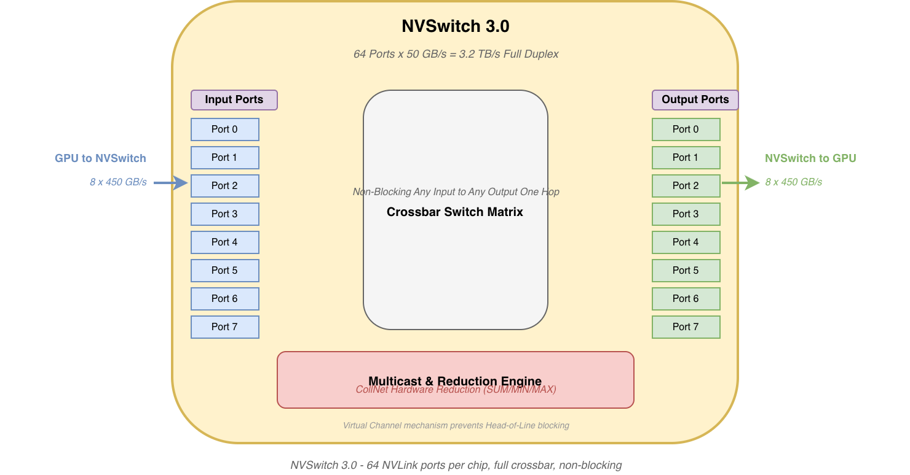
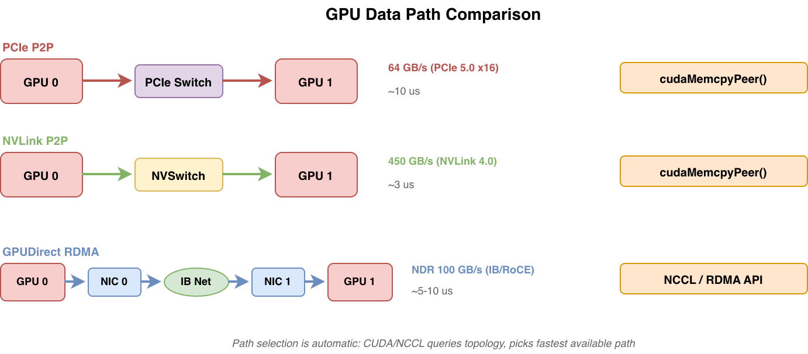

# GPU 互联深度解析：NVLink、NVSwitch、PCIe 与 CUDA

## 1. 问题：算力在涨，互联在拖后腿

先看一组数字：

- NVIDIA H100 FP16 Tensor Core 算力：~2000 TFLOPS
- HBM3 显存带宽：3.35 TB/s
- PCIe 5.0 x16 带宽：64 GB/s

**算力与 PCIe 带宽的比值约为 30000:1。** GPU 一秒钟能算 2000 万亿次，但要把算完的数据送出去，PCIe 这条管子只有 64 GB/s。就算走 NVLink 4.0（900 GB/s 双向），跨 GPU 访问仍然比本地 HBM 慢将近 4 倍。

这不是理论推演。在 GPT-3 级别的分布式训练中，梯度同步（AllReduce）占用总训练时间的 20-40%，这个比例随着 GPU 数量增加而上升。用 Amdahl's Law 简单推导：如果通信占 30%，即使计算部分无限加速，整体最多加速 3.3 倍。

PCIe 带宽的演进速度也追不上算力：

| PCIe 代际 | 单 lane 带宽 | x16 带宽 | 代表年份 |
|-----------|-------------|---------|---------|
| Gen3 | 8 GT/s | 16 GB/s | 2010 |
| Gen4 | 16 GT/s | 32 GB/s | 2017 |
| Gen5 | 32 GT/s | 64 GB/s | 2019 |
| Gen6 | 64 GT/s | 128 GB/s | 2022 |

每代翻倍，但 GPU 算力每代涨 3-5 倍（V100 120 TFLOPS → A100 624 TFLOPS → H100 2000 TFLOPS）。PCIe 永远在追，永远追不上。

NVIDIA 不是没看到这个瓶颈。他们的对策就是 **NVLink** 和 **NVSwitch**——一套完全独立于 PCIe 的私有互联体系。这篇文章从 GPU 内部的存储层级出发，逐层讲清楚 PCIe、NVLink、NVSwitch 的硬件原理，以及 CUDA 如何用 P2P、Unified Memory、Stream 等 API 驾驭这些硬件。

## 2. GPU 内部架构：为什么数据跨芯片这么贵

想象一块 H100 GPU。芯片上跑了 132 个 SM，每个 SM 里有 128 个 FP32 Core 和 4 个 Tensor Core——总共一万七千个计算单元，都在拼命算。它们算的数据从哪来？

答案是**看数据住哪，距离越远越慢**：


```
数据位置           带宽              相当于
──────────────────────────────────────────────────
Register          ~100 TB/s         就在手边（SM 内部）
L1/Shared Mem     ~33 TB/s          同一个房间
L2 Cache          ~12 TB/s          同一层楼
HBM3              3.35 TB/s         隔壁楼
NVLink 4.0        900 GB/s          隔壁街区
PCIe 5.0          64 GB/s           隔壁城市
```

从 Register 到 HBM，都在 GPU 芯片这一块板子上，速度已经降了 30 倍。出了芯片，走 NVLink 又降了 3.7 倍。走 PCIe 再降 14 倍——**从最快的 Register 到最慢的 PCIe，带宽差了 1500 倍。**

这张图本质上画的就是 H100 的物理布局：

- **132 个 SM** 挤在 die 中央，每个 SM 自带 256KB 的 Register File 和 256KB 的可配置 L1/Shared Memory
- **50MB L2 Cache** 围在 SM 外围，所有 SM 通过片上 Crossbar 网络共享
- **5 个 HBM3 Stack** 紧贴 die 的上下两条边——每个 Stack 是 8-12 层 DRAM die 垂直堆叠，通过 TSV（穿硅通孔）和硅中介层连到 GPU die。每个 Stack 有 1024-bit 宽的内存接口，5 个绑在一起才凑出 3.35 TB/s
- **18 个 NVLink PHY** 沿 die 左右两条边排列，每个 50 GB/s，凑出 900 GB/s 双向
- **PCIe Controller** 占 die 底部一小段，x16 通道，64 GB/s

注意一个物理事实：**die 的四条边是有限的**。HBM PHY 占了两条边的大部分，NVLink PHY 占了另外两条边，PCIe Controller 再占一段。这三者是竞争关系——想加 NVLink port？就得挤 HBM 的边。想做更多 HBM Stack？NVLink port 就得少。这是一个零和博弈。

这就是为什么 H100 只有 18 个 NVLink port 而不是 36 个——不是 NVIDIA 不想加，是 die edge 没地了。

理解了数据在芯片内部面临的带宽陡降，下一节我们看数据离开 GPU die 之后，走哪条路到其他 GPU 或网络。

## 3. PCIe：从 GPU 视角看

先看 PCIe，但这一次从 GPU 的视角，而不是 CPU 或网卡的视角。

### 3.1 GPU 作为 PCIe Endpoint

GPU 是 PCIe Endpoint，这意味着：
- 它被 CPU 侧 Root Complex（RC）发现和配置
- 它通过 BAR（Base Address Register）暴露自己的资源给系统
- 它可以作为 Bus Master 主动发起 DMA

NVIDIA GPU 典型暴露两个 BAR：

- **BAR0**：MMIO 寄存器空间。CPU 通过这里的寄存器控制 GPU（提交命令、查询状态、配置 MMU）。大小通常 32MB。
- **BAR1**：显存窗口。CPU 和 Peer GPU 通过 BAR1 访问 GPU 显存。H100 上，BAR1 通常设为 64GB（覆盖 80GB HBM 的大部分，按需映射）。

BAR1 是整个 GPU P2P 和 GPUDirect 体系的基础。一切对 GPU 显存的远程访问——无论是来自 CPU、Peer GPU 还是 RDMA NIC——本质上都是 PCIe Transaction Layer Packet（TLP）发到目标 GPU 的 BAR1 地址空间。

```
CPU/Peer/NIC 发起 PCIe Memory Read/Write TLP
  → 地址落在目标 GPU BAR1 范围内
    → GPU PCIe Controller 接收 TLP
      → 翻译为内部 HBM 地址
        → 读写 HBM
```

### 3.2 PCIe P2P：GPU 直连，不走 CPU

两块 GPU 挂在同一个 PCIe Switch 下时，GPU 0 可以直接向 GPU 1 的 BAR1 发 TLP，数据流完全不经过 RC（CPU 侧）。这就是 **PCIe P2P**。

```
GPU 0 → PCIe Switch → GPU 1
         (同一 Switch 下转发 TLP，不经过 RC)
```

但 P2P 有一个著名的拦路虎：**ACS（Access Control Services）**。ACS 是 PCIe 的一项安全特性，阻止 Endpoint 之间直接发 TLP——所有 TLP 必须先上送到 RC 做访问控制检查。很多服务器平台默认开启 ACS，直接废掉 P2P。

要让 P2P 工作，需要：
1. BIOS 中关闭对应 PCIe port 的 ACS
2. 内核配置 `CONFIG_PCI_REALLOC_ENABLE_AUTO` 或 `pci=realloc`
3. IOMMU 允许 Peer-to-Peer 访问（或直接关掉 IOMMU）

P2P 带宽受限于 PCIe 链路速率：PCIe 5.0 x16 = 64 GB/s 单向。延迟约 5-10 μs——主要用于 PCIe Switch 转发 + 目标 GPU 内部 TLB 翻译。

```bash
# 查看 PCIe 拓扑和 P2P 可用性
$ nvidia-smi topo -m
        GPU0    GPU1    GPU2    GPU3    ...
GPU0     X      PIX     PHB     PHB
GPU1    PIX      X      PHB     PHB
...
# PIX = 同一 PCIe Switch 下，P2P 可用
# PHB = 跨 PCIe Host Bridge，P2P 不可用（需经 CPU）
```

### 3.3 GPUDirect RDMA：GPU 显存直达网络

GPUDirect RDMA 进一步扩展了 P2P 的思路：**让 RDMA NIC 也能直接读写 GPU 显存**。

数据路径：

```
GPU 0 显存 → PCIe 总线 → NIC 0 → InfiniBand/RoCE 网络
→ 远端 NIC 1 → PCIe 总线 → GPU 1 显存
```

全程 DMA，零 CPU 拷贝，零 staging buffer。GPU 内核驱动 `nvidia-p2p.ko` 是这背后的关键。它导出一组 kernel API：

```c
// RDMA 驱动调用 nvidia-p2p 获取 GPU 物理页的 PCIe bus address
int nvidia_p2p_get_pages(..., &p2p_page_table);
// 返回 GPU 显存页在 PCIe 地址空间中的地址
// RDMA 驱动将其用作 DMA 的 source/destination address
```

关键约束：
- 需要 IOMMU/SMMU 正确配置，或直接关闭
- 平台需支持 ATS（Address Translation Services）做 GPU 页表翻译
- NVIDIA 驱动通过 `nvidia-p2p.ko` 导出 `nvidia_p2p_get_pages()` 等符号
- RDMA 驱动（如 mlx5）在 `ib_register_device()` 前检查 `nvidia_p2p` 是否可用

### 3.4 TLP 路由基础

PCIe 事务层用三种方式路由 TLP：

| 路由方式 | 依据 | 典型用途 |
|---------|------|---------|
| ID Routing | BDF (Bus:Device.Function) | 配置读写、MSI-X 中断 |
| Address Routing | 目标地址落在 BAR 范围 | MMIO、DMA、P2P |
| Implicit Routing | 消息类型（广播） | 电源管理、错误报告 |

P2P 和 GPUDirect RDMA 的 TLP 都是 **Address Routing**——数据包的目的地址落在目标 GPU BAR1 的物理地址窗口内，PCIe Switch 根据地址查表转发。

## 4. NVLink：GPU 直连的高铁

如果 PCIe 是市政道路——标准、开放、但带宽有限——NVLink 就是 NVIDIA 自建的 GPU 专线高铁。

### 4.1 NVLink 不是 PCIe

NVLink 是 NVIDIA 私有的 GPU 互联协议，从物理层到协议层都独立于 PCIe 规范：

- **物理层**：高速差分对（类似 PCIe SerDes），NVLink 3.0/4.0 使用 PAM4 编码
- **链路层**：独立的 link training 过程，类 PCIe LTSSM 但有差异
- **协议层**：支持 **load/store semantics**——GPU 可以直接对远程 GPU 显存做 load/store，不需要显式的 send/recv。这跟 PCIe 的 TLP 读写有根本区别：NVLink 暴露的是**缓存一致的内存视图**，而 PCIe BAR1 只是 MMIO 窗口

各代演进：

| 版本 | per-link 带宽 | links/GPU | 总带宽 | 代表 GPU | 年份 |
|------|-------------|-----------|--------|---------|------|
| NVLink 1.0 | 20 GB/s | 4 | 80 GB/s | P100 (Pascal) | 2016 |
| NVLink 2.0 | 25 GB/s | 6 | 300 GB/s | V100 (Volta) | 2017 |
| NVLink 3.0 | 50 GB/s | 12 | 600 GB/s | A100 (Ampere) | 2020 |
| NVLink 4.0 | 50 GB/s | 18 | **900 GB/s** | H100 (Hopper) | 2022 |
| NVLink 5.0 | 100 GB/s | 18 | **1.8 TB/s** | B200 (Blackwell) | 2024 |

### 4.2 协议层关键特性

**Load/Store vs Send/Recv——两种根本不同的编程模型**：

传统网络（包括 RDMA）采用的是 **send/recv 模型**——通信双方显式协调：发送方调 `send(buf, size, dest)`，接收方必须提前 posting `recv(buf, size, src)`。收发两端必须 tag 匹配、buffer 就位，数据到达时接收方才知道。

NVLink 采用的是 **load/store 模型**——发起方单方面完成操作，不需要对方配合。GPU 0 上运行的 kernel 可以直接 `ld.global` 读 GPU 1 的显存地址，就像访问本地内存一样。硬件自动通过 NVLink 发起远程 load 请求，目标 GPU 的 MMU 翻译地址后返回数据。被读的那块 GPU 完全不知道这件事，不需要跑任何程序。

关键区别：load/store 是被动访问——被访方不需要主动参与，地址翻译全由硬件 MMU + ATS 完成。send/recv 是主动通信——接收方必须 post receive 才会接受数据。这就是为什么 NVLink 上的 P2P 延迟能做到 ~1-3 μs，而 RDMA 网络通常需要 ~5-10 μs：不光带宽不同，**编程模型本身的开销也不在一个量级**。

**地址翻译**：GPU 内部 MMU 支持远程地址翻译。GPU 0 的 Page Table Entry 可以指向 GPU 1 的物理页，硬件通过 ATS（Address Translation Services）协议向 GPU 1 查询页表项。

**Flow Control**：NVLink 使用 credit-based 流控机制——接收方提前告知发送方可用的 buffer 数量（credits），发送方在 credits 范围内发送，防止接收方 buffer 溢出。这与 PCIe 的 credit-based flow control 类似，但 NVLink 的 credit 粒度更细。

**CC-NVLink（Grace Hopper）**：在 Grace Hopper 超级芯片中，NVLink 扩展为 **CC-NVLink**（Cache-Coherent NVLink），在 CPU（Grace）和 GPU（Hopper）之间维护硬件缓存一致性。CPU 和 GPU 共享同一个地址空间，任何一方的 cache line 修改会被自动 snoop 并 invalidate。这意味着 CPU 和 GPU 之间不再需要显式的 `cudaMemcpy`——直接用指针访问共享数据。

### 4.3 CUDA 如何利用 NVLink

通过 P2P Access API，CUDA 运行时自动选择底层路径：

```cpp
// 查询 P2P 是否可用
int canAccessPeer;
cudaDeviceCanAccessPeer(&canAccessPeer, dev0, dev1);

// 启用 P2P 访问
cudaSetDevice(dev0);
cudaDeviceEnablePeerAccess(dev1, 0);

// 直接 P2P 拷贝——CUDA 自动选 NVLink（如果可用），否则 fallback 到 PCIe
cudaMemcpyPeer(dst_ptr, dev0, src_ptr, dev1, size);
```

当 NVLink 存在时，`cudaMemcpyPeer()` 延迟约 **1-3 μs**，对比 PCIe P2P 的 **~10 μs**——快了 3-10 倍。

NVLink 是 **full-duplex**（全双工），18 条 link 同时双向传输，每方向 450 GB/s，总共 900 GB/s。这意味着可以同时做 send 和 receive，不互相影响——这一点对训练中的 AllReduce 至关重要（一边发送 gradient，一边接收 peer 的 gradient）。

### 4.4 DGX H100 NVLink 拓扑


DGX H100 内部有两张完全独立的互联平面：

**PCIe Plane（紫色/红色）**：
- CPU 0 → PCIe Switch 0 → GPU 0-3 + NIC 0-3
- CPU 1 → PCIe Switch 1 → GPU 4-7 + NIC 4-7
- 每个 GPU 通过 PCIe 5.0 x16 连接到对应 PCIe Switch（64 GB/s）
- 每张 GPU 配一张 ConnectX-7 NIC（GPUDirect RDMA 用途）

**NVLink Plane（绿色）**：
- 8 个 GPU 通过 4 颗 NVSwitch 芯片全互联
- 每个 GPU 连接所有 4 颗 NVSwitch（每 GPU 18 条 NVLink，分到 4 颗 Switch）
- 任意 GPU pair 一跳直达，带宽 450 GB/s 单向

两个平面各司其职：PCIe 管 GPU↔CPU 和 GPU↔NIC（跨机通信），NVLink 管 GPU↔GPU（机内通信）。这两种互联互不依赖——NVSwitch 不挂在 PCIe Switch 下面，GPU 的 NVLink port 和 PCIe port 是两套独立的物理接口。

## 5. NVSwitch：从点对点到全互联

NVLink 解决了 GPU 直连问题，但带来了一个新问题：全互联的连线复杂度。

### 5.1 问题：N 个 GPU 全互联需要多少对 NVLink？

8 块 GPU 两两直连：C(8,2) = 28 对。每块 H100 只有 18 个 NVLink port——不够。

即使够，物理连线也是噩梦：28 对高速差分线，需要穿越整个机箱，对信号完整性是巨大考验。NVSwitch 就是为这个问题设计的：**所有 GPU 连到 Switch，Switch 内部做交换**。

```
没有 NVSwitch（直连）:          有 NVSwitch（星型）:
GPU0 — GPU1                      GPU0 ─┐
GPU0 — GPU2                      GPU1 ─┤
GPU0 — GPU3                      GPU2 ─┼─ NVSwitch ─ GPUs
...                              GPU3 ─┤
(28 对线，每个 GPU 连 7 对)        (4 颗 Switch，每个 GPU 连所有 Switch)
```

### 5.2 NVSwitch 内部架构



NVSwitch 3.0 内部有三个关键组件：

**1. 64 个 NVLink Port（8 输入 + 8 输出）**

每个 port 支持 50 GB/s，总共 64 × 50 = 3.2 TB/s 全双工交换容量。在 DGX H100 中，每颗 NVSwitch 连接所有 8 个 GPU，每个 GPU 贡献 2-3 条 NVLink（具体分配：GPU 连所有 4 颗 Switch，18 ÷ 4 ≈ 4-5 条/GPU/Switch）。

**2. Crossbar 交换矩阵（Non-Blocking）**

内部采用 Crossbar（交叉开关矩阵），任意 Input Port 到任意 Output Port 无阻塞——不需要 buffer 排队等待其他传输结束。这在交换架构中是最理想的情况：**所有 8 个 GPU 同时发数据，全部通过，互不阻塞。**

结果是：任意 GPU pair 之间一跳直达，反向带宽 450 GB/s（单向），延迟仅 ~3 μs——只比 NVLink 直连多了 Switch 的内部转发延迟（~1 μs）。

**3. Multicast & Reduction Engine（CollNet 硬件基础）**

NVSwitch 不只是转发——它能对数据做**硬件归约（Hardware Reduction）**：

```
传统 AllReduce（Ring）:
  GPU0 → GPU1 → GPU2 → ... → GPU7 → GPU0
  每一跳都有延迟累积，N 个 GPU 需要 N-1 步

NVSwitch 硬件归约（CollNet）:
  GPU0-7 → NVSwitch → Switch 内部硬件 SUM → 广播结果 → GPU0-7
  一步完成！延迟远低于 Ring
```

这与 InfiniBand Switch 的 SHARP（Scalable Hierarchical Aggregation and Reduction Protocol）是同一思路——将归约计算下沉到网络硬件中，避免 data 来回搬运。

**Virtual Channel（VC）机制**：NVSwitch 内部支持多个 Virtual Channel，防止 Head-of-Line blocking。如果 Port A → Port B 的传输被阻塞（比如目标 buffer 满了），Port A → Port C 的传输可以从另一个 VC 绕过去——不排队。

### 5.3 DGX 系列的 NVSwitch 演进

| 系统 | NVSwitch 数量 | NVLink 版本 | per-GPU 带宽 | 拓扑特点 |
|------|-------------|------------|-------------|---------|
| DGX A100 | 6 × NVSwitch 3.0 | NVLink 3.0 | 600 GB/s | 8 GPU 全互联 |
| DGX H100 | 4 × NVSwitch 3.0 | NVLink 4.0 | 900 GB/s | 8 GPU 全互联 |
| DGX B200 | NVSwitch 4.0 | NVLink 5.0 | 1.8 TB/s | 更大交换容量 |

NVSwitch 从 DGX A100 的 6 颗缩减到 DGX H100 的 4 颗，因为每颗 NVSwitch 3.0 的 port 数从之前的版本翻倍（从 ~36 port 到 64 port），可以用更少的芯片完成全互联。

### 5.4 NVSwitch 的容错

NVLink 链路故障时，NVSwitch 可以重路由——绕过故障链路，用剩余健康链路继续工作。链路训练（link training）是 NVSwitch 和 GPU 之间 per-link 独立进行的，单条 link failure 不会让整个 port 掉线。

## 6. CUDA：软件如何驾驭硬件

硬件再好，也需要软件来用。CUDA 提供了一套完整的 API，让程序员无需关心底层走的是 PCIe 还是 NVLink。

### 6.1 P2P Access API

这是最常用的一组 API——启用 GPU 之间的直接通信：

```cpp
// Step 1: 查询 P2P 是否可用
int canAccessPeer;
cudaDeviceCanAccessPeer(&canAccessPeer, dev0, dev1);

// Step 2: 启用 P2P 访问
cudaSetDevice(dev0);
cudaDeviceEnablePeerAccess(dev1, 0);

// Step 3: 直接 P2P 拷贝——CUDA 自动选择路径
cudaMemcpyPeer(dst_gpu0, 0,  // dest on GPU 0
               src_gpu1, 1,  // source on GPU 1
               size);

// Step 4: 也可以让 kernel 直接访问远程 GPU 的显存
// (需要 Unified Memory 支持，见下文)
```

`cudaDeviceCanAccessPeer()` 返回 true 的条件是：
- 两块 GPU 在同一 PCIe Switch 下（P2P 可用）**或**有 NVLink 连接
- ACS 已关闭（PCIe P2P 路径）
- IOMMU 配置允许

CUDA 运行时在调用 `cudaMemcpyPeer()` 时自动查询拓扑，按以下优先级选择路径：
1. NVLink 直连或通过 NVSwitch（最快）
2. PCIe P2P（同一 Switch 下）
3. CPU 内存中转（staging buffer，最慢的回退路径）

### 6.2 Unified Memory（统一内存）

Unified Memory 提供跨 GPU 的统一地址空间。对程序员来说，只用一个指针，数据在哪里由系统自动管理：

```cpp
// 分配统一内存地址（所有 GPU 都能用这个指针访问）
float *data;
cudaMallocManaged(&data, N * sizeof(float));

// GPU 0 写数据
cudaSetDevice(0);
kernel<<<...>>>(data);

// GPU 1 读数据——触发 page fault，自动迁移
cudaSetDevice(1);
cudaDeviceSynchronize();
kernel<<<...>>>(data);  // data 通过 NVLink/PCIe 自动搬到 GPU 1
```

**Page Fault 处理流程**（以 GPU 1 访问 GPU 0 的数据为例）：

```
1. GPU 1 SM 发 load 指令访问不在本地 HBM 的地址
2. GPU 1 MMU → TLB miss → page table walk → page not present
3. GPU 硬件触发 page fault 中断 → GPU 驱动捕获
4. 驱动通知 UVM (Unified Virtual Memory) daemon（用户态进程）
5. UVM daemon 决策：
   - 数据从 GPU 0 搬过来（migration）
   - 或同时映射到 GPU 0 和 GPU 1（duplicate for read-only）
   - 或直接在 GPU 0 上远程访问（map remote, 走 NVLink）
6. 更新两个 GPU 的 page table，唤醒 faulting 线程
```

NVLink 的存在让 page fault 延迟从 PCIe 的 ~10 μs 降到 ~2 μs，显著改善了 Unified Memory 的性能。

**预取优化**：

```cpp
// 提前把数据搬到目标 GPU，批量迁移，避免运行时 page fault
cudaMemPrefetchAsync(data, N * sizeof(float), targetDevice, stream);
```

`cudaMemPrefetchAsync()` 利用 NVLink 高带宽做批量迁移，是训练代码中的常用优化——在 kernel launch 前预取下一批数据。

### 6.3 Stream 并发与计算通信 Overlap

CUDA Stream 是实现计算和通信重叠的关键机制：

```cpp
cudaStream_t computeStream, commStream;
cudaStreamCreate(&computeStream);
cudaStreamCreate(&commStream);

// 通信 stream：做 P2P / NCCL 传输
cudaMemcpyPeerAsync(dst, dstDev, src, srcDev, size, commStream);

// 计算 stream：同时跑 kernel——NVLink 是 full-duplex，不阻塞
kernel<<<grid, block, 0, computeStream>>>(...);

// 等待两个 stream 都完成
cudaStreamSynchronize(computeStream);
cudaStreamSynchronize(commStream);
```

NVLink 的 full-duplex 特性在这里至关重要：computeStream 的数据（本 GPU HBM → SM）和 commStream 的数据（HBM → NVLink → peer GPU）走不同的物理路径，互不争抢。

**但需要注意**：如果 kernel 的显存访问过于密集（memory-bound kernel），它本身就在跟通信 stream 争抢 HBM 带宽。HBM 的 3.35 TB/s 是计算和通信共享的——不是额外的。

### 6.4 MIG（Multi-Instance GPU）

H100 支持 MIG——将一块物理 GPU 切成最多 7 个独立的 GPU 实例：

```
H100 (132 SM, 80GB HBM) → MIG 模式：
  GI-0: 20 SM, 10GB
  GI-1: 20 SM, 10GB
  ...
  GI-6: 12 SM, 10GB
```

每个 MIG 实例有自己的显存、SM 配额、L2 cache 分区——相互之间完全隔离。但 NVLink 和 NVSwitch 在 MIG 下如何划分？

- **NVLink port 分配**：每个 MIG 实例分配独立的 NVLink port 子集
- **NVSwitch 连接**：MIG 实例的 NVLink 流量仍然走 NVSwitch，与其他实例流量在 Switch 内部做 QoS 隔离
- **限制**：MIG 实例之间的 P2P 需要走回 PCIe（因为 NVLink port 是独占分配的），跨 MIG 实例通信的带宽比完整 GPU 之间差很多

### 6.5 GPUDirect RDMA（CUDA 侧）

从 CUDA 编程的角度看 GPUDirect RDMA，核心 API 是获取 GPU 显存的物理地址：

```cpp
// 获取 GPU 指针的物理属性和 PCIe bus address
CUdeviceptr gpu_ptr;
CUmemGenericAllocationProperties prop = {};
prop.type = CU_MEM_ALLOCATION_TYPE_PINNED;
cuMemCreate(&handle, size, &prop, 0);
cuMemGetAddressRange(&ptr, &size_out, handle);

// nvidia-p2p.ko 导出物理地址给 RDMA 驱动
// RDMA 驱动用 cuMemGetHandleForAddressRange() 获取可导出的 handle
// 然后通过 nvidia_p2p_get_pages() 拿到 PCIe DMA address
```

这个 API 路径让 RDMA 网卡可以直接向 GPU 显存做 RDMA Write/Read——数据从远端 GPU 出发，经过网络，直接写入本地 GPU 显存——**全程零 CPU 内存拷贝**。

### 6.6 底层查询：cudaDeviceCanAccessPeer() 的实现

这个 API 最终调用 NVML（NVIDIA Management Library）查询两层拓扑：

1. **NVLink 拓扑**：通过 NVML 查询 GPU 之间的 NVLink 连接矩阵
2. **PCIe 拓扑**：通过 NVML 查询 PCIe 层级（GPU → PCIe Switch → RC → CPU）

```bash
# NVML 暴露的拓扑信息
$ nvidia-smi nvlink -s  # NVLink 状态（link 数量、速率、错误计数）
$ nvidia-smi topo -m    # 矩阵（PIX/PHB/NODE/SYS）
```

`cudaDeviceCanAccessPeer()` 合并两层拓扑信息，返回综合判断：有 NVLink → true，同一 PCIe Switch → true（如果 ACS 关闭），否则 false。

### 6.7 全链路调用栈：从 CUDA API 到内核

以最常用的 `cudaDeviceEnablePeerAccess()` + `cudaMemcpyPeer()` 为例，从用户态到内核的完整路径：

```
用户态
═══════════════════════════════════════════
cudaDeviceEnablePeerAccess(gpu1, 0)    [libcudart.so]
  → cuCtxEnablePeerAccess()            [libcuda.so, Driver API]
    → ioctl(/dev/nvidiaX,              [进入内核]
            NV_ESC_RM_CONTROL, ...)

cudaMemcpyPeer(dst, 0, src, 1, size)  [libcudart.so]
  → cuMemcpyPeerAsync()               [libcuda.so, Driver API]
    → ioctl(/dev/nvidiactl, ...)       [进入内核]

内核态
═══════════════════════════════════════════
nvidia.ko: nvidia_ioctl()
  → 根据 GPU ID 找到源/目标 GPU 设备结构
  → 查询拓扑（NVML 子系统内部维护了 NVLink/PCIe 拓扑图）
  → 按优先级选择路径：
     1. NVLink: 配 NVLink Controller 寄存器，源 GPU 发远程 load/store
     2. PCIe P2P: 配 DMA Engine，发 Memory Read/Write TLP 到目标 GPU BAR1
     3. 回退: 分配 CPU staging buffer，GPU DMA → CPU 内存 → GPU DMA
  → 如果是异步传输，排入 GPU 的 copy engine queue，返回 stream handle
```

**关键模块分工：**

| 模块 | 职责 |
|------|------|
| `libcudart.so` | CUDA Runtime API，用户直接调用的 thin wrapper |
| `libcuda.so` | CUDA Driver API，ioctl 的发起方，管理 /dev/nvidia\* 设备节点 |
| `nvidia.ko` | 主驱动：GPU 初始化、内存管理、P2P 路径选择、DMA 引擎编程、NVLink 控制 |
| `nvidia-uvm.ko` | Unified Memory 驱动：page fault 处理、数据迁移、与 UVM daemon 协作 |
| `nvidia-p2p.ko` | 导出 GPU 物理页的 PCIe bus address，供 RDMA 驱动（如 mlx5）使用 |
| NVML (`libnvidia-ml.so`) | 拓扑查询、设备属性导出、`nvidia-smi` 的后端 |

**Page Fault 路径（Unified Memory）**——这是另一条独立的调用链：

```
GPU MMU → TLB miss → page table walk → fault
  → 中断 → nvidia-uvm.ko 捕获
    → uvm daemon（用户态进程）通过 eventfd 收到通知
      → uvm daemon 决策：migrate / duplicate / map-remote
        → ioctl(/dev/nvidia-uvm) → 触发迁移
          → nvidia.ko 执行 DMA/NVLink 迁移
            → 更新 GPU page table → 唤醒 faulting 线程
```

每一个 `cudaMemcpyPeer()` 调用最终都会变成一次 ioctl，内核根据拓扑信息决定数据走 PCIe 还是 NVLink。对程序员来说只看到 `cudaMemcpyPeer()`，但下面有完整的 driver stack 在路由。

### 6.8 CUDA 11 vs 12 的 P2P 行为差异

CUDA 12 对 P2P 做了一些重要改进：

- **默认行为更激进**：CUDA 12 默认为所有支持 P2P 的 GPU pair 启用 peer access，而 CUDA 11 需要手动调用 `cudaDeviceEnablePeerAccess()`
- **Unified Memory 改进**：UVM daemon 的迁移策略更智能，更好地利用 NVLink 的高带宽做 prefetch
- **MIG 支持增强**：CUDA 12 中 MIG 实例的 P2P 路径选择更可靠，能正确识别哪些实例共享 NVLink port

## 7. 数据路径全景

到目前为止，我们已经覆盖了 GPU 互联的全部硬件组件（PCIe、NVLink、NVSwitch）和软件层（CUDA P2P、Unified Memory、GPUDirect RDMA）。最后一步，把所有路径放在一起做定量对比。



### 7.1 五条路径对比

| 路径 | 物理链路 | 带宽（单向） | 典型延迟 | CUDA API | 场景 |
|------|---------|------------|---------|----------|------|
| PCIe P2P | PCIe Switch | 64 GB/s | ~10 μs | `cudaMemcpyPeer` | 多 GPU，无 NVLink |
| NVLink P2P | NVLink 直连 | 450 GB/s | ~2 μs | `cudaMemcpyPeer` | 同机 GPU-GPU |
| NVSwitch | NVLink + Switch | 450 GB/s | ~3 μs | `cudaMemcpyPeer` | 同机多 GPU 全互联 |
| GPUDirect RDMA | GPU→PCIe→NIC→Net | 100 GB/s (NDR) | ~5-10 μs | NCCL / RDMA API | 跨机 GPU-GPU |
| CPU 中转 | GPU→CPU→GPU | ~32 GB/s | ~50 μs | `cudaMemcpy` × 2 | 兼容回退 |

### 7.2 路径选择策略

路径选择是**自动的**——程序员不需要（也不应该）手动指定走哪条路径。CUDA runtime 和 NCCL 内部都有一套拓扑感知的路由逻辑：

```
CUDA runtime 路径选择（cudaMemcpyPeer 内部）:
  if (NVLink 直连或通过 NVSwitch):
      → 走 NVLink/NVSwitch，延迟 ~2-3 μs
  elif (同一 PCIe Switch 下，ACS 关闭):
      → 走 PCIe P2P，延迟 ~10 μs
  else:
      → 走 CPU 内存中转（staging buffer），延迟 ~50 μs
```

NCCL 在此基础上还处理跨机场景——如果检测到 IB/RoCE 网卡可做 GPUDirect RDMA，就直接让 NIC DMA 读写 GPU 显存。

### 7.3 实际训练中的路径组合

一个典型的 8×H100 单机训练（如 DGX H100）：

```
GPU 0-3 ↔ GPU 0-3:  NVSwitch（450 GB/s，一跳直达）
GPU 4-7 ↔ GPU 4-7:  NVSwitch（450 GB/s，一跳直达）
GPU 0-3 ↔ GPU 4-7:  NVSwitch（仍然一跳直达——4 颗 NVSwitch 全互联！）
```

注意：虽然 GPU 0-3 和 GPU 4-7 分属两个 PCIe domain（PCIe Switch 0/1），但它们在 NVLink plane 上是通的——4 颗 NVSwitch 连接了所有 8 个 GPU。这是两套独立平面的关键优势：**PCIe 的拓扑划分不影响 NVLink 的全互联。**

跨机训练（如 64×H100 = 8 节点）：

```
机内: NVSwitch（450 GB/s, ~3 μs）
跨机: GPUDirect RDMA over NDR IB（100 GB/s, ~5-10 μs）
```

机内通信速度是跨机通信的 4.5 倍。这就是为什么大模型训练策略（如 FSDP、Tensor Parallel、Pipeline Parallel）要精心规划每层的并行度——**通信量最大的并行方式放在机内**（如 Tensor Parallel 的 AllReduce 放机内 NVLink），**通信量适中的放跨机**（如 Data Parallel 的 gradient sync 放跨机 RDMA）。

### 7.4 关键约束速查

| 约束 | 说明 |
|------|------|
| NVLink port 数量 | H100: 18 per GPU，受 die edge 物理面积限制 |
| ACS 阻断 P2P | BIOS 中关闭 ACS + IOMMU 放行才能用 PCIe P2P |
| GPUDirect RDMA | 需要 nvidia-p2p.ko + ATS 支持 + IOMMU 配置正确 |
| MIG 降低 NVLink 带宽 | MIG 实例分走 NVLink port，跨 MIG 实例的 P2P 走 PCIe |
| HBM 带宽是共享的 | 计算密集 kernel 和通信 stream 共享 HBM 3.35 TB/s |
| NVSwitch 非阻塞 | 64 port Crossbar，任意 port pair 同时通信 |

---

本文从 GPU 内部的存储层级开始，逐层拆解了 PCIe、NVLink、NVSwitch 三种互联的硬件原理，以及 CUDA 如何使用 P2P API、Unified Memory、Stream 等软件抽象驾驭这些硬件。理解这套体系后，再看 NCCL 的 Ring/Tree 算法选择、FSDP 的分片策略、Megatron 的 TP/PP/DP 并行设计，就会发现它们的核心约束都来自本文讨论的这些硬件数字。

