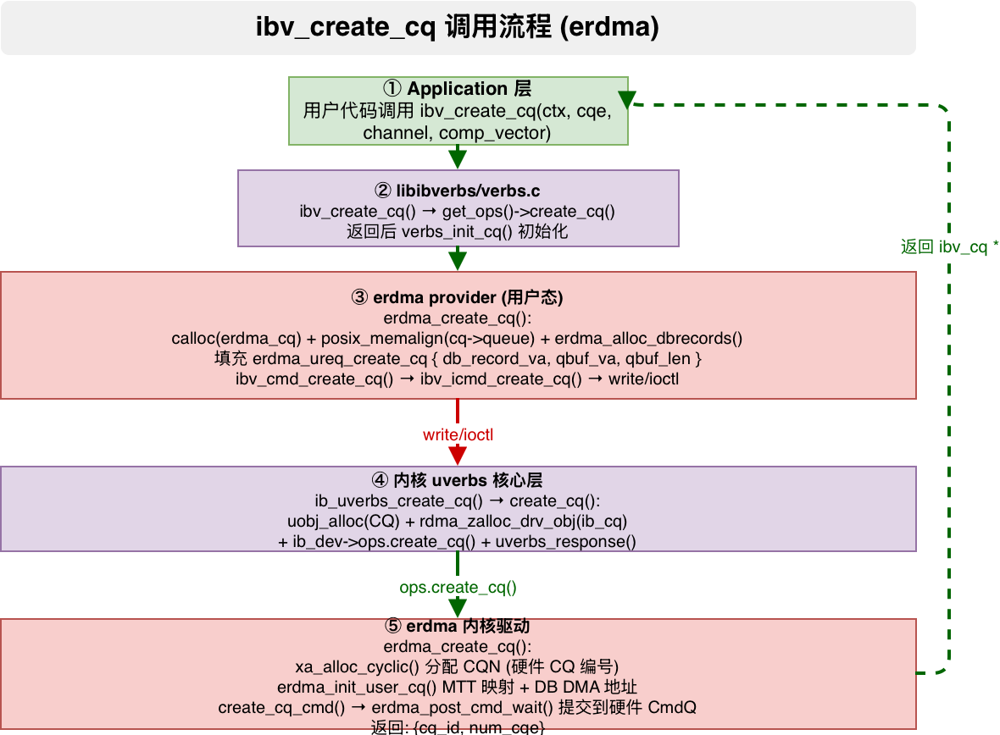

# ibv_create_cq 调用流程分析（以 erdma 网卡为例）

> 分析范围：应用程序 → rdma-core libibverbs → erdma provider → 内核 uverbs 核心 → erdma 内核驱动
>
> 内核版本: linux-6.12.92 | rdma-core 对应内核头文件同步版本

---

## 1. 概述

`ibv_create_cq` 用于创建 **完成队列（Completion Queue, CQ）**。CQ 是 RDMA 中异步事件通知机制的核心——当 SQ/WQ 上的 WR（工作请求）完成时，硬件会在 CQ 中写入 CQE（完成队列元素），用户态通过 `ibv_poll_cq` 轮询获取完成状态。



整个调用路径涉及 **5 层** 软件栈：

```
Application (用户程序)
    ↓
rdma-core libibverbs (verbs.c) — 通用 ops 分发
    ↓
rdma-core erdma provider (rdma-core/providers/erdma/) — 厂商实现
    ↓
write() 系统调用 (/dev/infiniband/uverbsX)
    ↓
内核 uverbs 核心层 (linux-6.12.92/drivers/infiniband/core/) — 命令分发 + 对象管理
    ↓
内核 erdma 驱动 (linux-6.12.92/drivers/infiniband/hw/erdma/) — CQ 资源分配 + 硬件配置
```

---

## 2. 关键数据结构

### 2.1 用户态数据结构

**`struct ibv_cq`** — 用户态 CQ 表示 (`rdma-core/libibverbs/verbs.h:1507`)

```c
struct ibv_cq {
    struct ibv_context     *context;       // 所属设备上下文
    struct ibv_comp_channel *channel;      // 完成事件通道 (可选)
    void                   *cq_context;    // 用户注册的上下文指针
    uint32_t                handle;        // 内核返回的 CQ 句柄 (uobj->id)
    int                     cqe;           // CQ 深度 (CQE 数量)
    pthread_mutex_t         mutex;         // 保护 comp_sem 的互斥锁
    pthread_cond_t          cond;          // 完成事件条件变量
    struct ibv_comp_event   comp_events[1024]; // 完成事件环形缓冲区
};
```

**`struct erdma_cq`** — erdma 用户态 CQ (`rdma-core/providers/erdma/erdma_verbs.h:56`)

```c
struct erdma_cq {
    struct ibv_cq       base_cq;      // 嵌入通用 ibv_cq
    void               *queue;        // CQ 环形队列 (CQE 数组，页对齐)
    void               *db;           // Doorbell 寄存器 MMIO 地址
    uint64_t           *db_record;    // Doorbell 记录 (用户态写，硬件轮询)
    uint32_t            db_offset;    // Doorbell 寄存器偏移
    uint32_t            db_index;     // Doorbell 索引计数器
    uint32_t            id;           // erdma CQ 编号 (来自内核)
    uint32_t            depth;        // CQ 深度 (实际)
    int                 comp_vector;  // 完成向量
    uint32_t            ci;           // 消费者索引
    uint32_t            cmdsn;        // 命令序列号
    pthread_spinlock_t  lock;         // Doorbell 自旋锁
};
```

> 关键成员解析：
> - **`queue`**：CQE 环形缓冲，页对齐，用户态和硬件通过该队列交互完成事件
> - **`db`**：Doorbell 寄存器 MMIO 地址（通过 `mmap` 映射），用户态写 Doorbell 通知硬件轮询 CQ
> - **`db_record`**：Doorbell 记录（系统内存），硬件通过 DMA 读取，避免直接读取 MMIO

### 2.2 内核态数据结构

**`struct ib_cq`** — 内核通用 CQ 结构 (`linux-6.12.92/include/rdma/ib_verbs.h:1593`)

```c
struct ib_cq {
    struct ib_device       *device;        // 所属 RDMA 设备
    struct ib_ucq_object   *uobject;       // CQ uobject (含事件管理)
    ib_comp_handler         comp_handler;  // 完成事件处理函数
    void                   (*event_handler)(struct ib_event *, void *);
    void                   *cq_context;    // 完成事件上下文
    atomic_t                usecnt;        // 引用计数
    unsigned int            cqe;           // CQ 深度
    unsigned int            consumers;     // 消费者数量
    spinlock_t              lock;          // 保护 completion_list 的锁
    struct rdma_restrack_entry res;         // 资源跟踪
};
```

**`struct erdma_cq`** (内核态) — erdma 内核 CQ (`linux-6.12.92/drivers/infiniband/hw/erdma/erdma_verbs.h:243`)

```c
struct erdma_cq {
    struct ib_cq ibcq;             // 嵌入通用 ib_cq
    struct erdma_dev *dev;         // 所属 erdma 设备
    u32 cqn;                       // CQ 编号 (xa_alloc 分配)
    u32 depth;                     // CQ 深度
    u32 assoc_eqn;                 // 关联的 EQ 编号 (中断)
    void *kern_cq.qbuf;            // 内核 CQ 队列缓冲
    // + user_cq / qbuf_mem 等 (用户态相关)
};
```

### 2.3 ABI 结构 (用户态↔内核通信)

**`struct erdma_ureq_create_cq`** — 创建 CQ 的用户请求 (`rdma-core/kernel-headers/rdma/erdma-abi.h:13`)

```c
struct erdma_ureq_create_cq {
    __aligned_u64 db_record_va;    // Doorbell 记录的用户态虚拟地址
    __aligned_u64 qbuf_va;         // CQ 队列缓冲的用户态虚拟地址
    __u32 qbuf_len;                // 队列缓冲大小
    __u32 rsvd0;
};
```

**`struct erdma_uresp_create_cq`** — 创建 CQ 的内核响应 (`rdma-core/kernel-headers/rdma/erdma-abi.h:20`)

```c
struct erdma_uresp_create_cq {
    __u32 cq_id;                   // erdma CQ 编号
    __u32 num_cqe;                 // 实际 CQ 深度
};
```

---

## 3. 完整调用流程

### Step 1: 应用程序调用

```c
// 用户代码
struct ibv_cq *cq = ibv_create_cq(context, 1024, NULL, NULL, 0);
```

参数: `context`(设备上下文)、`cqe`(CQ 深度)、`cq_context`(用户上下文)、`channel`(完成通道)、`comp_vector`(中断向量)。

---

### Step 2: libibverbs 通用入口 — `ibv_create_cq()`

**文件**: `rdma-core/libibverbs/verbs.c:545-558`

```c
LATEST_SYMVER_FUNC(ibv_create_cq, 1_1, "IBVERBS_1.1",
                   struct ibv_cq *,
                   struct ibv_context *context, int cqe, void *cq_context,
                   struct ibv_comp_channel *channel, int comp_vector)
{
    struct ibv_cq *cq;

    // ops 分发到 provider
    cq = get_ops(context)->create_cq(context, cqe, channel, comp_vector);

    if (cq)
        verbs_init_cq(cq, context, channel, cq_context);

    return cq;
}
```

**`verbs_init_cq()`** 初始化锁、条件变量和完成事件缓冲区：

```c
void verbs_init_cq(struct ibv_cq *cq, struct ibv_context *context,
                   struct ibv_comp_channel *channel, void *cq_context)
{
    cq->context   = context;
    cq->channel   = channel;
    cq->cq_context = cq_context;
    pthread_mutex_init(&cq->mutex, NULL);
    pthread_cond_init(&cq->cond, NULL);
    cq->comp_events_completed = 0;
    cq->async_events_completed = 0;
}
```

---

### Step 3: erdma provider — `erdma_create_cq()`

**文件**: `rdma-core/providers/erdma/erdma_verbs.c:159-244`

```c
struct ibv_cq *erdma_create_cq(struct ibv_context *ctx, int num_cqe,
                               struct ibv_comp_channel *channel,
                               int comp_vector)
{
    struct erdma_context *ectx = to_ectx(ctx);
    struct erdma_cmd_create_cq_resp resp = {};
    struct erdma_cmd_create_cq cmd = {};
    uint64_t *db_records = NULL;
    struct erdma_cq *cq;
    size_t cq_size;
    int rv;

    // 1. 分配用户态 CQ 结构
    cq = calloc(1, sizeof(*cq));
    if (!cq)
        return NULL;

    // 2. 对齐 CQ 深度 (最小 64，向上取 2 的幂)
    if (num_cqe < 64)
        num_cqe = 64;
    num_cqe = roundup_pow_of_two(num_cqe);
    cq_size = align(num_cqe * sizeof(struct erdma_cqe), ERDMA_PAGE_SIZE);

    // 3. 分配 CQ 队列缓冲 (页对齐)
    rv = posix_memalign((void **)&cq->queue, ERDMA_PAGE_SIZE, cq_size);
    if (rv) {
        errno = rv;
        free(cq);
        return NULL;
    }

    // 4. 锁定 CQ 队列缓冲，防止被 swap
    rv = ibv_dontfork_range(cq->queue, cq_size);
    if (rv) {
        free(cq->queue);
        cq->queue = NULL;
        goto error_alloc;
    }
    memset(cq->queue, 0, cq_size);

    // 5. 分配 Doorbell 记录 (用于硬件写完成通知)
    db_records = erdma_alloc_dbrecords(ectx);
    if (!db_records) {
        errno = ENOMEM;
        goto error_alloc;
    }

    // 6. 填充驱动命令 (用户态地址传给内核)
    cmd.db_record_va = (uintptr_t)db_records;
    cmd.qbuf_va      = (uintptr_t)cq->queue;
    cmd.qbuf_len     = cq_size;

    // 7. 调用通用命令传输
    rv = ibv_cmd_create_cq(ctx, num_cqe, channel, comp_vector, &cq->base_cq,
                           &cmd.ibv_cmd, sizeof(cmd), &resp.ibv_resp,
                           sizeof(resp));
    if (rv) {
        errno = EIO;
        goto error_alloc;
    }

    // 8. 初始化 Doorbell (基于内核返回的 CQ ID)
    pthread_spin_init(&cq->lock, PTHREAD_PROCESS_PRIVATE);
    *db_records = 0;
    cq->db_record = db_records;
    cq->id     = resp.cq_id;
    cq->depth  = resp.num_cqe;
    cq->db     = ectx->cdb + (cq->id & (ERDMA_PAGE_SIZE / ERDMA_CQDB_SIZE - 1)) *
                              ERDMA_CQDB_SIZE;

    cq->comp_vector = comp_vector;

    return &cq->base_cq;
    // 错误处理省略...
}
```

**关键设计**：

- **CQ 队列缓冲**：用户态分配（`posix_memalign`），页对齐，通过 `ibv_dontfork_range` 锁定。内核通过 `get_user_pages` 获取物理页
- **Doorbell 记录**：用户态分配的物理页，硬件 DMA 写入。用户态直接读取 `db_record` 获取完成通知，无需系统调用
- **Doorbell 寄存器**：MMIO 映射到用户态，写 Doorbell 通知硬件轮询 CQ
- **erdma_alloc_dbrecords() 内部**: 通过 `mmap` 映射 `/dev/infiniband/uverbsX` 的 Doorbell 记录页（驱动 mmap 回调分配）

---

### Step 4: 命令传输 — `ibv_cmd_create_cq()`

**文件**: `rdma-core/libibverbs/cmd_cq.c:130-142`

```c
int ibv_cmd_create_cq(struct ibv_context *context, int cqe,
                      struct ibv_comp_channel *channel, int comp_vector,
                      struct ibv_cq *cq, struct ibv_create_cq *cmd,
                      size_t cmd_size, struct ib_uverbs_create_cq_resp *resp,
                      size_t resp_size)
{
    DECLARE_CMD_BUFFER_COMPAT(cmdb, UVERBS_OBJECT_CQ,
                              UVERBS_METHOD_CQ_CREATE, cmd, cmd_size, resp,
                              resp_size);

    return ibv_icmd_create_cq(context, cqe, channel, comp_vector, 0, cq,
                              cmdb, 0);
}
```

> 使用新一代 ioctl 命令缓冲区（`DECLARE_CMD_BUFFER_COMPAT`），兼容 write() 和 ioctl() 两种路径。内部最终调用 `execute_cmd_write` 或 `execute_ioctl`。

---

### Step 5: write() 系统调用

与 alloc_pd 相同路径：

```
cmd_fd → write() → /dev/infiniband/uverbsX → 内核 ib_uverbs_write()
```

`IB_USER_VERBS_CMD_CREATE_CQ` 对应的 handler 为 `ib_uverbs_create_cq`。

---

### Step 6: 内核 uverbs 核心 — `ib_uverbs_create_cq()` → `create_cq()`

**文件**: `linux-6.12.92/drivers/infiniband/core/uverbs_cmd.c:1081-1098` / `1004-1079`

```c
// 旧写接口的入口 (write ABI)
static int ib_uverbs_create_cq(struct uverbs_attr_bundle *attrs)
{
    struct ib_uverbs_create_cq      cmd;
    struct ib_uverbs_ex_create_cq   cmd_ex;
    int ret;

    ret = uverbs_request(attrs, &cmd, sizeof(cmd));
    if (ret)
        return ret;

    // 转换为扩展命令格式
    cmd_ex.user_handle   = cmd.user_handle;
    cmd_ex.cqe           = cmd.cqe;
    cmd_ex.comp_vector   = cmd.comp_vector;
    cmd_ex.comp_channel  = cmd.comp_channel;

    return create_cq(attrs, &cmd_ex);   // 内部统一处理
}
```

**内部 `create_cq()` 函数**:

```c
static int create_cq(struct uverbs_attr_bundle *attrs,
                     struct ib_uverbs_ex_create_cq *cmd)
{
    struct ib_ucq_object           *obj;
    struct ib_cq                   *cq;
    struct ib_device *ib_dev;

    // 1. 检查中断向量合法性
    if (cmd->comp_vector >= attrs->ufile->device->num_comp_vectors)
        return -EINVAL;

    // 2. 分配 uobject (CQ + 完成事件管理)
    obj = uobj_alloc(UVERBS_OBJECT_CQ, attrs, &ib_dev);
    if (IS_ERR(obj))
        return PTR_ERR(obj);

    // 3. 关联完成通道 (可选)
    if (cmd->comp_channel >= 0) {
        ev_file = ib_uverbs_lookup_comp_file(cmd->comp_channel, attrs);
        if (IS_ERR(ev_file)) {
            ret = PTR_ERR(ev_file);
            goto err;
        }
    }

    // 4. 初始化 uobject 事件管理
    obj->uevent.uobject.user_handle = cmd->user_handle;
    INIT_LIST_HEAD(&obj->comp_list);
    INIT_LIST_HEAD(&obj->uevent.event_list);

    // 5. 分配内核 ib_cq (使用 rdma_zalloc_drv_obj)
    //    erdma 分配 sizeof(struct erdma_cq)
    cq = rdma_zalloc_drv_obj(ib_dev, ib_cq);
    if (!cq) {
        ret = -ENOMEM;
        goto err_file;
    }

    cq->device        = ib_dev;
    cq->uobject       = obj;
    cq->comp_handler  = ib_uverbs_comp_handler;
    cq->event_handler = ib_uverbs_cq_event_handler;
    cq->cq_context    = ev_file ? &ev_file->ev_queue : NULL;
    atomic_set(&cq->usecnt, 0);

    // 6. 调用驱动层的 create_cq 回调 (→ erdma_create_cq)
    attr.cqe = cmd->cqe;
    attr.comp_vector = cmd->comp_vector;
    ret = ib_dev->ops.create_cq(cq, &attr, attrs);
    if (ret)
        goto err_free;

    // 7. 填充响应
    uobj->object = cq;
    resp.base.cq_handle = obj->uevent.uobject.id;
    resp.base.cqe       = cq->cqe;
    return uverbs_response(attrs, &resp, sizeof(resp));
    // ...
}
```

**关键点**：

- **`uobj_alloc(UVERBS_OBJECT_CQ)`**：分配 CQ 类型的 uobject，包含 `ib_ucq_object`（继承 `ib_uobject` 并增加完成事件管理）
- **`ib_uverbs_lookup_comp_file()`**：根据用户传入的 `comp_channel` 句柄查找之前创建的事件通道
- **`rdma_zalloc_drv_obj(ib_dev, ib_cq)`**：分配 `erdma_cq` 空间（`sizeof(struct erdma_cq)`）
- **`ib_dev->ops.create_cq()`**：调用 erdma 驱动的 `erdma_create_cq()`

---

### Step 7: erdma 内核驱动 — `erdma_create_cq()`

**文件**: `linux-6.12.92/drivers/infiniband/hw/erdma/erdma_verbs.c:1656-1728`

```c
int erdma_create_cq(struct ib_cq *ibcq, const struct ib_cq_init_attr *attr,
                    struct uverbs_attr_bundle *attrs)
{
    struct ib_udata *udata = &attrs->driver_udata;
    struct erdma_cq *cq = to_ecq(ibcq);
    struct erdma_dev *dev = to_edev(ibcq->device);
    unsigned int depth = attr->cqe;
    int ret;

    // 1. 校验 CQ 深度
    if (depth > dev->attrs.max_cqe)
        return -EINVAL;
    depth = roundup_pow_of_two(depth);
    cq->ibcq.cqe = depth;
    cq->depth = depth;
    cq->assoc_eqn = attr->comp_vector + 1;

    // 2. xarray 分配 CQ 编号 (全局唯一)
    ret = xa_alloc_cyclic(&dev->cq_xa, &cq->cqn, cq,
                          XA_LIMIT(1, dev->attrs.max_cq - 1),
                          &dev->next_alloc_cqn, GFP_KERNEL);
    if (ret < 0)
        return ret;

    // 3. 用户态 CQ 初始化: 从 udata 获取用户态队列和 DB 记录信息
    if (!rdma_is_kernel_res(&ibcq->res)) {
        struct erdma_ureq_create_cq ureq;
        struct erdma_uresp_create_cq uresp;

        // 3a. 拷贝用户态请求 (qbuf_va, db_record_va, qbuf_len)
        ret = ib_copy_from_udata(&ureq, udata,
                                 min(udata->inlen, sizeof(ureq)));
        if (ret)
            goto err_out_xa;

        // 3b. 初始化用户 CQ (get_user_pages 映射用户队列和 DB 页)
        ret = erdma_init_user_cq(ctx, cq, &ureq);
        if (ret)
            goto err_out_xa;

        // 3c. 填充响应 (CQ ID + 实际深度)
        uresp.cq_id   = cq->cqn;
        uresp.num_cqe = depth;

        ret = ib_copy_to_udata(udata, &uresp,
                               min(sizeof(uresp), udata->outlen));
        if (ret)
            goto err_free_res;
    } else {
        // 内核 CQ (非用户态创建): 跳过
        ret = erdma_init_kernel_cq(cq);
        if (ret)
            goto err_out_xa;
    }

    // 4. 通过 CmdQ 通知硬件创建 CQ
    ret = create_cq_cmd(ctx, cq);
    if (ret)
        goto err_free_res;

    return 0;
    // 错误处理...
}
```

**关键点**：

- **`xa_alloc_cyclic()`**：xarray 分配全局唯一的 CQ 编号 `cqn`，用于后续硬件交互
- **`ib_copy_from_udata()`**：从用户态拷贝 `erdma_ureq_create_cq` 命令（包含 `qbuf_va`、`db_record_va` 等）
- **`erdma_init_user_cq()` 内部**：调用 `get_user_pages_fast()` 锁定用户态的 CQ 队列缓冲和 Doorbell 记录页，获取物理 DMA 地址
- **`create_cq_cmd()`**：通过 erdma CmdQ 向硬件发送创建 CQ 命令，硬件初始化内部的 CQ 调度器

---

### Step 8: 用户态 CQ 初始化 — `erdma_init_user_cq()`

**文件**: `linux-6.12.92/drivers/infiniband/hw/erdma/erdma_verbs.c:1620-1654`

```c
static int erdma_init_user_cq(struct erdma_ucontext *ctx, struct erdma_cq *cq,
                              struct erdma_ureq_create_cq *ureq)
{
    struct erdma_dev *dev = to_edev(cq->ibcq.device);

    // 1. 映射用户态的 CQ 队列缓冲 → 获取物理 DMA 地址
    //    (用于硬件 DMA 写入 CQE)
    ret = rdma_user_mmap_entry_insert_range(
            &dev->ibdev, &cq->user_cq.qbuf_mem, ...);

    // 2. 映射用户态的 Doorbell 记录页
    //    (硬件通过 DMA 读取该记录获取 Doorbell 信息)
    ret = erdma_map_user_dbrecords(ctx, &cq->user_cq.user_dbr_page,
                                   ureq->db_record_va);

    // 3. 设置 Doorbell 寄存器地址 (MMIO)
    cq->kern_cq.db = dev->func_bar + ERDMA_BAR_CQDB_SPACE_OFFSET;

    return 0;
}
```

> 核心工作是将用户态分配的缓冲（CQ 队列 + Doorbell 记录）通过 `get_user_pages` 固定并获取物理地址，然后将物理地址填入硬件可访问的 DMA 描述符中。

---

### Step 9: 硬件命令下发 — `create_cq_cmd()`

通过 erdma CmdQ 向硬件发送 `CMDQ_OPCODE_CREATE_CQ` 命令，包含：
- CQ ID (xa_alloc 分配的 cqn)
- CQ 队列 DMA 地址
- Doorbell 记录 DMA 地址
- CQ 深度 (条目数)
- 关联 EQ 编号 (中断)

硬件收到后在内部 CQ 调度表中创建条目，使能 CQ 的完成事件投递。

---

## 4. 返回路径详解

### 返回数据流

```
⑨ erdma 内核驱动: return 0  (cqn/depth 设置到 uresp)
    ↓
⑧ create_cq():
    resp.base.cq_handle = uobj->id;
    resp.base.cqe       = cq->cqe;
    uverbs_response() → copy_to_user(用户态 resp 缓冲区)
    ↓
⑦ ibv_cmd_create_cq():
    base_cq->handle = resp->cq_handle;
    base_cq->cqe    = resp->cqe;
    return 0;
    ↓
   erdma_create_cq():
    cq->id    = resp.cq_id;        // erdma 私有 CQ ID
    cq->depth = resp.num_cqe;      // 实际 CQ 深度
    cq->db    = ectx->cdb + ...;   // Doorbell MMIO 地址
    return &cq->base_cq;
    ↓
⑥ ibv_create_cq():
    verbs_init_cq(cq, context, channel, cq_context);
    return cq;
    ↓
⑤ 用户代码拿到 ibv_cq * 指针，包含 CQ 队列 + Doorbell
```

### 关键理解

| 概念 | 说明 |
|------|------|
| **CQ 队列** | 用户态分配的环形缓冲，硬件 DMA 写入 CQE，用户态 `ibv_poll_cq` 读取 |
| **Doorbell 记录** | 用户态分配，硬件 DMA 读取。用户态写入 Doorbell 信息后，硬件直接感知 |
| **Doorbell 寄存器** | MMIO 映射到用户态，写 Doorbell 触发硬件处理新请求 |
| **cq->handle** | uobject ID，用于后续 destroy_cq 等操作 |
| **cq->id** | erdma CQ 编号 (xa_alloc)，硬件内部标识 |

---

## 5. 总结

### erdma CQ 创建特点

1. **用户态分配的硬件队列**：CQ 队列缓冲和 Doorbell 记录都在用户态分配，内核通过 `get_user_pages` 固定物理页
2. **四段式分配**：用户态 provider `calloc` + 内核 `rdma_zalloc_drv_obj` + `xa_alloc_cyclic` 分配 CQ 编号 + CmdQ 硬件配置
3. **零拷贝完成通知**：硬件直接 DMA 写 CQE 到用户态队列，无需系统调用即可 `ibv_poll_cq`
4. **Doorbell 机制**：用户态写 MMIO 寄存器通知硬件，硬件 DMA 读 Doorbell 记录获取详细信息

### 完整调用链一览

| 步骤 | 文件/函数 | 核心动作 |
|------|-----------|----------|
| ① | 用户代码 | `ibv_create_cq(ctx, 1024, NULL, NULL, 0)` |
| ② | `rdma-core/libibverbs/verbs.c:545` | `get_ops()->create_cq()` ops 分发 |
| ③ | `rdma-core/providers/erdma/erdma_verbs.c:159` | 分配 CQ 队列 + DB 记录 + `ibv_cmd_create_cq()` |
| ④ | `rdma-core/libibverbs/cmd_cq.c:130` | `ibv_icmd_create_cq()` → write() 系统调用 |
| ⑤ | `linux-6.12.92/drivers/infiniband/core/uverbs_main.c` | `ib_uverbs_write()` 命令分发 |
| ⑥ | `linux-6.12.92/drivers/infiniband/core/uverbs_cmd.c:1081` | `uobj_alloc(CQ)` + `rdma_zalloc_drv_obj(ib_cq)` |
| ⑦ | `linux-6.12.92/drivers/infiniband/hw/erdma/erdma_verbs.c:1656` | `xa_alloc_cyclic()` 分配 CQ 编号 |
| ⑧ | `linux-6.12.92/drivers/infiniband/hw/erdma/erdma_verbs.c:1690` | `erdma_init_user_cq()` 映射用户页 |
| ⑨ | `linux-6.12.92/drivers/infiniband/hw/erdma/erdma_verbs.c:1707` | `create_cq_cmd()` → CmdQ 通知硬件 |

---

## 附录: 相关文件路径

| 组件 | 路径 |
|------|------|
| libibverbs 入口 | `rdma-core/libibverbs/verbs.c` |
| CQ 命令传输 | `rdma-core/libibverbs/cmd_cq.c` |
| write 封装 | `rdma-core/libibverbs/cmd_fallback.c` |
| ops 定义 | `rdma-core/libibverbs/driver.h` |
| get_ops 实现 | `rdma-core/libibverbs/ibverbs.h` |
| 用户态 erdma provider | `rdma-core/providers/erdma/erdma_verbs.c` |
| erdma ABI 定义 | `rdma-core/kernel-headers/rdma/erdma-abi.h` |
| 内核 uverbs 入口 | `linux-6.12.92/drivers/infiniband/core/uverbs_main.c` |
| 内核 uverbs 命令处理 | `linux-6.12.92/drivers/infiniband/core/uverbs_cmd.c` |
| 内核通用数据结构 | `linux-6.12.92/include/rdma/ib_verbs.h` |
| 内核 erdma CQ 创建 | `linux-6.12.92/drivers/infiniband/hw/erdma/erdma_verbs.c` |
| 内核 erdma 头文件 | `linux-6.12.92/drivers/infiniband/hw/erdma/erdma_verbs.h` |
