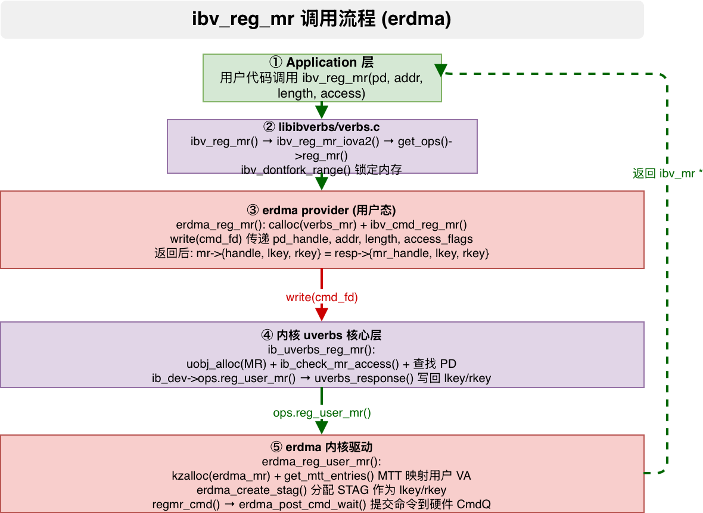

# ibv_reg_mr 调用流程分析（以 erdma 网卡为例）

> 分析范围：应用程序 → rdma-core libibverbs → erdma provider → 内核 uverbs 核心 → erdma 内核驱动
>
> 内核版本: linux-6.12.92 | rdma-core 对应内核头文件同步版本

---

## 1. 概述

`ibv_reg_mr` 用于将一段 **用户态虚拟地址空间** 注册到 RDMA 硬件，使其能够直接访问（DMA 读写）。注册成功后返回 `struct ibv_mr`，其中包含硬件识别的 **lkey/rkey（STAG）**——这是 RDMA 操作中内存保护的关键令牌。



整个调用路径涉及 **5 层** 软件栈：

```
Application (用户程序)
    ↓
rdma-core libibverbs (verbs.c) — 通用 ops 分发
    ↓
rdma-core erdma provider (rdma-core/providers/erdma/) — 厂商实现
    ↓
write() 系统调用 (/dev/infiniband/uverbsX)
    ↓
内核 uverbs 核心层 (linux-6.12.92/drivers/infiniband/core/) — 命令分发 + 对象管理
    ↓
内核 erdma 驱动 (linux-6.12.92/drivers/infiniband/hw/erdma/) — MTT 映射 + STAG 分配
```

---

## 2. 关键数据结构

### 2.1 用户态数据结构

**`struct ibv_mr`** — 用户态 MR 表示 (`rdma-core/libibverbs/verbs.h:667`)

```c
struct ibv_mr {
    struct ibv_context     *context;  // 所属设备上下文
    struct ibv_pd          *pd;       // 所属保护域
    void                   *addr;     // 用户态起始虚拟地址
    size_t                  length;   // 映射长度
    uint32_t                handle;   // 内核返回的 MR 句柄 (uobj->id)
    uint32_t                lkey;     // 本地访问密钥 (Local STAG)
    uint32_t                rkey;     // 远端访问密钥 (Remote STAG)
};
```

> 其中 `lkey` 和 `rkey` 在 erdma 中相同值（同一个 STAG），用于本地和远端 RDMA 操作的内存保护检查。

**`struct verbs_mr`** — libibverbs 内部 MR 包装 (`driver.h`)

```c
struct verbs_mr {
    struct ibv_mr           ibv_mr;   // 嵌入通用 ibv_mr
    struct ibv_pd          *pd;       // 所属 PD
    uint32_t                access;   // 访问权限标志
    uint32_t                mr_type;  // MR 类型 (MR/DM/ODP 等)
    // ...
};
```

### 2.2 内核态数据结构

**`struct ib_mr`** — 内核通用 MR 结构 (`linux-6.12.92/include/rdma/ib_verbs.h:1832`)

```c
struct ib_mr {
    struct ib_device       *device;       // 所属 RDMA 设备
    struct ib_pd           *pd;           // 所属保护域
    struct ib_uobject      *uobject;      // 关联的 uobject
    u64                     iova;         // IO 虚拟地址 (DMA 地址)
    u64                     length;       // 映射长度
    u32                     lkey;         // 本地密钥
    u32                     rkey;         // 远端密钥
    u32                     flags;        // 标志
    enum ib_mr_type         type;         // MR 类型
    struct ib_dm           *dm;           // 关联设备内存 (若有)
    struct rdma_restrack_entry res;        // 资源跟踪
};
```

**`struct erdma_mr`** — erdma 驱动私有 MR 结构 (`linux-6.12.92/drivers/infiniband/hw/erdma/erdma_verbs.h:124`)

```c
struct erdma_mr {
    struct ib_mr ibmr;           // 嵌入通用 ib_mr
    struct erdma_mem mem;        // MTT 内存映射信息
    u32 access;                  // erdma 本地访问权限标志
    u32 type;                    // MR 类型 (NORMAL/DMA/FAKE)
    u32 valid;                   // 有效标志
};
```

**`struct erdma_mem`** — erdma 内存映射描述 (`linux-6.12.92/drivers/infiniband/hw/erdma/erdma_verbs.h`)

```c
struct erdma_mem {
    u64 va;                      // 虚拟地址
    u64 len;                     // 长度
    u64 dma_addr;                // DMA 地址
    struct erdma_mtt_entry *mtt; // MTT 条目数组 (页级映射)
    u32 mtt_num;                 // MTT 条目数
};
```

**`struct erdma_mtt_entry`** — 内存转换表条目 (`linux-6.12.92/drivers/infiniband/hw/erdma/erdma.h`)

```c
struct erdma_mtt_entry {
    u64 addr;                    // DMA 地址 (物理页)
    u32 size;                    // 页大小
    u32 valid;                   // 有效标志
};
```

> MTT（Memory Translation Table）是 erdma 硬件的页表结构，类似于 CPU 的页表，负责将用户 VA 转换为物理 DMA 地址。每个条目映射一个连续的物理页。

---

## 3. 完整调用流程

### Step 1: 应用程序调用

```c
// 用户代码
struct ibv_mr *mr = ibv_reg_mr(pd, buf, size, IBV_ACCESS_LOCAL_WRITE |
                                                 IBV_ACCESS_REMOTE_WRITE |
                                                 IBV_ACCESS_REMOTE_READ);
```

应用程序传入已分配的 `ibv_pd *`、虚拟地址 `buf`、长度 `size` 和访问权限标志，调用 `ibv_reg_mr`。

---

### Step 2: libibverbs 通用入口 — `ibv_reg_mr_iova2()`

**文件**: `rdma-core/libibverbs/verbs.c:310-335`

```c
struct ibv_mr *ibv_reg_mr_iova2(struct ibv_pd *pd, void *addr, size_t length,
                                uint64_t iova, unsigned int access)
{
    struct verbs_device *device = verbs_get_device(pd->context->device);
    bool odp_mr = access & IBV_ACCESS_ON_DEMAND;
    struct ibv_mr *mr;

    // 检查设备是否支持可选的 MR 访问标志
    if (!(device->core_support & IB_UVERBS_CORE_SUPPORT_OPTIONAL_MR_ACCESS))
        access &= ~IBV_ACCESS_OPTIONAL_RANGE;

    // mlock 锁定内存区域，防止被 swap 出去
    if (!odp_mr && ibv_dontfork_range(addr, length))
        return NULL;

    // ops 分发到 provider
    mr = get_ops(pd->context)->reg_mr(pd, addr, length, iova, access);
    if (mr) {
        mr->context = pd->context;
        mr->pd      = pd;
        mr->addr    = addr;
        mr->length  = length;
    } else {
        // 失败时解锁内存
        if (!odp_mr)
            ibv_dofork_range(addr, length);
    }

    return mr;
}
```

**关键点**：

- `ibv_reg_mr` 旧接口内部调用 `ibv_reg_mr_iova2`（设置 iova=addr）
- `ibv_dontfork_range()`：内部调用 `mlock()` 或 `MADV_DONTFORK`，防止内存被 swap 或 fork 时 COW 破坏物理页固定
- ODP（On-Demand Paging）路径跳过 `ibv_dontfork_range`，允许 page fault 按需映射

---

### Step 3: erdma provider — `erdma_reg_mr()`

**文件**: `rdma-core/providers/erdma/erdma_verbs.c:98-118`

```c
struct ibv_mr *erdma_reg_mr(struct ibv_pd *pd, void *addr, size_t len,
                            uint64_t hca_va, int access)
{
    struct ib_uverbs_reg_mr_resp resp;
    struct ibv_reg_mr cmd;
    struct verbs_mr *vmr;
    int ret;

    // 1. 分配 verbs_mr (包含 ibv_mr + 额外元数据)
    vmr = calloc(1, sizeof(*vmr));
    if (!vmr)
        return NULL;

    // 2. 调用通用命令传输，填写 cmd + 发送 write()
    ret = ibv_cmd_reg_mr(pd, addr, len, hca_va, access, vmr, &cmd,
                         sizeof(cmd), &resp, sizeof(resp));
    if (ret) {
        free(vmr);
        return NULL;
    }

    // 3. 返回 ibv_mr 指针 (ibv_cmd_reg_mr 内部已填充 lkey/rkey/handle)
    return &vmr->ibv_mr;
}
```

**关键设计**：

- `verbs_mr` 包含了 `ibv_mr`（`lkey/rkey/handle`）和私有字段（`access/mr_type`）
- erdma 的实现很简洁，不需要额外的 MMIO 配置——MR 的主要工作在 MTT 构建和 STAG 分配上，这些都在内核驱动中完成

---

### Step 4: 命令传输 — `ibv_cmd_reg_mr()`

**文件**: `rdma-core/libibverbs/cmd.c:99-138`

```c
int ibv_cmd_reg_mr(struct ibv_pd *pd, void *addr, size_t length,
                   uint64_t hca_va, int access,
                   struct verbs_mr *vmr, struct ibv_reg_mr *cmd,
                   size_t cmd_size,
                   struct ib_uverbs_reg_mr_resp *resp, size_t resp_size)
{
    int ret;

    // 1. 填充命令字段
    cmd->start        = (uintptr_t) addr;    // 起始虚拟地址
    cmd->length       = length;              // 映射长度
    cmd->hca_va       = hca_va;              // IO 虚拟地址
    cmd->pd_handle    = pd->handle;          // PD 句柄 (alloc_pd 时分配)
    cmd->access_flags = access;              // 访问权限

    // 2. 通过 write() 系统调用发送命令
    ret = execute_cmd_write(pd->context, IB_USER_VERBS_CMD_REG_MR,
                            cmd, cmd_size, resp, resp_size);
    if (ret)
        return ret;

    // 3. 从内核响应中读取结果
    vmr->ibv_mr.handle  = resp->mr_handle;   // MR 句柄
    vmr->ibv_mr.lkey    = resp->lkey;         // 本地密钥
    vmr->ibv_mr.rkey    = resp->rkey;         // 远端密钥
    vmr->ibv_mr.context = pd->context;
    vmr->mr_type        = IBV_MR_TYPE_MR;
    vmr->access = access;

    return 0;
}
```

**关键点**：

- `cmd->pd_handle`：使用之前 `ibv_alloc_pd` 返回的 PD 句柄，告诉内核在哪个 PD 下注册 MR
- `cmd->start`：用户态虚拟地址，内核需要通过 `get_user_pages` 或类似机制转换为物理页
- `resp->lkey` / `resp->rkey`：硬件密钥，后续所有的 SEND/RDMA WRITE/RDMA READ 都需要用它们保护内存访问

---

### Step 5: write() 系统调用

与 alloc_pd 相同路径：

**文件**: `rdma-core/libibverbs/cmd_fallback.c:233-257`

```
cmd_fd → write() → /dev/infiniband/uverbsX → 内核 ib_uverbs_write()
```

`IB_USER_VERBS_CMD_REG_MR` 对应的 handler 在内核注册为 `ib_uverbs_reg_mr`。

---

### Step 6: 内核 uverbs 核心 — `ib_uverbs_reg_mr()`

**文件**: `linux-6.12.92/drivers/infiniband/core/uverbs_cmd.c:695-762`

```c
static int ib_uverbs_reg_mr(struct uverbs_attr_bundle *attrs)
{
    struct ib_uverbs_reg_mr_resp resp = {};
    struct ib_uverbs_reg_mr      cmd;
    struct ib_uobject           *uobj;
    struct ib_pd                *pd;
    struct ib_mr                *mr;
    int                          ret;

    // 1. 从用户态拷贝命令数据
    ret = uverbs_request(attrs, &cmd, sizeof(cmd));
    if (ret)
        return ret;

    // 2. 检查地址对齐 (start 和 hca_va 页内偏移需一致)
    if ((cmd.start & ~PAGE_MASK) != (cmd.hca_va & ~PAGE_MASK))
        return -EINVAL;

    // 3. 分配 uobject (MR 对象管理)
    uobj = uobj_alloc(UVERBS_OBJECT_MR, attrs, &ib_dev);
    if (IS_ERR(uobj))
        return PTR_ERR(uobj);

    // 4. 检查 MR 访问权限与设备能力匹配
    ret = ib_check_mr_access(ib_dev, cmd.access_flags);
    if (ret)
        goto err_free;

    // 5. 根据 pd_handle 查找 ib_pd 对象
    pd = uobj_get_obj_read(pd, UVERBS_OBJECT_PD, cmd.pd_handle, attrs);
    if (IS_ERR(pd)) {
        ret = PTR_ERR(pd);
        goto err_free;
    }

    // 6. 调用 RDMA 驱动层的 reg_user_mr 回调 (→ erdma_reg_user_mr)
    mr = pd->device->ops.reg_user_mr(pd, cmd.start, cmd.length, cmd.hca_va,
                                     cmd.access_flags, &attrs->driver_udata);
    if (IS_ERR(mr)) {
        ret = PTR_ERR(mr);
        goto err_put;
    }

    // 7. 初始化 ib_mr 字段
    mr->device  = pd->device;
    mr->pd      = pd;
    mr->type    = IB_MR_TYPE_USER;
    mr->uobject = uobj;
    atomic_inc(&pd->usecnt);
    mr->iova    = cmd.hca_va;
    mr->length  = cmd.length;

    // 8. 资源跟踪注册
    rdma_restrack_new(&mr->res, RDMA_RESTRACK_MR);
    rdma_restrack_set_name(&mr->res, NULL);
    rdma_restrack_add(&mr->res);

    // 9. 关联 uobject → mr，返回响应
    uobj->object = mr;
    resp.lkey     = mr->lkey;
    resp.rkey     = mr->rkey;
    resp.mr_handle = uobj->id;
    return uverbs_response(attrs, &resp, sizeof(resp));
    // ...
}
```

**关键点**：

- **`uobj_alloc(UVERBS_OBJECT_MR)`**：分配 MR 类型的 uobject，分配 ID 作为 `mr_handle`
- **`ib_check_mr_access()`**：检查请求的访问权限是否在设备能力范围内
- **`uobj_get_obj_read(pd, ..., cmd.pd_handle)`**：通过 handle 查找之前 `ibv_alloc_pd` 创建的 PD 对象，增加引用计数
- **`pd->device->ops.reg_user_mr()`**：调用到 erdma 驱动的 `erdma_reg_user_mr()`

---

### Step 7: erdma 内核驱动 — `erdma_reg_user_mr()`

**文件**: `linux-6.12.92/drivers/infiniband/hw/erdma/erdma_verbs.c:1159-1208`

```c
struct ib_mr *erdma_reg_user_mr(struct ib_pd *ibpd, u64 start, u64 len,
                                u64 virt, int access, struct ib_udata *udata)
{
    struct erdma_mr *mr = NULL;
    struct erdma_dev *dev = to_edev(ibpd->device);
    u32 stag;
    int ret;

    // 1. 检查长度合法性
    if (!len || len > dev->attrs.max_mr_size)
        return ERR_PTR(-EINVAL);

    // 2. 分配 erdma_mr 结构
    mr = kzalloc(sizeof(*mr), GFP_KERNEL);
    if (!mr)
        return ERR_PTR(-ENOMEM);

    // 3. 构建 MTT 映射：将用户 VA 转换为物理 DMA 地址列表
    //    get_mtt_entries 内部调用 get_user_pages 锁定用户页
    //    并构建硬件可读的 MTT 表
    ret = get_mtt_entries(dev, &mr->mem, start, len, access, virt,
                          SZ_2G - SZ_4K, false);
    if (ret)
        goto err_out_free;

    // 4. 分配 STAG (Stream Tag) = lkey = rkey
    //    STAG 是硬件保护的关键，每个 MR 有唯一 STAG
    ret = erdma_create_stag(dev, &stag);
    if (ret)
        goto err_out_put_mtt;

    // 5. 设置 MR 属性
    mr->ibmr.lkey = mr->ibmr.rkey = stag;   // erdma 中 lkey == rkey
    mr->ibmr.pd   = ibpd;
    mr->mem.va    = virt;
    mr->mem.len   = len;
    mr->access    = ERDMA_MR_ACC_LR | to_erdma_access_flags(access);
    mr->valid     = 1;
    mr->type      = ERDMA_MR_TYPE_NORMAL;

    // 6. 通过 CmdQ 通知硬件 (下发注册 MR 命令)
    ret = regmr_cmd(dev, mr);
    if (ret)
        goto err_out_mr;

    return &mr->ibmr;

err_out_mr:
    erdma_free_idx(&dev->res_cb[ERDMA_RES_TYPE_STAG_IDX], mr->ibmr.lkey >> 8);
err_out_put_mtt:
    put_mtt_entries(dev, &mr->mem);
err_out_free:
    kfree(mr);
    return ERR_PTR(ret);
}
```

**关键点**：

- **`get_mtt_entries()`**：核心函数，内部调用 `get_user_pages_fast()` 将用户虚拟地址转换为物理页，并构建 erdma 硬件所需的 MTT 表
  - 对于 2MB 以内连续页使用单条 MTT 大页条目
  - 超过 2MB 或非连续页拆分为多条 4K 条目
- **`erdma_create_stag()`**：从 bitmap 分配 STAG 索引（左移 8 位作为 lkey/rkey）
- **`regmr_cmd()`**：通过 erdma CmdQ 向硬件发送注册 MR 命令，硬件在 MTT 表中记录映射
- **`put_mtt_entries()`**：错误路径释放 MTT 映射（内部调用 put_page 等）

---

### Step 8: STAG 分配 — `erdma_create_stag()`

**文件**: `linux-6.12.92/drivers/infiniband/hw/erdma/erdma_verbs.c:1023-1034`

```c
static int erdma_create_stag(struct erdma_dev *dev, u32 *stag)
{
    int stag_idx;

    stag_idx = erdma_alloc_idx(&dev->res_cb[ERDMA_RES_TYPE_STAG_IDX]);
    if (stag_idx < 0)
        return stag_idx;

    // lkey/rkey = (stag_idx << 8) | 0x01
    // 左移 8 位 + 低 8 位标志位
    *stag = (stag_idx << ERDMA_STAG_SHIFT) | ERDMA_STAG_KEY;
    return 0;
}
```

> STAG 格式: `[stag_idx (24bit)] [key (8bit)]`。`stag_idx` 是 bitmap 分配的索引；`key` 固定为 `ERDMA_STAG_KEY`（`0x01`）。

### Step 9: 硬件命令下发 — `regmr_cmd()`

**文件**: `linux-6.12.92/drivers/infiniband/hw/erdma/erdma_verbs.c` (约 Line 1130-1156)

```c
static int regmr_cmd(struct erdma_dev *dev, struct erdma_mr *mr)
{
    struct erdma_cmdq_reg_mr_req req = {};
    // ...

    // 构造 CmdQ 请求
    req.hdr.subcmd = CMDQ_SUBMOD_COMMON;
    req.hdr.opcode = CMDQ_OPCODE_REG_MR;
    req.stag = mr->ibmr.lkey;
    req.mtt_addr = mr->mem.dma_addr;   // MTT 表的 DMA 地址
    req.mtt_cnt = mr->mem.mtt_num;     // MTT 条目数
    req.access = mr->access;
    req.va = mr->mem.va;
    req.len = mr->mem.len;

    // 投递到 CmdQ，等待 CCQ 完成
    return erdma_cmdq_exec(dev, &req.hdr, NULL, 0);
}
```

> 通过 erdma 的命令队列（CmdQ）将 MR 注册信息同步到硬件。硬件收到后会在内部的 MTT 缓存和 STAG 表中添加条目，使能 DMA 访问。

---

## 4. 返回路径详解

### 返回数据流

```
⑨ erdma 内核驱动: return &mr->ibmr  (lkey/rkey/device 已设置)
    ↓
⑧ ib_uverbs_reg_mr():
    resp.lkey     = mr->lkey;
    resp.rkey     = mr->rkey;
    resp.mr_handle = uobj->id;
    uverbs_response() → copy_to_user(用户态 resp 缓冲区)
    ↓
⑦ ibv_cmd_reg_mr():
    vmr->ibv_mr.handle = resp->mr_handle;
    vmr->ibv_mr.lkey   = resp->lkey;
    vmr->ibv_mr.rkey   = resp->rkey;
    return 0;
    ↓
   erdma_reg_mr():
    return &vmr->ibv_mr;
    ↓
⑥ ibv_reg_mr_iova2():
    mr->context = pd->context;
    mr->pd      = pd;
    mr->addr    = addr;
    mr->length  = length;
    return mr;
    ↓
⑤ 用户代码拿到 ibv_mr * 指针，其中包含 lkey/rkey
```

### 关键理解

| 概念 | 说明 |
|------|------|
| `lkey = rkey` | erdma 中 STAG 同时作为本地和远端密钥 |
| `mr->handle` | uobject ID，用于后续 dereg_mr 等操作 |
| **STAG** | 硬件内存保护的核心——每次 DMA 读写都检查 STAG 是否匹配 |
| **MTT** | 硬件页表，将用户 VA 映射到物理 DMA 地址 |

---

## 5. 总结

### erdma MR 注册特点

1. **三段式分配**：用户态 `calloc(verbs_mr)` + 内核 `kzalloc(erdma_mr)` + 硬件 STAG/MTT 条目
2. **物理内存锁定**：通过 `ibv_dontfork_range` + 内核 `get_user_pages` 确保物理页固定
3. **硬件通知**：通过 CmdQ 将 MTT 和 STAG 信息同步到硬件
4. **lkey == rkey**：erdma 简化设计，使用同一个 STAG

### 完整调用链一览

| 步骤 | 文件/函数 | 核心动作 |
|------|-----------|----------|
| ① | 用户代码 | `ibv_reg_mr(pd, buf, size, access)` |
| ② | `rdma-core/libibverbs/verbs.c:310` | `ibv_dontfork_range()` + `get_ops()->reg_mr()` |
| ③ | `rdma-core/providers/erdma/erdma_verbs.c:98` | `calloc(verbs_mr)` + `ibv_cmd_reg_mr()` |
| ④ | `rdma-core/libibverbs/cmd.c:99` | 填充 `cmd = {start, length, pd_handle, access}` + `execute_cmd_write()` |
| ⑤ | `rdma-core/libibverbs/cmd_fallback.c:233` | `write(ctx->cmd_fd)` 系统调用 |
| ⑥ | `linux-6.12.92/drivers/infiniband/core/uverbs_main.c:570` | `ib_uverbs_write()` 命令分发 |
| ⑦ | `linux-6.12.92/drivers/infiniband/core/uverbs_cmd.c:695` | `uobj_alloc(MR)` + `uobj_get_obj_read(pd)` → `ops.reg_user_mr()` |
| ⑧ | `linux-6.12.92/drivers/infiniband/hw/erdma/erdma_verbs.c:1159` | `get_mtt_entries()` 锁定页 + 构建 MTT |
| ⑨ | `linux-6.12.92/drivers/infiniband/hw/erdma/erdma_verbs.c:1179` | `erdma_create_stag()` 分配 STAG |
| ⑩ | `linux-6.12.92/drivers/infiniband/hw/erdma/erdma_verbs.c:1191` | `regmr_cmd()` → CmdQ 通知硬件 |

---

## 附录: 相关文件路径

| 组件 | 路径 |
|------|------|
| libibverbs 入口 | `rdma-core/libibverbs/verbs.c` |
| 命令传输 (MR) | `rdma-core/libibverbs/cmd.c` |
| write 封装 | `rdma-core/libibverbs/cmd_fallback.c` |
| ops 定义 | `rdma-core/libibverbs/driver.h` |
| get_ops 实现 | `rdma-core/libibverbs/ibverbs.h` |
| 用户态 erdma provider | `rdma-core/providers/erdma/erdma_verbs.c` |
| 内核 uverbs 入口 | `linux-6.12.92/drivers/infiniband/core/uverbs_main.c` |
| 内核 uverbs 命令处理 | `linux-6.12.92/drivers/infiniband/core/uverbs_cmd.c` |
| 内核通用数据结构 | `linux-6.12.92/include/rdma/ib_verbs.h` |
| 内核 erdma 驱动 | `linux-6.12.92/drivers/infiniband/hw/erdma/erdma_verbs.c` |
| 内核 erdma 头文件 | `linux-6.12.92/drivers/infiniband/hw/erdma/erdma_verbs.h` |
| 内核 erdma 设备结构 | `linux-6.12.92/drivers/infiniband/hw/erdma/erdma.h` |
